# OTR v2.0 Workflow Distillation -- 2026-05-16

**Source of truth:** `sprint-d-period-llm @ 5b0d0ba` (Sprint D D-final).
**Workflow JSON:** `workflows/otr_scifi_16gb_full.json` (34 nodes, 60 links).
**Reviewer audience:** Cold-read pre-Sprint-A QA (fresh Claude session + Gemini Deep Research).
**Author:** Jeffrey A. Brick / Cowork.
**Branch policy:** This file lands docs-only, no source change. Bug Bible regression baseline 23 passed / 1 skipped / 2 xfailed must hold.

---

## §0  How to read this file

This is a pre-Sprint-A cold-read QA artifact for the OTR v2.0 workflow. The reviewer is reading without repo access; every contract, signature, wiring fact, and known failure mode the reviewer needs is in this file. Read top-down: §1 link topology first to build the mental graph, then §2-§9 component-by-component, then §10 cross-cutting contracts, then §11 unproven surfaces. Severity rubric and the verbatim copy-pasteable review prompt are in §12. The reviewer's job is to surface contract gaps, silent failures, type mismatches, work-by-accident paths, comment/code disagreements, Sprint D regression risks, HuMo readiness concerns, audio C7 risks, and unproven-at-scale issues. Do not propose remediations longer than two sentences each. The author has already absorbed Sprint C and Sprint D adversarial-audit retrospectives.

---

## §1  Workflow JSON link topology

The graph has eight functional lanes plus the validator. Mermaid block first for visual scan; ASCII tree below for precise wire walking. The Mermaid is grouped by lane subgraph to keep it readable; the ASCII tree is the authoritative source if Mermaid disagrees with itself.

**Sprint D D0d rewires** that the reviewer should pay extra attention to are flagged inline with `[D0d]`. Five wire changes landed at D0d:

1. **Three `ledger_json` source rewires** -- HuMo (51.5), VideoComposite (52.2), and LTX (55.3) ledger_json inputs previously sourced from SignalLostVideo.video_path or other duck-typed paths; D0d rewires all three to FreezeCascade.script_json so consumers read the post-freeze L3 contract.
2. **VideoPlan audio_gate dependency wire.** VideoPlan input slot 1 is named `audio_gate` (forceInput STRING). Pre-D0d it sat unwired (topsort relied on the IMAGE-edge chain through FLUX/UnloadAll/HuMo); post-D0d it IS wired via L47 from FreezeCascade.script_json as a pure dependency edge so VideoPlan cannot run before the freeze stamps meta.story_brief. The socket name `audio_gate` is misleading post-D0d and is queued for rename to `freeze_done_gate` in Sprint E.

```mermaid
graph LR
  %% =========================================================
  %% Sprint D Workflow Topology -- otr_scifi_16gb_full.json
  %% 34 nodes / 60 links
  %% Sprint D D0d rewires flagged [D0d]
  %% =========================================================
  subgraph WRITER["Writer + Reflection (creative + technical slots)"]
    N63["63: OTR_WorkflowValidator<br/>(opt-in, [50, 2100])"]
    N1["1: OTR_LedgerScriptWriter<br/>(Story Writer LPL v2.0)"]
  end
  subgraph FREEZE["Freeze + Reviewer (cast lock, audit, doctor)"]
    N62["62: OTR_LedgerFreezeCascade<br/>(Phase 0.10)"]
  end
  subgraph AUDIO["Audio lane (Bark + Kokoro + MusicGen + AudioGen + ProcSFX)"]
    N11["11: OTR_BatchBarkGenerator"]
    N13["13: OTR_KokoroAnnouncer"]
    N14["14: OTR_MusicGenTheme"]
    N15["15: OTR_BatchAudioGenGenerator"]
    N3["3: OTR_SceneSequencer"]
    N4["4: OTR_AudioEnhance"]
    N7["7: OTR_EpisodeAssembler"]
  end
  subgraph VISUAL_FLUX["Visual lane FLUX (env + portrait + bookend)"]
    N22["22: CheckpointLoaderSimple<br/>(FLUX.1-dev-fp8)"]
    N42["42: PatchSageAttentionKJ<br/>(DISABLED, BUG-LOCAL-070)"]
    N23["23: OTR_BatchFluxRender"]
    N59["59: OTR_BatchFluxPortraitRender"]
    N20["20: OTR_VideoPlan"]
    N21["21: OTR_ShotDurationCalculator"]
    N24["24: OTR_UnloadAll"]
    N25["25: OTR_SaveToEpisodeWorkspace"]
  end
  subgraph VISUAL_HUMO["Dialogue lane HuMo (Wan 2.1, Whisper, lightx2v)"]
    N45["45: UNETLoader (HuMo 14B fp8)"]
    N46["46: LoraLoaderModelOnly<br/>(lightx2v 4-step distill)"]
    N47["47: ModelSamplingSD3 (shift=8)"]
    N48["48: CLIPLoader (umt5_xxl)"]
    N49["49: VAELoader (wan_2.1)"]
    N50["50: AudioEncoderLoader<br/>(Whisper Large v3)"]
    N51["51: OTR_BatchHumoRender"]
  end
  subgraph VISUAL_LTX["Motion lane LTX 2.3"]
    N54["54: LowVRAMCheckpointLoader"]
    N60["60: LoraLoaderModelOnly<br/>(LTX distill @ 0.5)"]
    N61["61: LoraLoaderModelOnly<br/>(LTX distill @ 0.2)"]
    N57["57: LTXAVTextEncoderLoader<br/>(Gemma)"]
    N55["55: OTR_BatchLTXRender"]
    N56["56: OTR_RTXUpscale"]
  end
  subgraph COMPOSITE["Composite lane (SignalLost + VideoComposite + PostBlend)"]
    N12["12: OTR_SignalLostVideo<br/>(procgen 1080p)"]
    N52["52: OTR_VideoComposite<br/>(1472x832 layered, HuMo 512px pillar)"]
    N58["58: OTR_PostUpscaleProcgenBlend"]
  end

  %% --- Writer to Freeze ---
  N1 -- "1.0 script_text -> 62.0 (L106 STRING)" --> N62
  N1 -- "1.1 script_json -> 62.1 (L107 STRING)" --> N62
  N1 -- "1.2 news_used -> 62.2 (L108 STRING)" --> N62
  N1 -- "1.3 estimated_minutes -> 62.3 (L109 INT)" --> N62
  N1 -- "1.5 technical_model -> 62.4 (L115 STRING)" --> N62

  %% --- Freeze broadcasts (script_json fanout from slot 1) ---
  N62 -- "62.1 -> 3.0  (L2  STRING)" --> N3
  N62 -- "62.1 -> 11.0 (L12 STRING)" --> N11
  N62 -- "62.1 -> 13.0 (L19 STRING)" --> N13
  N62 -- "62.1 -> 14.0 (L21 STRING)" --> N14
  N62 -- "62.1 -> 15.0 (L24 STRING)" --> N15
  N62 -- "62.1 -> 12.1 (L16 STRING)" --> N12
  N62 -- "62.1 -> 20.1 (L47 STRING) [D0d wire-1]" --> N20
  N62 -- "62.1 -> 20.0 (L113 STRING) [D0d wire-1]" --> N20
  N62 -- "62.1 -> 59.3 (L114 STRING) [D0d wire-1]" --> N59
  N62 -- "62.1 -> 51.5 (L79 STRING) [D0d wire-1]" --> N51
  N62 -- "62.1 -> 52.2 (L82 STRING)" --> N52
  N62 -- "62.1 -> 55.3 (L90 STRING)" --> N55
  N62 -- "62.2 news_used -> 12.2 (L110)" --> N12

  %% --- Audio lane chain ---
  N11 -- "11.0 tts -> 3.1 AUDIO (L14)" --> N3
  N13 -- "13.0 ann -> 3.2 AUDIO (L20)" --> N3
  N15 -- "15.0 sfx -> 3.3 AUDIO (L25)" --> N3
  N3 -- "3.0 -> 4.0 AUDIO (L5)" --> N4
  N4 -- "4.0 -> 7.0 AUDIO (L6)" --> N7
  N14 -- "14.0 opening -> 7.1 AUDIO (L22)" --> N7
  N14 -- "14.1 closing -> 7.2 AUDIO (L23)" --> N7
  N14 -- "14.1 closing -> 12.3 AUDIO (L105)" --> N12
  N7 -- "7.0 episode_audio -> 12.0 AUDIO (L15)" --> N12
  N7 -- "7.0 episode_audio -> 51.4 AUDIO (L78)" --> N51

  %% --- FLUX visual lane ---
  N22 -- "22.0 MODEL -> 42.0 (L42; Sage DISABLED)" --> N42
  N42 -- "42.0 MODEL -> 23.0 (L69)" --> N23
  N22 -- "22.1 CLIP -> 23.1 (L43)" --> N23
  N22 -- "22.2 VAE -> 23.2 (L44)" --> N23
  N20 -- "20.2 shot_durations -> 21.0 (L40)" --> N21
  N21 -- "21.0 -> 23.3 STRING (L41)" --> N23
  N23 -- "23.0 IMAGE -> 59.4 flux_done_gate (L101)" --> N59
  N23 -- "23.0 IMAGE -> 25.0 (L104)" --> N25
  N22 -- "22.0 MODEL -> 59.0 (L97)" --> N59
  N22 -- "22.1 CLIP -> 59.1 (L98)" --> N59
  N22 -- "22.2 VAE -> 59.2 (L99)" --> N59
  N59 -- "59.0 portrait_batch -> 24.0 IMAGE (L45)" --> N24
  N59 -- "59.2 portraits_dir -> 51.6 STRING (L116) [D0d wire-3]" --> N51
  N24 -- "24.0 IMAGE -> 51.7 flux_done_gate (L83)" --> N51

  %% --- HuMo dialogue lane ---
  N45 -- "45.0 MODEL -> 46.0 (L72)" --> N46
  N46 -- "46.0 MODEL -> 47.0 (L73)" --> N47
  N47 -- "47.0 MODEL -> 51.0 (L74)" --> N51
  N48 -- "48.0 CLIP -> 51.1 (L75)" --> N51
  N49 -- "49.0 VAE -> 51.2 (L76)" --> N51
  N50 -- "50.0 AUDIO_ENCODER -> 51.3 (L77)" --> N51
  N51 -- "51.0 clips_dir -> 55.4 (L91, DAG seq)" --> N55
  N51 -- "51.2 -> 54.0 STRING (L86, ckpt name)" --> N54

  %% --- LTX motion lane ---
  N54 -- "54.0 MODEL -> 60.0 (L87)" --> N60
  N60 -- "60.0 MODEL -> 61.0 (L102)" --> N61
  N61 -- "61.0 MODEL -> 55.0 (L103)" --> N55
  N54 -- "54.2 VAE -> 55.2 (L89)" --> N55
  N57 -- "57.0 CLIP -> 55.1 (L94)" --> N55
  N55 -- "55.0 clips_dir -> 52.1 (L92)" --> N52
  N55 -- "55.0 clips_dir -> 56.0 (L93)" --> N56

  %% --- Composite lane ---
  N12 -- "12.0 procgen.mp4 -> 52.0 (L80)" --> N52
  N12 -- "12.0 procgen.mp4 -> 58.1 (L96)" --> N58
  N52 -- "52.0 final_mp4 -> 56.0 -> 58.0 (L93,L95)" --> N56
  N56 -- "56.0 upscaled -> 58.0 (L95)" --> N58
```

3. **`portraits_dir` wire (59.2 -> 51.6).** BatchFluxPortraitRender (59) emits a new third STRING output `portraits_dir`; HuMo (51) consumes it on its `portraits_dir` input. Pre-D0d HuMo fell through to `output/otr/portraits/<ep_id>/` via auto-resolve; post-D0d the wire is explicit so a renamed portrait directory cannot silently miss the face-reference lookup.



### ASCII tree -- authoritative wiring per link id

Format: `node.slot -> node.slot   (link_id  TYPE)   [tag]`

```
Lane: WRITER -> FREEZE (5 wires from node 1 to node 62)
   1.0  script_text          -> 62.0  script_text         (L106  STRING)
   1.1  script_json          -> 62.1  script_json         (L107  STRING)
   1.2  news_used            -> 62.2  news_used           (L108  STRING)
   1.3  estimated_minutes    -> 62.3  estimated_minutes   (L109  INT)
   1.5  technical_model      -> 62.4  technical_model     (L115  STRING)
   NOTE 1: 1.4 = creative_writing_model is broadcast but the
           cascade reads only 1.5 (technical_model). The creative
           id reaches consumers via the writer's internal slot
           scheduler (Sprint D D2b creative prompt router); no
           graph wire is required.
   NOTE 2: 62.4 is the cascade's technical_model input socket,
           NOT a model_id widget. Sprint D inherited S30 B3's
           "no per-node model_id widget, read from writer
           broadcast" rule. Cascade unwired -> MissingModelInputError
           at run time.

Lane: FREEZE -> EVERY CONSUMER (script_json fanout from 62.1)
   62.1  script_json -> 3.0   SceneSequencer.script_json     (L2     STRING)
   62.1  script_json -> 11.0  BatchBark.script_json          (L12    STRING)
   62.1  script_json -> 12.1  SignalLost.script_json         (L16    STRING)
   62.1  script_json -> 13.0  Kokoro.script_json             (L19    STRING)
   62.1  script_json -> 14.0  MusicGen.script_json           (L21    STRING)
   62.1  script_json -> 15.0  AudioGen.script_json           (L24    STRING)
   62.1  script_json -> 20.1  VideoPlan.audio_gate           (L47    STRING)   [D0d wire-1] -- see NOTE 3
   62.1  script_json -> 20.0  VideoPlan.script_json          (L113   STRING)   [D0d wire-1]
   62.1  script_json -> 51.5  HuMo.ledger_json               (L79    STRING)   [D0d wire-1]
   62.1  script_json -> 52.2  VideoComposite.ledger_json     (L82    STRING)
   62.1  script_json -> 55.3  LTX.ledger_json                (L90    STRING)
   62.1  script_json -> 59.3  FluxPortrait.ledger_json       (L114   STRING)   [D0d wire-1]
   NOTE 3: L47's target slot 20.1 is the audio_gate (forceInput
           STRING). VideoPlan ignores the value -- it is a pure
           topological-sort dependency edge per the
           voice-path-cleanbreak Sprint 2 wiring pattern. Pre-D0d
           this gate was unwired and topsort relied on the
           IMAGE-edge chain through FLUX/UnloadAll. D0d formalizes
           the dependency on the cascade so VideoPlan cannot run
           before the freeze stamps meta.story_brief.

   62.2  news_used   -> 12.2  SignalLost.news_used           (L110   STRING)

Lane: AUDIO PRODUCERS -> SCENESEQUENCER -> ENHANCE -> ASSEMBLER -> EPISODE AUDIO BUS
   11.0  tts_audio_clips    -> 3.1  SceneSequencer.bark_audio_clips      (L14   AUDIO)
   13.0  announcer_clips    -> 3.2  SceneSequencer.announcer_audio_clips (L20   AUDIO)
   15.0  sfx_clips          -> 3.3  SceneSequencer.audiogen_audio_clips  (L25   AUDIO)
   3.0   episode_audio      -> 4.0  AudioEnhance.audio                   (L5    AUDIO)
   4.0   enhanced_audio     -> 7.0  EpisodeAssembler.audio_main          (L6    AUDIO)
   14.0  opening_audio      -> 7.1  EpisodeAssembler.opening_theme       (L22   AUDIO)
   14.1  closing_audio      -> 7.2  EpisodeAssembler.closing_theme       (L23   AUDIO)
   14.1  closing_audio      -> 12.3 SignalLost.closing_audio             (L105  AUDIO)

   7.0   final_episode_audio -> 12.0 SignalLost.audio                    (L15   AUDIO)
   7.0   final_episode_audio -> 51.4 HuMo.audio                          (L78   AUDIO)
   NOTE 4: L78 is the canonical audio C7 byte-identity carrier.
           HuMo conditions on this audio (Whisper-encoded
           latents); the audio itself is NOT re-vocoded by HuMo
           -- the bytes are passed through to disk via FFmpeg
           post-render. See §6 contract: HuMo audio passthrough.

Lane: FLUX VISUAL (env stills + radio bookend + portraits)
   22.0  MODEL -> 42.0 Sage patch  (L42   MODEL)     [Sage DISABLED, BUG-LOCAL-070]
   42.0  MODEL -> 23.0 BatchFluxRender (L69   MODEL)
   22.1  CLIP  -> 23.1 BatchFluxRender (L43   CLIP)
   22.2  VAE   -> 23.2 BatchFluxRender (L44   VAE)
   22.0  MODEL -> 59.0 FluxPortrait    (L97   MODEL)
   22.1  CLIP  -> 59.1 FluxPortrait    (L98   CLIP)
   22.2  VAE   -> 59.2 FluxPortrait    (L99   VAE)
   20.2  shot_durations   -> 21.0 ShotDurationCalc (L40   STRING)
   21.0  shot_duration_s  -> 23.3 BatchFluxRender   (L41   STRING)
   23.0  images IMAGE     -> 59.4 FluxPortrait.flux_done_gate (L101  IMAGE)   -- DAG seq
   23.0  images IMAGE     -> 25.0 SaveToEpisodeWorkspace      (L104  IMAGE)
   59.0  portrait_batch   -> 24.0 UnloadAll.IMAGE             (L45   IMAGE)   -- DAG seq
   59.2  portraits_dir    -> 51.6 HuMo.portraits_dir          (L116  STRING)  [D0d wire-3]
   24.0  unload IMAGE     -> 51.7 HuMo.flux_done_gate         (L83   IMAGE)   -- DAG seq

Lane: HUMO DIALOGUE (Wan 2.1 stack, lightx2v, Whisper)
   45.0  UNET MODEL  -> 46.0 LoraLoader (L72   MODEL)
   46.0  +LoRA MODEL -> 47.0 ModelSamplingSD3 (L73   MODEL)
   47.0  shift=8 MODEL -> 51.0 HuMo.model (L74   MODEL)
   48.0  umt5_xxl CLIP -> 51.1 HuMo.clip  (L75   CLIP)
   49.0  wan_2.1 VAE  -> 51.2 HuMo.vae   (L76   VAE)
   50.0  Whisper AUDIO_ENCODER -> 51.3 HuMo.audio_encoder (L77 AUDIO_ENCODER)
   51.0  HuMo clips_dir -> 55.4 LTX.humo_clips_dir (L91   STRING)  -- DAG seq
   51.2  HuMo.report    -> 54.0 LowVRAMCheckpointLoader.<input> (L86 *) -- DAG seq
                  L86 edge type is `*` (ComfyUI dependency type),
                  NOT STRING. Source slot is HuMo report STRING but
                  target slot accepts the * dependency wire. Pure
                  topsort edge; value ignored at execute(). Sprint E
                  E6 renames the target input to `sequence_gate` to
                  drop the misleading `ckpt_name` framing.

Lane: LTX MOTION (22B-distilled stack)
   54.0  LTX 22B MODEL  -> 60.0 LoraLoader (L87   MODEL)
   60.0  +LoRA @0.5 MODEL -> 61.0 LoraLoader (L102  MODEL)
   61.0  +LoRA @0.2 MODEL -> 55.0 LTX.model  (L103  MODEL)
   54.2  LTX VAE  -> 55.2 LTX.vae    (L89   VAE)
   57.0  Gemma CLIP -> 55.1 LTX.clip  (L94   CLIP)
   55.0  LTX clips_dir -> 52.1 VideoComposite.clips_dir (L92  STRING)
   55.0  LTX clips_dir -> 56.0 RTXUpscale.input         (L93  STRING)

Lane: COMPOSITE (SignalLost + VideoComposite + RTXUpscale + PostBlend)
   12.0  procgen.mp4 -> 52.0 VideoComposite.procgen_video_path  (L80  STRING)
   12.0  procgen.mp4 -> 58.1 PostUpscaleProcgenBlend.procgen    (L96  STRING)
   52.0  final_mp4   -> 56.0 RTXUpscale                          (L93  STRING) -- shared link
   56.0  upscaled    -> 58.0 PostUpscaleProcgenBlend             (L95  STRING)

Lane: VALIDATOR (opt-in, first-node placement)
   No edges in or out. Reads workflow JSON from disk via path
   widget. OUTPUT_NODE = True so ComfyUI executes it for its
   side effect. Sprint D D0d MOVED it ON-CANVAS at [50, 2100].
   Pre-D0d it sat at [-300, -300] off-canvas (S29 Phase 1 had
   already placed it but the canvas position drift was caught
   in the D0d wiring audit).
```

### D0d rewires -- explicit before/after

| # | Surface | Pre-D0d state | Post-D0d state |
|---|---|---|---|
| 1 | `script_json` fanout from FreezeCascade | 6 consumers wired (Sequencer, Bark, Kokoro, MusicGen, AudioGen, SignalLost) | 12 consumers wired (+ VideoPlan.script_json L113, VideoPlan.audio_gate L47, HuMo.ledger_json L79, FluxPortrait.ledger_json L114, VideoComposite, LTX -- the last three were partially wired pre-D0d via duck-typed `.mp4` paths) |
| 2 | `audio_gate` on VideoPlan | Optional, unwired in canonical JSON; topsort relied on IMAGE-edge chain through FLUX/UnloadAll | Wired from `62.1 script_json` (L47, dependency-only edge). VideoPlan still ignores the value at execute(). |
| 3 | `portraits_dir` 59 -> 51 | FluxPortrait emitted 2 outputs (IMAGE, STRING report). HuMo auto-resolved `output/otr/portraits/<ep_id>/` if its `portraits_dir` widget was empty. | FluxPortrait emits 3 outputs (IMAGE, STRING report, STRING portraits_dir). HuMo's `portraits_dir` input is wired (L116). Auto-resolve is still the fallback when the wire is missing. |

### Unusual wire callouts

- **L78** (EpisodeAssembler `7.0` audio -> HuMo `51.4`). The HuMo audio gate consumes the FINAL composed episode audio (post-Bark + Kokoro + MusicGen + SFX through SceneSequencer + AudioEnhance + Assembler), not the per-line Bark output. This is the Prime Directive 1 audio-passthrough contract: the same bytes the audience hears drive HuMo's lip phoneme conditioning, and the same bytes get FFmpeg-muxed back onto the silent HuMo video. Any topology change that re-routes HuMo to listen to a pre-Assembler audio is an audio C7 risk.
- **L91** (HuMo `51.0` clips_dir -> LTX `55.4` humo_clips_dir). This is a pure DAG sequencing edge -- the value is ignored at LTX execute(). The wire exists so ComfyUI's topsort runs HuMo's render + teardown before LTX claims the 22B model VRAM. Removing this wire is an OOM hazard. The `del humo_clips_dir` line at `batch_ltx_render.py:998` documents that the value is intentionally consumed and unused.
- **L86** (HuMo `51.2` report -> LowVRAMCheckpointLoader `54.0`). Edge type `*` (ComfyUI dependency type), not STRING. Source is HuMo's `report` STRING slot but the target accepts the `*` dependency wire as a pure topological-sort gate -- the LTX checkpoint loader does not consume the value. The misleading framing was the target slot being named `ckpt_name` while functioning as a dependency port. Sprint E E6 renames the target input to `sequence_gate` so the contract matches the use.
- **L105** (MusicGen `14.1` closing_audio -> SignalLost `12.3`). The procgen video receives the closing music for its post-roll credits-blend. SignalLost lazy-feathers the episode audio into the closing music if the closing_audio socket is connected; otherwise it does an exponential decay of the main audio. Sprint A should verify both paths.
- **L83 + L101 + L45** form the FLUX -> Portrait -> Unload -> HuMo dependency chain. L101 (BatchFluxRender IMAGE -> FluxPortrait flux_done_gate) sequences FluxPortrait after BatchFluxRender. L45 (FluxPortrait IMAGE -> UnloadAll IMAGE) sequences UnloadAll after FluxPortrait. L83 (UnloadAll IMAGE -> HuMo flux_done_gate) sequences HuMo after FLUX VRAM is released. All three edges are value-ignored.
- **Sage patch node 42** is in the graph but DISABLED per BUG-LOCAL-070. L42 (22 -> 42) and L69 (42 -> 23) form a bypass: MODEL flows 22.0 -> 42.0 -> 23.0 with the Sage patch node acting as a passthrough. Sprint A should verify the bypass does not silently re-enable Sage on a code change.

---

## §2  Writer + reflection

**Files:**
- `nodes/OTR_LedgerScriptWriter.py` (3340 LOC)
- `nodes/_otr_story_brief.py` (731 LOC) -- pure reflection module, no node class
- `nodes/_otr_creative_prompt_router.py` (111 LOC, NEW in Sprint D D2a)
- `nodes/_otr_loader_backends.py` (219 LOC, NEW in Sprint D D1b)
- `nodes/_otr_model_runtime.py` (181 LOC, NEW in Sprint D D2c)
- `nodes/_otr_model_catalog.py` (+91 LOC in Sprint D D1a)

### Purpose

The writer is the upstream LLM brain. It produces the production ledger (cast + lines + meta) and broadcasts the resolved creative + technical model IDs to every downstream LLM consumer (cascade reviewer, FLUX prompt builder via Sprint D D2b, etc.). Reflection (`_otr_story_brief`) is a single post-composition LLM call that reads the just-composed ledger and produces `meta.story_brief` -- an 8-key visual brief consumed by every downstream visual + audio node (FLUX env, FLUX portrait, LTX, HuMo, MusicGen).

### Class signature

`nodes/OTR_LedgerScriptWriter.py` L1268+:

```python
class OTR_LedgerScriptWriter:
    """v2.0 LPL script writer with legacy-style widget surface."""

    CATEGORY = "OldTimeRadio"
    FUNCTION = "run"
    RETURN_TYPES = ("STRING", "STRING", "STRING", "INT", "STRING", "STRING")
    RETURN_NAMES = (
        "script_text", "script_json", "news_used", "estimated_minutes",
        "creative_writing_model", "technical_model",
    )
```

Registered as `OTR_LedgerScriptWriter` in `__init__.py`.

### INPUT_TYPES (writer)

Required:

```
episode_title    STRING   default ""        Optional title override
target_words     INT      default 350       Target spoken word count @ 140 wpm
num_characters   INT      default 2         Speaking characters + ANNOUNCER bookends
```

Optional (widget order is load-bearing -- workflow JSON binds positionally):

```
seed                     INT     default 42        C7 byte-identity contract
creative_writing_model   STRING  default DEFAULT_LLM  Catalog dropdown, Sprint D D1a +6 fields
technical_model          STRING  default DEFAULT_LLM  Catalog dropdown, two-slot rule
custom_premise           STRING  default ""        Empty -> RSS auto-fetch
include_act_breaks       BOOLEAN default True
act_count                INT     default 0         0 = auto-derive from target_words
style                    STRING  default _STYLE_AUTO_SENTINEL  "let the story decide"
style_custom             STRING  default ""        Free-form override
creativity               STRING  default "balanced"  temp/top_p curated preset
optimization_profile     STRING  default "Standard"  VRAM tier
perfect_run_spacesaver   BOOLEAN default False    Wipes intermediates post-render
min_p                    FLOAT   default 0.05     Tier 2 fix #17
repetition_penalty       FLOAT   default 1.03     Tier 2 fix #17
max_new_tokens_cap       INT     default 200      Per-line composer hot-path
enable_polish_pass       BOOLEAN default False    Narration-leak polish gate
```

Notes:
- Two-model selector (S30 / B sprint) replaced the single legacy `model_id` widget.
- Sprint D D1a extended `CuratedModel` with 6 new fields and added a `talkie` row; see `_otr_model_catalog.py` for the talkie dropdown values.
- `creative_writing_model` and `technical_model` are dropdown choices populated by `_otr_model_catalog.dropdown_choices()` -- the function scans the local HuggingFace cache at INPUT_TYPES() registration time and applies `[NOT DOWNLOADED]` suffixes to curated rows missing from disk. Suffix is stripped before any HF lookup.

**JSON-shipped widget values that differ from schema defaults** (pre-Sprint-E-E2 audit):
- `seed`: schema default 42 (audio C7 baseline reference). JSON-shipped value 0 + control widget `randomize`. Runtime baseline reproduction requires the operator to flip the control to `fixed` and set seed=42, OR for Sprint E E2 to write the canonical values into the JSON.
- `act_count`: schema default 0 (auto-derive from `target_words`). JSON-shipped value 3 (overrides auto-derive). Sprint A should decide whether the JSON-shipped 3 is canonical or whether auto-derive should be the shipping default.
- All other widgets ship at their schema defaults.

### Core method body (writer.run spine)

The writer's `run` method is ~1300 LOC. The spine (entry -> outline -> cast lock -> line composer -> reflection -> return) is:

```python
def run(self, episode_title, target_words, num_characters,
        seed=42, creative_writing_model=..., technical_model=...,
        custom_premise="", include_act_breaks=True, act_count=0,
        style=_STYLE_AUTO_SENTINEL, style_custom="", creativity="balanced",
        optimization_profile="Standard", perfect_run_spacesaver=False,
        min_p=0.05, repetition_penalty=1.03, max_new_tokens_cap=200,
        enable_polish_pass=False):
    # K.0: budget + RNG derivation
    budget = EpisodeBudget(target_words=target_words, num_characters=num_characters,
                           act_count=act_count or default_act_count(target_words))
    rng = _seed_rng(seed)

    # K.1: news_seed (RSS fetch or custom_premise verbatim)
    news_seed = _resolve_news_seed(custom_premise, rng)
    # ...

    # K.2: style picker (two-pass inventor + chooser)
    resolved_style = _pick_style(news_seed, style, style_custom, rng,
                                 creative_fn=creative_fn,
                                 technical_fn=technical_fn)
    # LLM slot: creative (inventor) + technical (chooser)

    # K.3: outline (3-7 act plan)
    outline = _build_outline(news_seed, resolved_style, budget,
                              include_act_breaks=include_act_breaks,
                              creative_fn=creative_fn)
    # LLM slot: creative

    # K.4: cast lock (locked roster + voice presets + LEMMY 11% roll)
    cast = _lock_cast(outline, budget, rng, creative_fn=creative_fn,
                       technical_fn=technical_fn)
    # LLM slot: creative (cast contract) + technical (schema validator)

    # K.5: per-beat line composition (Bark + Kokoro + MusicGen + SFX roles)
    led = compose_lines(outline, cast, budget, rng,
                         creative_fn=creative_fn,
                         polish_generate_fn=polish_generate_fn,
                         min_p=min_p,
                         repetition_penalty=repetition_penalty,
                         max_new_tokens_cap=max_new_tokens_cap,
                         enable_polish_pass=enable_polish_pass)
    # LLM slot: creative (each beat) + creative polish (optional)

    # K.5.5: reflection -- build meta.story_brief (Sprint C C5a2 wire)
    brief = _otr_story_brief.run_reflection(led, technical_fn=technical_fn)
    # LLM slot: technical
    led.data.setdefault("meta", {})["story_brief"] = brief

    # K.5.6 (Sprint D D2b): stamp meta.creative_model and
    # meta.creative_prompt_profile so the period-prose router has a
    # forensic record per ledger.
    led.data["meta"]["creative_model"] = resolved_creative_id
    led.data["meta"]["creative_prompt_profile"] = resolved_prompt_profile

    # K.6: serialize + return
    script_text = _PL.assemble_script_text_from_ledger(led.data)
    script_json = json.dumps(led.data, indent=2, ensure_ascii=False)
    return (script_text, script_json, news_used_str, est_minutes,
             resolved_creative_id, resolved_technical_id)
```

### StoryBrief module (no node class)

`nodes/_otr_story_brief.py` is a pure module called from inside the writer at K.5.5. It is not a ComfyUI node; there is no `INPUT_TYPES`. Module entry point:

```python
def run_reflection(led, *, technical_fn) -> dict:
    """Return the 8-key story_brief dict for ledger.meta.story_brief."""
    # LLM slot: technical
```

### StoryBrief pydantic schema (consumed shape verbatim)

```python
class StoryBriefModel(BaseModel):
    story_brief:      str       = Field(min_length=10, max_length=300)
    setting_terms:    list[str] = Field(default_factory=list, max_length=10)
    lighting_terms:   list[str] = Field(default_factory=list, max_length=10)
    atmosphere_terms: list[str] = Field(default_factory=list, max_length=10)
```

### StoryBrief 8-key on-meta shape (post C5a2)

```
meta.story_brief = {
    "story_brief":         str,         # one prose clause, <=300 chars
    "setting_terms":       list[str],   # 3-6 nouns, each <24 chars
    "lighting_terms":      list[str],   # 3-6 nouns
    "atmosphere_terms":    list[str],   # 3-6 nouns
    "status":              str,         # "ok" | "missing" | "failed_repair"
    "prompt_version":      str,         # "v1"
    "source":              str,         # "post_script_reflection"
    "rejection_classes":   list[str],   # empty on ok; populated on repair
}
```

### Reflection LLM settings

```
temperature       0.3   (E-18 compliance-honest JSON output)
max_new_tokens    160   (covers JSON + 300-char prose, no chatty preamble)
repair_temperature   temp+0.15 clamped to 0.55 ceiling
repair_prompt_prefix "CRITICAL: ..."  (per R-06 deterministic-retry break)
```

### Reflection 3-arm scoped try/except (verbatim L-6 pattern)

```python
try:
    raw = technical_fn(messages, temperature=_REFLECTION_TEMPERATURE,
                       max_new_tokens=_REFLECTION_MAX_NEW_TOKENS)
except Exception as exc:
    # Arm 1: LLM call raised -- network, OOM, malformed weights.
    return _empty_brief(status="failed_llm_call", rejection_classes=[str(exc)])

try:
    blob = json.loads(_extract_json(raw))
except (json.JSONDecodeError, ValueError):
    # Arm 2: JSON parse failure. Run repair pass once.
    return _repair_then_validate(messages, raw, technical_fn)

try:
    brief = StoryBriefModel(**blob)
    reject = _validate_brief(brief.story_brief, ledger)
    if reject:
        return _repair_then_validate(messages, raw, technical_fn,
                                      initial_reject=reject)
except (ValidationError, ValueError) as exc:
    # Arm 3: schema or content rule failure.
    return _repair_then_validate(messages, raw, technical_fn,
                                  initial_reject=[str(exc)])
```

### Rejection classes (verbatim)

```
REJECT_NAMED_CHARACTER     = "named_character"
REJECT_DIALOGUE_VERB       = "dialogue_verb"
REJECT_PLOT_VERB           = "plot_verb"
REJECT_UNSUPPORTED_PERIOD  = "unsupported_period"
REJECT_TOO_LONG            = "too_long"
REJECT_MULTI_SENTENCE      = "multi_sentence"
REJECT_QUOTES_OR_MARKUP    = "quotes_or_markup"
REJECT_JSON_PARSE          = "json_parse_failed"
REJECT_SCHEMA              = "schema_validation_failed"
```

### Workflow JSON wiring (writer + reflection)

- **Writer outputs:** the writer's 6 RETURN sockets (`script_text`, `script_json`, `news_used`, `estimated_minutes`, `creative_writing_model`, `technical_model`) all flow to FreezeCascade (62), per §1 ASCII tree, links L106-L109 + L115.
- **Reflection result** is stamped directly on `led.data.meta.story_brief` at K.5.5 inside writer.run(); it is NOT a separate output socket. Downstream consumers read it from the post-freeze JSON via the central helpers in `nodes/_otr_story_brief_helpers.py`.

### Central story_brief helpers (5 functions, verbatim signatures)

```python
def get_story_brief_full(meta) -> str: ...
def get_story_brief_ltx(meta, max_chars=90) -> str: ...
def get_story_brief_lighting(meta) -> list[str]: ...
def get_story_brief_music_mood(meta) -> list[str]:
    """Return atmosphere_terms intersected with the 16-term _MUSIC_MOOD_VOCAB."""
def get_story_brief_status(meta) -> str:
    """One of: 'ok', 'missing', 'failed_repair'."""
```

The MusicGen consumer is the only one that uses `get_story_brief_music_mood` -- it intersects with a hardcoded 16-term vocabulary so a runaway LLM cannot smuggle a `disco-funk` into the audio C7 baseline.

### Contracts consumed (writer)

- `creative_writing_model` and `technical_model` widget values are stripped of `[NOT DOWNLOADED]` suffixes and resolved against the local HF cache before any LLM call.
- `seed` drives `_seed_rng()` which is the only RNG source for cast lock, style picker pass-1 inventor sampling, LEMMY's 11% roll, and the reviewer's `seed_for_reviewer` derivation. C7 byte-identity contract: `seed` constant + both model slots == Mistral-Nemo-Instruct-2407 -> byte-identical audio output against `tests/fixtures/baseline_v1.5.wav` (post-Sprint-C C5g baseline, capture deferred to Sprint A first commit).

### Contracts produced (writer)

- `script_text` (slot 0): assembled prose script for downstream forensic inspection.
- `script_json` (slot 1): the canonical L3 ledger JSON. Schema version `l3-2026-05-08`. 8-key story_brief stamped at meta.story_brief.
- `news_used` (slot 2): news seed disposition JSON.
- `estimated_minutes` (slot 3): INT, episode runtime estimate.
- `creative_writing_model` (slot 4): resolved HF id for the creative LLM slot. Broadcast to consumers; Sprint D D2b's creative prompt router uses this to dispatch period-aware prompts.
- `technical_model` (slot 5): resolved HF id for the technical LLM slot. Broadcast to FreezeCascade.

Also stamped on `meta` (consumed by §3-§9 but produced here):
- `meta.story_brief` (8-key, see above)
- `meta.creative_model` (Sprint D D2b, NEW)
- `meta.creative_prompt_profile` (Sprint D D2b, NEW; values: `"modern"` | `"otr_1940s_v1"`)
- `meta.slot_calls_by_helper` (S32 B6)
- `meta.slot_transitions_by_phase` (S32 B6)
- `meta.news` (post-R&D `news_interpreter`)
- `meta.cast_locked` (the locked cast roster + voice presets + LEMMY easter egg slot)
- `meta.gen_params_initial` (verbatim copy of the widget surface at run start; consumed by MusicGen / FLUX env / portrait / LTX / HuMo for downstream prompts).
- `meta.episode_title` (if widget non-empty)

### Sprint D touches

- **D2a** (`747a376`): creative prompt router resolver helper defined but not wired. `_otr_creative_prompt_router.py:resolve()` returns a `(profile, messages)` tuple given the resolved creative model id; selects `"otr_1940s_v1"` profile if model id matches the curated talkie row (per D1a CuratedModel.talkie=True), else `"modern"`.
- **D2b** (`0e6d50b`): wire creative prompt router at 4 sites + stamp creative meta. The 4 wire sites are documented in `BUG_LOG`-pending Sprint D wiring inventory. Wire sites consume `creative_writing_model` and route through `_otr_creative_prompt_router.resolve()`. `meta.creative_model` and `meta.creative_prompt_profile` are stamped on every successful writer run.
- **D2c** (`bc11788`): chat template kind dispatch + stop tokens passthrough. `_otr_model_runtime.py` introduces a `ChatTemplateKind` enum and dispatches generate_fn signatures per backend (HuggingFace transformers vs GPTQ adapter from D1b vs talkie chat-template). Stop tokens now pass through the backend correctly; pre-D2c the GPTQ path silently dropped them.
- **D3** (`2cf2333`): reflection boundary sweep + scope validator hard-fail + `news_interpreter` unrouted. The reflection pass runs ONLY on the technical slot (L-2); a unit test asserts the creative slot is never used for reflection. `news_interpreter` is explicitly unrouted from the creative prompt router (it stays on the technical slot regardless of period-prose profile).
- **D4** (`c876714`): runtime-gated period creative tests + context window precondition. New tests under `tests/test_d4_period_creative_runtime.py` flip live under `OTR_REGRESSION_RUNTIME=1`. Context window precondition: every LLM call asserts `context_cap >= prompt_tokens + max_new_tokens` before invocation.
- **D-final** (`5b0d0ba`): sprint close. Writer's class docstring + widget tooltips refreshed; no behavior change.

### Known failure modes (writer + reflection)

- **BUG-LOCAL-224** (FIXED `e4e3c10` 2026-05-13). Producer-side `try/except` wrapped `make_polish_generate_fn` with a None fallback that re-injected the awkward-substitution polish regression. The fix made the factory unconditional. Sprint D inherits the fix; Sprint A should soak-verify polish output cleanliness.
- **BUG-LOCAL-207** (FIXED `b443f46` 2026-05-13). Orphan Director-derived fallback `production_plan_or_empty()` deleted. No live consumer post-voice-path-cleanbreak.
- **Period-prose poisoning the reflection pass at scale (Sprint D D3 risk).** The reflection prompt is period-neutral by design (no era literals; atmosphere terms only). If the creative slot is on a period model (D1a talkie row) and the technical slot is also on the same model (default config), the reflection JSON output could absorb period-flavored vocabulary into the brief. The validator's `_PERIOD_REGEX` catches well-known eras (1947, Victorian, etc.) but the failure mode at scale is not soak-verified. D3 unrouted news_interpreter is a partial mitigation; the empirical check is staged at D4 with `OTR_REGRESSION_RUNTIME=1` flag.
- **Reflection LLM repair-loop failure.** If JSON parse fails AND the repair pass also fails JSON parse, the function returns `_empty_brief(status="failed_repair", rejection_classes=[...])`. Downstream consumers branch on `status` -- MusicGen skips the mood prefix, FLUX env falls back to widget style, FLUX portrait falls back to the style anchor, LTX falls back to the legacy LTX style brief deletion path, HuMo falls back to `_DEFAULT_POS_SUFFIX`. The fallback is per-consumer; there is no centralized failure-disposition broadcast. **Flag for reviewer: CONTRACT GAP candidate -- consumers individually decide what "missing" looks like.**
- **Two-model default config drift.** S32 B5 verified `Mistral-Nemo == Mistral-Nemo` audio C7 holds. C3b legitimately shifted the baseline (default flips to Gemma-4-E4B-it for VRAM headroom in v2.1+). Today's baseline is still both slots Mistral-Nemo. Any test that asserts a non-Mistral-Nemo default is stale.
- **Talkie row in catalog (D1a).** The talkie row is the period-creative model; if downloaded and selected as `creative_writing_model`, the prompt router dispatches `otr_1940s_v1` profile. The router's selection logic relies on a substring match against curated entries -- if a user picks a non-curated HF id that happens to contain the talkie substring (e.g. `someone/forked-talkie`), the router will dispatch the period profile against a non-period model. **Flag for reviewer: SILENT FAILURE candidate.**

---

## §3  FreezeCascade + reviewer

**Files:**
- `nodes/OTR_LedgerFreezeCascade.py` (430 LOC)
- `nodes/_otr_ledger_reviewer.py` (1181 LOC) -- pure module, no node class
- `nodes/_otr_freeze_cascade.py` (orchestrator, not registered as node)

### Purpose

The FreezeCascade is the gate between writer output and every downstream consumer. It runs the cast contract auditor (Pass 1) + Script Doctor (Pass 2), then validates G1-G8 invariants on the ledger and finalizes the cast lock. The freeze cascade is the only place where the ledger can be mutated post-writer; downstream consumers read the post-freeze JSON in read-only mode.

### Class signature

`nodes/OTR_LedgerFreezeCascade.py` L77+:

```python
class OTR_LedgerFreezeCascade:
    """Ledger Freeze Cascade -- multi-phase post-writer cleanup."""

    CATEGORY = "OldTimeRadio/v2"
    FUNCTION = "run"
    RETURN_TYPES = ("STRING", "STRING", "STRING", "INT", "STRING")
    RETURN_NAMES = (
        "script_text", "script_json", "news_used",
        "estimated_minutes", "freeze_verdict",
    )
```

Registered as `OTR_LedgerFreezeCascade` in `__init__.py`.

### INPUT_TYPES (cascade)

Required:

```
script_text  STRING  forceInput   Passthrough from writer
```

Optional (all forceInput from writer broadcasts):

```
script_json                       STRING  forceInput  L3 ledger JSON
news_used                         STRING  forceInput  Passthrough
estimated_minutes                 INT     forceInput  Passthrough
technical_model                   STRING  forceInput  Writer broadcast (S30 B3)
enable_phase_7_audio_readiness    BOOL    default True   Abbreviation expansion (Dr. -> Doctor)
enable_phase_8_video_readiness    BOOL    default True   Cast portraits + visual coverage audit
vram_ceiling_gb                   FLOAT   default 14.0   ADR section 6.8 cap
```

### freeze_verdict literal set (post-S33 B2 trim)

```
"frozen_clean"
"frozen_with_warns"
"frozen_with_doctor_edits"
"too_many_edits"
"needs_full_rerun"
```

`cast_unrecoverable` and `post_audit_failed` were RETIRED in S33 B2 (2026-05-15) with the corresponding rollback gates per the refined no-auditors rule.

### Core method body (cascade.run spine)

```python
def run(self, script_text, script_json, news_used, estimated_minutes,
        technical_model, enable_phase_7_audio_readiness,
        enable_phase_8_video_readiness, vram_ceiling_gb):
    # Lazy imports (cheap node load).
    from . import _otr_freeze_cascade as _LFC_ORCH
    from . import _otr_model_loader as _OTRML
    from . import _otr_model_inputs as _OTRMI
    from . import production_ledger as _PL

    # Pre-flight: handle missing ledger handle (writer didn't run).
    has_current = getattr(_PL, "has_current_ledger", None)
    if callable(has_current) and not has_current():
        return (script_text or "", _no_ledger_error_json(script_json),
                news_used or "", int(estimated_minutes or 0),
                "needs_full_rerun")
    led = _PL.peek_ledger()
    if led is None:
        return (script_text or "", _no_ledger_error_json(script_json),
                news_used or "", int(estimated_minutes or 0),
                "needs_full_rerun")

    # S30 B3: technical_model resolved via require_model (fail-loud).
    # LLM slot: technical (reviewer Phase 1 + Phase 2).
    resolved_technical_id = _OTRMI.require_model(
        technical_model, slot="technical",
    )
    cache_entry = _OTRML.request_slot("technical", resolved_technical_id)
    generate_fn = _OTRML.make_generate_fn(cache_entry)
    polish_generate_fn = _OTRML.make_polish_generate_fn(cache_entry)

    # B1 fix (commit 12.12, 2026-05-12): try/finally wraps cascade so
    # unload_llm() runs even on cascade exception.
    disp = None
    updated_script_json = script_json or "{}"
    rebuilt_script_text = script_text or ""
    unload_ok = True
    try:
        disp = _LFC_ORCH.run_freeze_cascade(
            generate_fn, led,
            polish_generate_fn=polish_generate_fn,
            enable_phase_7_audio_readiness=enable_phase_7_audio_readiness,
            enable_phase_8_video_readiness=enable_phase_8_video_readiness,
            vram_ceiling_gb=float(vram_ceiling_gb),
        )
        # Serialize while model still loaded (pure dict/string work).
        updated_script_json = json.dumps(led.data, indent=2, ensure_ascii=False)
        rebuilt_script_text = (
            _PL.assemble_script_text_from_ledger(led.data)
            or (script_text or "")
        )
    finally:
        # Unload Mistral-Nemo before downstream visual nodes load.
        try:
            _OTRML.unload_llm()
        except Exception as exc:
            log.warning("unload_llm raised (%s); meta.freeze_unload_ok=False", exc)
            unload_ok = False
        # Stamp on meta so downstream can branch on the unload outcome.
        try:
            if hasattr(led, "data") and isinstance(led.data, dict):
                led.data.setdefault("meta", {})["freeze_unload_ok"] = unload_ok
        except Exception:
            pass

    # S34 B2 (2026-05-15): RESERIALIZE so freeze_unload_ok is visible.
    # Pre-S34-B2 the JSON serialized at L346 was missing the finally
    # stamp -- comment at L374 claiming the next visual node "can
    # branch on the stamp" was a comment-code disagreement until B2.
    try:
        updated_script_json = json.dumps(led.data, indent=2, ensure_ascii=False)
    except Exception as exc:
        log.warning("reserialize failed (%s); stamp may not reach downstream", exc)

    return (rebuilt_script_text, updated_script_json,
            news_used or "", int(estimated_minutes or 0),
            disp.verdict)
```

### Reviewer module (4 dataclasses + Phase 1 + Phase 2)

`nodes/_otr_ledger_reviewer.py` exports:

```python
__all__ = [
    "ReviewerVerdict",
    "CastViolation",
    "PreAuditReport",
    "ReviewerEdit",
    "ScriptDoctorReport",
    "ReviewerDisposition",
    "audit_cast_contract",
    "apply_deterministic_cast_repairs",
    "auto_remap_phantom",
    "compute_edit_cap",
    "review_ledger",
]
```

### ReviewerVerdict literal (post-S33 trimmed)

```python
ReviewerVerdict = Literal[
    "clean_no_edits",
    "improved",
    "too_many_edits",
    "needs_full_rerun",
]
```

### Dataclasses (verbatim)

```python
class CastViolation(BaseModel):
    line_id: str
    kind: Literal[
        "bad_casing", "alias_used", "invented_name",
        "wrong_char_id", "role_mismatch", "speaker_unknown",
    ]
    found: str
    expected: str = ""
    confidence: float = Field(default=0.5, ge=0.0, le=1.0)


class PreAuditReport(BaseModel):
    violations: list[CastViolation] = Field(default_factory=list)
    pass_clean: bool = True
    audit_failed: bool = False         # Wiring-review #8 fail-loud
    audit_failure_reason: str = ""


class ReviewerEdit(BaseModel):
    line_id: str
    action: Literal["rewrite", "skip", "annotate"]
    payload: str
    rationale: str = ""


class ScriptDoctorReport(BaseModel):
    edits: list[ReviewerEdit] = Field(default_factory=list)
    overall_verdict: Literal["clean", "improved", "needs_full_rerun"] = "clean"


@dataclass(frozen=True)
class ReviewerDisposition:
    """End-of-review summary stamped to meta.reviewer_disposition."""
    verdict: str                      # ReviewerVerdict literal
    pre_audit_violations: int
    pre_audit_repairs_applied: int
    doctor_edits_proposed: int
    doctor_edits_applied: int
    post_audit_violations: int        # Always 0 post-S33 B3; field retained
                                      # for backward forensic compat
```

### Phase 1 (audit_cast_contract) generation params

```python
_AUDIT_TEMPERATURE     = 0.2
_AUDIT_MAX_NEW_TOKENS  = 2000
```

### Phase 2 (Script Doctor) generation params

```python
_DOCTOR_TEMPERATURE    = 0.5
_DOCTOR_MAX_NEW_TOKENS = 3500
```

### Phase 1 audit verdict semantics (S34 B1 fix)

`run_script_doctor` (Phase 2) used to silently fail-soft -- returning a default `ScriptDoctorReport()` on LLM exception, JSON parse failure, or schema validation failure. S34 B1 (2026-05-15) changed all three failure paths to return `ScriptDoctorReport(overall_verdict="needs_full_rerun")` instead, matching the Phase 1 `_audit_failed_sentinel(pass_clean=False)` pattern. The cascade orchestrator now correctly maps doctor failure through `REVIEWER_TO_FREEZE_VERDICT` to the output `freeze_verdict` slot.

### Workflow JSON wiring

- **Inputs:** all from writer (62 ports 0-4 are all `forceInput`). See §1 ASCII tree links L106-L109 + L115.
- **Outputs:** the cascade broadcasts `script_json` (slot 1) to 11 downstream consumers as flagged in §1. Slot 2 (news_used) goes only to SignalLost (L110).

### Contracts consumed

- Writer's `script_json` (L107). Reads `meta.style`, `meta.gen_params_initial`, `meta.cast_contract`, `meta.news`, `meta.story_brief` (must be present post-Sprint-C; cascade does not regenerate it).
- Writer's `technical_model` (L115) -- resolved through `_otr_model_inputs.require_model` (fail-loud).

### Contracts produced

- `freeze_verdict` (slot 4) -- one of the 5 enum values.
- `meta.freeze_unload_ok` (BOOL) -- stamped in the finally block; downstream visual nodes can branch on it.
- `meta.freeze_disposition` -- contains skipped/skipped_reason/skipped_reason_detail for forensic.
- `meta.reviewer_verdict` + `meta.reviewer_disposition` (stamped by `review_ledger` inside the cascade).
- `meta.gap_audit_pre` + `meta.gap_audit_post` (G1-G8 invariant audit results).
- Cast-locked roster + voice_preset bindings on `cast[]`.
- `meta.video_readiness` (if Phase 8 enabled) -- portrait + visual coverage diagnostic.

### G1-G8 invariants (cast-lock + audit)

```
G1   Every line has a non-empty line_id.
G2   line_id is a string.
G3   speaker_role is in {character, announcer, music, sfx, env, scene}.
G4   character lines have a non-empty char_id matching cast.
G5   announcer lines have speaker_role == "announcer".
G6   cast.voice_preset is v2/* form (Bark contract).
G7   SFX dur_s in [SFX_DUR_MIN_S, SFX_DUR_MAX_S] = [0.5, 10.0] post-S6.4.
G8   line_id is UNIQUE across ledger.lines[] (BUG-LOCAL-204 fix).
```

Phase 0 collects warn-mode invariant violations; Phase 10 raises `FreezeAssertionError` on any G1-G8 violation. Diagnostic caps display duplicates at 5 + `(+N more)` suffix.

### Known failure modes

- **BUG-LOCAL-200** (G7 widget drift; FIXED `3090007` 2026-05-12). Magic-number widget min/max on AudioGen + ProcSFX disagreed with FreezeCascade's G7 bounds. Fixed by importing `SFX_DUR_MIN_S` / `SFX_DUR_MAX_S` from `_otr_ledger_freeze.py::__all__`.
- **BUG-LOCAL-204** (G8 missing; FIXED `02ca26c` 2026-05-12). No invariant enforced `line_id` uniqueness -> duplicate ids silently overwrote each other in `patch_line_fields` and ProcSFX filenames. G8 added in S13.2.
- **Phase 2 silent fail-soft (FIXED S34 B1 2026-05-15).** `run_script_doctor` returned default `ScriptDoctorReport()` on any failure; caller's `apply_doctor_edits` saw an empty edit list and exited cleanly. Verdict slot received `"clean_no_edits"` despite the doctor never running. S34 B1 swapped all three failure paths to `needs_full_rerun`.
- **Finally-block VRAM leak (FIXED commit 12.12 2026-05-12).** Pre-fix `unload_llm()` ran outside the try/finally; on cascade exception VRAM stayed held and the next visual node hit OOM on top of an un-released Mistral-Nemo cache.
- **S34 B2 freeze_unload_ok visibility (FIXED 2026-05-15).** Pre-B2 the JSON serialized at L346 was missing the finally-block stamp. Sprint D inherits the fix.

### Sprint D touches

- D0d activated the WorkflowValidator (node 63) wiring; the validator was the workflow contract integrity check that Sprint C had left dormant. Cascade itself is unchanged in Sprint D; the validator runs FIRST on canvas (per its `OUTPUT_NODE = True` + `[50, 2100]` placement) so downstream `MissingModelInputError` from the cascade fires only when validator has already cleared.

---

## §4  FLUX env + portrait

**Files:**
- `visual/batch_flux_render.py` (1042 LOC)
- `visual/batch_flux_portrait_render.py` (570 LOC, +26 in Sprint D)

### Purpose

Two FLUX renders share the same FLUX.1-dev-fp8 checkpoint:

1. **BatchFluxRender (node 23)** -- per-shot env stills + the radio bookend still. Env stills are DEAD CODE on the active pipeline (BUG-LOCAL-078 follow-up); the radio bookend is still load-bearing (used by HuMo's Tier 4 fallback and by SignalLost/VideoComposite/PostUpscaleProcgenBlend).
2. **BatchFluxPortraitRender (node 59)** -- per-cast portraits (one per character). Outputs `portraits_dir` for HuMo's Tier 1 face-reference lookup.

The two nodes share the FLUX MODEL/CLIP/VAE checkpoint; only one of the two pays the FLUX load cost.

### Class signature (env)

`visual/batch_flux_render.py` L411+:

```python
class BatchFluxRender:
    CATEGORY = "OTR/v2/Visual"
    FUNCTION = "execute"
    RETURN_TYPES = ("IMAGE", "STRING")
    RETURN_NAMES = ("images", "report")
```

Registered as `OTR_BatchFluxRender` in `__init__.py`.

### INPUT_TYPES (env, verbatim) -- required

```
model              MODEL                       FLUX MODEL output
clip               CLIP                        FLUX CLIP output
vae                VAE                         FLUX VAE output
script_json        STRING multiline default "" Ledger
batch_limit        INT    default 4            (1-16)
seed               INT    default 1            (0 - 64-bit max)
steps              INT    default 20           (1-100)
cfg                FLOAT  default 1.0          FLUX runs at cfg=1
sampler_name       LIST   default "euler"      KSampler.SAMPLERS
scheduler          LIST   default "simple"     KSampler.SCHEDULERS
width              INT    default 1024
height             INT    default 1024
guidance           FLOAT  default 3.5          FluxGuidance canonical
```

### INPUT_TYPES (env, verbatim) -- optional

```
fallback_prompt          STRING multiline default _DEFAULT_FALLBACK
style_suffix             STRING default _DEFAULT_STYLE_SUFFIX
freeze_seed              BOOL   default False
fast_batch               BOOL   default True
radio_bookend_prompt     STRING multiline default ""    Empty -> dynamic builder
radio_bookend_seed       INT    default 4242
skip_env_stills          BOOL   default True            BUG-078 follow-up
```

### Core method body (env spine)

```python
def execute(self, model, clip, vae, script_json, batch_limit, seed, steps,
            cfg, sampler_name, scheduler, width, height, guidance,
            fallback_prompt=_DEFAULT_FALLBACK, style_suffix=_DEFAULT_STYLE_SUFFIX,
            freeze_seed=False, fast_batch=True,
            radio_bookend_prompt="", radio_bookend_seed=4242,
            skip_env_stills=True):
    t_start = time.time()
    prompts = _parse_env_prompts(script_json, batch_limit, fallback_prompt, style_suffix)

    # Pin MODEL on GPU.
    import comfy.model_management as mm
    mm.load_models_gpu([model], force_full_load=True)

    # ... CLIPTextEncode + KSampler + VAEDecode setup ...
    text_enc = CLIPTextEncode()
    sampler = KSampler()
    decoder = VAEDecode()
    empty_latent_cls = EmptySD3() if EmptySD3 else EmptyBasic()
    guidance_node = FluxGuidance() if FluxGuidance else None

    if skip_env_stills:
        # BUG-LOCAL-078 follow-up: bypass per-shot env-still pass.
        # Renders ONLY the radio bookend, returns 1x16x16 placeholder IMAGE.
        self._render_and_save_radio_bookend(
            prompt_text=str(radio_bookend_prompt or ""),
            model=model, clip=clip, vae=vae,
            text_enc=text_enc, guidance_node=guidance_node,
            empty_latent_cls=empty_latent_cls, sampler=sampler,
            decoder=decoder, negative=negative,
            seed=int(radio_bookend_seed), steps=steps, cfg=cfg,
            sampler_name=sampler_name, scheduler=scheduler,
            width=1248, height=720, guidance=guidance,
            report_lines=report_lines,
        )
        import torch
        placeholder = torch.zeros((1, 16, 16, 3), dtype=torch.float32)
        return (placeholder, "\n".join(report_lines))

    # If skip_env_stills=False (legacy), fall into the FAST BATCH path
    # or serial loop. Each prompt -> KSampler -> VAEDecode -> save.
    # ...

    return (image_batch, "\n".join(report_lines))
```

### Radio bookend prompt builder (`_build_dynamic_radio_prompt`)

C5c (Sprint C) wired the radio bookend prompt to `meta.story_brief`. Pre-C5c the radio prompt's Tier 4 fallback was `scenes[0].env`; post-C5c it is `get_story_brief_full(meta)` when the brief status is `"ok"`.

```python
def _build_dynamic_radio_prompt(led):
    """Tier 1-6 resolution.
       Tier 1: meta.gen_params_initial.style (widget pick)
       Tier 2: meta.gen_params.style (legacy back-compat slot, deletable)
       Tier 3: meta.gen_params_initial.style_custom (free-form)
       Tier 4: get_story_brief_full(meta) -- C5c rewires from scenes[0].env
       Tier 5: ledger.episode_id slug
       Tier 6: _RADIO_FALLBACK_PROMPT (true last resort)
       Scene context hint (first scene env/description) appended if distinct."""
    # ... see source for tier walk and append logic ...
```

The `_RADIO_PROMPT_SUFFIX` is a universal cinematic distress signature appended to every variant so the radio's visual identity stays consistent.

### Env prompt parsing (`_parse_env_prompts`)

Pre-C5b the env prompt parser walked `ledger.scenes[]` and took `scene.env`. Post-C5b (Sprint C) the env prompt builder reads `meta.story_brief` directly. Sprint A should soak-verify that the env images get richer atmosphere from the brief versus the prior thin scene env field.

### Class signature (portrait)

`visual/batch_flux_portrait_render.py` L157+:

```python
class BatchFluxPortraitRender:
    CATEGORY = "OTR/v2/Visual"
    OUTPUT_NODE = True
    FUNCTION = "execute"
    # Sprint D D0d: added third output `portraits_dir` so downstream
    # HuMo can wire its face-reference input to the actual write
    # directory instead of falling through to comfy_output_dir().
    RETURN_TYPES = ("IMAGE", "STRING", "STRING")
    RETURN_NAMES = ("portrait_batch", "report", "portraits_dir")
```

Registered as `OTR_BatchFluxPortraitRender` in `__init__.py`.

### INPUT_TYPES (portrait, verbatim) -- required

```
model         MODEL                            FLUX MODEL output
clip          CLIP                             FLUX CLIP output
vae           VAE                              FLUX VAE output
ledger_json   STRING multiline=False default ""  Auto-pick on empty
```

### INPUT_TYPES (portrait, verbatim) -- optional

```
style_anchor              STRING default "head-and-shoulders studio portrait, neutral lighting, cinematic"
width                     INT    default DEFAULT_PORTRAIT_W (768)
height                    INT    default DEFAULT_PORTRAIT_H (1024)
steps                     INT    default 20
cfg                       FLOAT  default 1.0
guidance                  FLOAT  default 3.5
sampler_name              LIST   default "euler"
scheduler                 LIST   default "simple"
seed                      INT    default 100      Each cast member gets seed+i
skip_announcer            BOOL   default True     LTX renders radio scene
flux_done_gate            IMAGE                   Optional DAG-sequencing
```

### Core method body (portrait spine)

```python
def execute(self, model, clip, vae, ledger_json="", style_anchor="...",
            width=DEFAULT_PORTRAIT_W, height=DEFAULT_PORTRAIT_H, steps=20,
            cfg=1.0, guidance=3.5, sampler_name="euler", scheduler="simple",
            seed=100, skip_announcer=True, flux_done_gate=None):
    del flux_done_gate  # ordering edge only

    # Lazy imports
    from PIL import Image
    from nodes import CLIPTextEncode, EmptyLatentImage, KSampler, VAEDecode
    from comfy_extras.nodes_flux import FluxGuidance

    text_enc = CLIPTextEncode()
    empty_latent_cls = EmptyLatentImage()
    sampler = KSampler()
    decoder = VAEDecode()
    guidance_node = FluxGuidance()

    # Load ledger.
    led, led_path = self._load_ledger(ledger_json)
    episode_id = str(led.get("episode_id") or "episode")
    cast = led.get("cast") or []

    # Sprint D D0d: resolve portraits_dir up-front so both no-cast
    # early-return path AND normal return path surface a real directory.
    portraits_dir = otr_portraits_dir(episode_id)
    portraits_dir.mkdir(parents=True, exist_ok=True)

    if not cast:
        # Early-return path: emit placeholder IMAGE + portraits_dir string.
        return (placeholder_image, "no cast rows", str(portraits_dir))

    # Per-character loop (skip announcers if skip_announcer=True).
    portraits = []
    for i, row in enumerate(cast):
        if skip_announcer and row.get("speaker_role") == "announcer":
            continue
        char_seed = int(seed) + i
        prompt = _build_portrait_prompt(row, style_anchor, meta=led.get("meta") or {})
        # LLM slot: N/A -- FLUX prompts are deterministic Python composition.
        # ... encode + sample + decode + save to portraits_dir/<char_id>_portrait.png ...
        portraits.append(image)

    return (stacked_portrait_batch, "\n".join(report), str(portraits_dir))
```

### Portrait prompt builder (`_build_portrait_prompt`, C5d wire)

C5d (Sprint C) wired the portrait prompt to `get_story_brief_lighting(meta)`. The portrait prompt assembles:

```
<style_anchor>, <character description from cast row>,
<lighting_terms intersected with portrait-safe vocab>
```

Setting noise (atmosphere, era literals) is INTENTIONALLY EXCLUDED -- portraits stay in head-and-shoulders studio framing regardless of episode genre. Only lighting terms make the cut.

### Workflow JSON wiring (FLUX lane)

See §1 ASCII tree. Highlights:
- **Sage patch DISABLED but graphed.** L42 + L69 form a 22 -> 42 -> 23 bypass; the patch node sits in the graph but the patch is configured OFF per BUG-LOCAL-070. Sprint A risk: a code change that re-enables Sage will silently destabilize FLUX output.
- **L101** sequences FluxPortrait AFTER BatchFluxRender (env stills + radio bookend must exist on disk before portraits start). Value ignored.
- **L45** sequences UnloadAll AFTER FluxPortrait (FLUX checkpoint released before HuMo loads its 16.5 GB stack). Value ignored.
- **L116 (D0d wire-3)** sends the new `portraits_dir` STRING to HuMo's `portraits_dir` input.

### Contracts consumed

- BatchFluxRender: `meta.gen_params_initial.style` (Tier 1), `meta.gen_params.style` (Tier 2 back-compat), `meta.gen_params_initial.style_custom` (Tier 3), `meta.story_brief` via `get_story_brief_full` (Tier 4 post-C5c), `ledger.scenes[0].env` (no longer Tier 4; legacy path).
- BatchFluxPortraitRender: `ledger.cast[]` + per-row `name` + `character_description` + `speaker_role`. `meta.story_brief.lighting_terms` via `get_story_brief_lighting`.

### Contracts produced

- BatchFluxRender:
  - On-disk PNG at `output/otr/stills/radio_bookend_<ep_id>.png` (radio bookend).
  - On-disk PNGs at `output/otr/stills/<ep_id>_shot_<i>.png` (env stills, if skip_env_stills=False).
  - Stamps `ledger.radio_bookend_path` + `ledger.meta.radio_bookend_path`.
- BatchFluxPortraitRender:
  - On-disk PNG per character at `output/otr/portraits/<ep_id>/<char_id>_portrait.png`.
  - `cast[i].portrait_path` stamped on ledger for HuMo Tier 1 lookup.
  - `portraits_dir` STRING output (new in Sprint D D0d).

### Known failure modes

- **BUG-LOCAL-070 (Sage attention on FLUX disabled).** The Sage patch was destabilizing FLUX FP8 output; the patch node is in-graph but bypassed. Verify the bypass on any visual code change.
- **BUG-LOCAL-078 follow-up (env stills dead path).** `skip_env_stills=True` is the default; the env-still pass is dead code in the active pipeline. Saves ~2-3 minutes of FLUX time per episode. If a future Phase C layered backdrop mode revives the consumer, set `skip_env_stills=False`.
- **BUG-LOCAL-086 / 094 (FLUX -> HuMo DAG sequencing).** The IMAGE dependency edges (L101, L45, L83) are essential; removing them lets HuMo run before FLUX VRAM is released and OOMs the 16 GB ceiling.
- **Period-prose leakage on portraits (post-D2b).** If `meta.creative_prompt_profile == "otr_1940s_v1"` AND the writer was on a non-period model, the portrait prompt's `character_description` could contain period vocabulary. The portrait prompt builder does not filter for era literals -- only the brief's lighting_terms intersection filters. **Flag for reviewer: HUMO READINESS candidate -- portrait drift propagates into HuMo's face-reference identity.**
- **Workflow JSON `portraits_dir` widget drift.** HuMo's `portraits_dir` input (input slot 6) has a default `""` that auto-resolves to `output/otr/portraits/<ep_id>/`. With D0d wire-3 the slot is wired, but a user who edits the workflow JSON and unwires L116 will fall through to auto-resolve. Sprint A risk if the FluxPortrait write directory is ever moved.

### Sprint D touches

- D0d: portrait `RETURN_TYPES` extended to 3 outputs; new `portraits_dir` STRING. Wiring partner for HuMo's pre-existing but unlinked `portraits_dir` input.
- D2b: None direct. Portrait prompt builder is deterministic Python composition with no LLM call (see core method body comment `LLM slot: N/A`). The creative prompt router operates on writer-internal LLM phases only -- the 4 D2b wire sites live inside `OTR_LedgerScriptWriter` (outline, line composer, polish character, polish announcer per §2). `meta.creative_prompt_profile` is consumed in §4 only as a forensic field that the portrait prompt does NOT branch on.

---

## §5  LTX motion

**Files:**
- `nodes/batch_ltx_render.py` (2260 LOC)

### Purpose

LTX motion render for non-character ledger lines (announcer / music_open / music_close / music_inter / sfx). The CHARACTER lines go to HuMo; LTX picks up everything else, rendering motion clips against the radio bookend image. LTX 2.3 22B-distilled is the production target on RTX 5080 16 GB; LTX 2B v0.9 is smoke-test only.

### Class signature

`nodes/batch_ltx_render.py` L893+:

```python
class BatchLTXRender:
    """Render N LTX-2 video clips in one graph execution for non-character
    ledger lines (announcer / music_* / sfx).

    OUTPUT_NODE = True so ComfyUI doesn't prune this side-effect node
    when downstream consumers don't fully chain (lesson from BUG-LOCAL-077).
    """

    CATEGORY = "OTR/v2/Visual"
    OUTPUT_NODE = True
    FUNCTION = "execute"
    RETURN_TYPES = ("STRING", "INT", "STRING")
    RETURN_NAMES = ("clips_dir", "clip_count", "report")
```

Registered as `OTR_BatchLTXRender` in `__init__.py`.

### INPUT_TYPES (LTX, verbatim) -- required

```
model         MODEL                            LTX-2 model
clip          CLIP                             LTX text encoder
vae           VAE                              LTX VAE
ledger_json   STRING multiline default ""      L3 ledger
seed          INT    default 1                 (0 - 64-bit max)
```

### INPUT_TYPES (LTX, verbatim) -- optional

```
ffmpeg            STRING default "ffmpeg"        binary path or PATH name
humo_clips_dir    STRING default ""              DAG seq edge -- IGNORED at execute
clip_length       FLOAT  default 22.0            Max per-CHUNK duration
                  min 1.32, max 28.16, step 0.04
                  (BUG-LOCAL-117e: 22s safe; 28s ceiling unverified coherence)
```

### Engine selector (BUG-LOCAL-117)

The node reads `OTR_LTX_ENGINE` env var (`v0_9` or `v2_3`). Default is `OTR_LTX_ENGINE_DEFAULT` (`v0_9` historically; v2.3 is the production target). The two engines have:
- different sampler chains (RES4LYF `res_2s` for v2.3, vanilla `euler` for v0.9),
- different VAE wiring,
- different latent shapes.

Silent mismatch produces garbage output OR a tensor shape crash. The node logs a loud WARNING if the env var is unset.

### Defensive guard against checkpoint/engine mismatch

If `model._otr_ckpt_name` is stamped (a future `LowVRAMCheckpointLoader` patch could add this), the guard raises if engine=v0_9 but a v2.3 checkpoint is loaded, or vice versa. Today the stock CheckpointLoaderSimple does not stamp this attribute, so the guard is a no-op forward-compat (degrades to env-var warning).

### Core method body (LTX spine)

```python
def execute(self, model, clip, vae, ledger_json, seed=1,
            ffmpeg="ffmpeg", humo_clips_dir="", clip_length=22.0):
    # humo_clips_dir is a DAG-seq edge -- consume and discard.
    del humo_clips_dir
    t_start = time.time()
    report_lines = []

    # Engine selection (BUG-LOCAL-117).
    engine = (os.environ.get("OTR_LTX_ENGINE") or OTR_LTX_ENGINE_DEFAULT).strip().lower()
    if engine not in ("v0_9", "v2_3"):
        engine = OTR_LTX_ENGINE_DEFAULT

    # Defensive guard: refuse mismatched engine + checkpoint.
    # ... see source ...

    # Load ledger, walk non-character lines.
    led = _load_ledger(ledger_json)
    motion_items = [ln for ln in led.lines if ln.speaker_role != "character"]

    # Per-line loop:
    for i, ln in enumerate(motion_items):
        prompt = _build_ltx_role_prompt(ln, led.meta)  # C5e: get_story_brief_ltx
        # LLM slot: N/A -- LTX prompts are deterministic Python composition.

        # Compute chunk count from audio duration vs clip_length.
        # Split into N chunks @ (8n+1) frames each, render against
        # radio bookend, ffmpeg-concat to <line_id>.mp4.

        # ... text encode + I2V conditioning + RES4LYF sampler + VAE decode ...
        out_path = clips_dir / f"{ln.line_id}.mp4"
        # ... atomic save ...

    return (str(clips_dir), len(motion_items), "\n".join(report_lines))
```

### LTX role prompt builder (`_build_ltx_role_prompt`, C5e wire)

Sprint C C5e wired LTX motion prompts to `get_story_brief_ltx(meta, max_chars=90)`. The contract is:
- Motion-first: the brief's motion descriptors come BEFORE atmosphere descriptors.
- 90-char fragment max.
- Drop past 140 chars: if the brief plus the role-specific suffix exceeds 140, the brief is truncated first (suffix is load-bearing for the role).

Pre-C5e the LTX prompt used `meta.ltx_style_brief` (a deprecated separate brief slot). C2a (Sprint C) deleted the `meta.ltx_style_brief` field; C5e rewired to the unified `meta.story_brief`.

### Workflow JSON wiring

See §1 ASCII tree:
- **L74** + L75 + L76 + L77 are the LTX checkpoint stack (UNET via LowVRAMCheckpointLoader 54, LoRA stacking via 60 + 61, VAE via 54, Gemma text encoder via 57).
- **L91** (HuMo `51.0` clips_dir -> LTX `55.4` humo_clips_dir) is the DAG seq edge.
- **L92** + L93 are LTX outputs flowing to VideoComposite and RTXUpscale.
- **L86** (HuMo `51.2` report -> LowVRAMCheckpointLoader `54.0` ckpt_name) is the other DAG seq edge that triggers LTX loading after HuMo teardown.

### Contracts consumed

- `meta.story_brief` via `get_story_brief_ltx(max_chars=90)`.
- `ledger.lines[]` filtered by `speaker_role != "character"`.
- Per-line `text` (for the role-specific portion of the prompt).
- Per-line `dur_s` and audio for chunk count derivation.
- Radio bookend PNG from FLUX env render (Tier 1 reference image).

### Contracts produced

- On-disk per-line MP4s at `output/otr/videos/<ep_id>/<line_id>.mp4`.
- `clips_dir` STRING output (slot 0).
- `clip_count` INT output (slot 1).
- `report` STRING output (slot 2).
- Per-line stamps on `ledger.clips[]` (line_id, mp4_path, render_status).

### Known failure modes

- **BUG-LOCAL-117 (engine selector unset).** Default `v0_9` against a v2.3 checkpoint -> garbage or shape crash. Mitigation is the env-var WARNING; Sprint A should set `OTR_LTX_ENGINE=v2_3` permanently.
- **BUG-LOCAL-097 (widget vector position drift).** `clip_length` was inserted at the END of optional to preserve back-compat with saved workflow JSONs. A future widget added at any position other than END will shift saved values.
- **VRAM contention with HuMo (L91 / L86 DAG seq).** Both edges are essential -- removing either lets LTX claim the 22B model VRAM before HuMo's 16.5 GB MODEL is unloaded. Round-robin consult 2026-05-02 endorsed this pattern as acceptable ComfyUI sequencing.
- **L86 typed-dependency clarity.** L86 is a `*` dependency wire (not STRING) from HuMo's `report` source slot to LowVRAMCheckpointLoader's target. The value is ignored at execute(). Sprint E E6 renames the target input to `sequence_gate` to remove the original misleading `ckpt_name` framing and locks the dependency-only contract with a regression test.
- **LTX 2B v0.9 cannot produce motion (BUG-LOCAL-117 supersedes BUG-LOCAL-112).** Regardless of prompt quality; the 2B engine is smoke-test only. Production target is 22B-distilled.
- **GGUF Q4 non-determinism (Sprint A unproven).** Sub-8-bit quantization uses split-K parallelization; floating-point accumulation order is non-associative across thread blocks. Byte-deterministic visual output across re-renders at the same seed is NOT achievable without batch-invariant compute flags. Sprint A should soak-verify visual coherence rather than byte-identity.

### Sprint D touches

None direct. The LTX prompt path uses brief helpers landed in Sprint C; Sprint D did not touch the LTX consumer.

---

## §6  HuMo lip-sync

**Files:**
- `nodes/batch_humo_render.py` (3048 LOC)

### Purpose

HuMo (Wan 2.1 14B fp8 e4m3fn scaled, with lightx2v 4-step distill LoRA + ModelSamplingSD3 shift=8) renders per-line lip-sync video clips for CHARACTER ledger lines (speaker_role == "character"). The audio drives Whisper-encoded phoneme conditioning; the FLUX portrait PNG (Tier 1 reference from FluxPortrait) drives the face-reference identity. Per-clip wall time on RTX 5080: ~10-12 minutes per character line (NOT 60-120s -- the lightx2v distill is faster than the full HuMo schedule but still expensive).

### Class signature

`nodes/batch_humo_render.py` L1231+:

```python
class HumoSoakCapReached(Exception):
    """Sentinel for soak-run cap reached -- diagnostic stop, not a render error."""
    ...


class BatchHumoRender:
    """Render N HuMo lip-sync clips in one graph execution.

    OUTPUT_NODE = True (BUG-LOCAL-077 lesson): this node has side-effects
    (writes per-line .mp4 files to output/otr/videos/<ep_id>/) AND its
    output STRINGs are diagnostic.
    """

    CATEGORY = "OTR/v2/Visual"
    FUNCTION = "execute"
    RETURN_TYPES = ("STRING", "INT", "STRING")
    RETURN_NAMES = ("clips_dir", "clip_count", "report")
    OUTPUT_NODE = True
```

Registered as `OTR_BatchHumoRender` in `__init__.py`.

### INPUT_TYPES (HuMo, verbatim) -- required

```
model           MODEL                       HuMo model w/ lightx2v Lora + ModelSamplingSD3
clip            CLIP                        umt5_xxl text encoder via CLIPLoader
vae             VAE                         wan_2.1 VAE via VAELoader
audio_encoder   AUDIO_ENCODER               Whisper Large v3 fp16 via AudioEncoderLoader
audio           AUDIO                       Full episode audio from EpisodeAssembler
ledger_json     STRING multiline default ""  4 duck-typed forms (empty/JSON/path/.mp4)
portraits_dir   STRING default ""           [D0d wire-3] -- auto-resolve on empty
clip_length     FLOAT  default 7.0          Max per-CHUNK duration
                min 1.32, max 14.12, step 0.04
                7.0s -> 175 frames -> 177 (Wan 2.1 4n+1 = 7.08s)
max_clips       INT    default 0            0 = render every line
seed            INT    default 7
steps           INT    default 6            lightx2v 4-step distill margin
cfg             FLOAT  default 1.0
sampler_name    LIST   default "uni_pc"     KSampler.SAMPLERS
scheduler       LIST   default "simple"
width           INT    default 480          480x832 = canonical Wan2.1-HuMo trained shape
height          INT    default 832
```

### INPUT_TYPES (HuMo, verbatim) -- optional

```
flux_done_gate            IMAGE                        Optional FLUX->HuMo DAG seq
humo_warmup_pad_ms        INT    default 200, min 0, max 500
                          BUG-LOCAL-102: ~3-6 frame motion-onset freeze
                          burned on silence pad, trimmed off on-disk
min_speech_rms_db         FLOAT  default -28.0         BUG-LOCAL-031 silent-skip gate
resume_from_ledger        BOOL   default True          Skip re-render if mp4_path exists
                                                       (further widgets continue...)
```

### Core method body (HuMo spine)

```python
def execute(self, model, clip, vae, audio_encoder, audio, ledger_json,
            portraits_dir="", clip_length=7.0, max_clips=0, seed=7,
            steps=6, cfg=1.0, sampler_name="uni_pc", scheduler="simple",
            width=480, height=832,
            flux_done_gate=None, humo_warmup_pad_ms=200,
            min_speech_rms_db=-28.0, resume_from_ledger=True, ...):
    del flux_done_gate
    t_start = time.time()
    report_lines = []

    # Load ledger (4 duck-typed forms; see INPUT_TYPES tooltip).
    led, led_path = self._load_ledger_with_path(ledger_json)
    episode_id = led.get("episode_id") or "episode"
    cast = led.get("cast") or []

    # Resolve portraits_dir.
    if not portraits_dir:
        portraits_dir = str(otr_portraits_dir(episode_id))

    # Walk character lines.
    character_lines = [ln for ln in led["lines"]
                       if ln.get("speaker_role") == "character"]
    if max_clips > 0:
        character_lines = character_lines[:max_clips]

    # Per-line loop:
    for i, ln in enumerate(character_lines):
        line_id = ln["line_id"]
        char_id = ln["char_id"]

        # BUG-LOCAL-032: preserved-mode placeholder when speech absent.
        # If audio slice RMS < min_speech_rms_db, SKIP this line.
        rms_db = _measure_line_rms_db(audio, ln.get("start_s"), ln.get("dur_s"))
        if rms_db < min_speech_rms_db:
            self._stamp_preserved_placeholder(led, line_id, char_id, rms_db)
            continue

        # Resume_from_ledger: skip if mp4_path exists on disk.
        if resume_from_ledger and self._resume_check(led, line_id):
            continue

        # Tier 1-4 portrait resolution:
        #   Tier 1: portraits_dir/<char_id>_portrait.png   (from FluxPortrait)
        #   Tier 2: env_stills last shot (legacy; rare hit)
        #   Tier 3: radio_bookend.png
        #   Tier 4: comfy_output_dir() fallback
        portrait_path = self._find_portrait(portraits_dir, char_id, episode_id)

        # Build pos prompt (C5f wire: get_story_brief_lighting).
        pos_prompt = _build_pos_prompt(ln, led.meta)
        # LLM slot: N/A -- HuMo prompts are deterministic Python composition.

        # Extract per-line audio slice + warmup pad.
        audio_slice = self._extract_line_audio(audio, ln, humo_warmup_pad_ms)

        # Chunk count from audio duration vs clip_length.
        chunks = self._chunk_audio(audio_slice, clip_length)

        # Per-chunk sampler:
        for chunk_idx, chunk in enumerate(chunks):
            # ... CLIPTextEncode pos + neg ...
            # ... Whisper encode chunk audio ...
            # ... portrait conditioning ...
            # ... KSampler (uni_pc / simple, lightx2v 4-step) ...
            # ... VAEDecode + FFmpeg write ...

        # FFmpeg concat chunks + audio mux. AUDIO PASSTHROUGH:
        # The on-disk mp4 carries the ORIGINAL audio bytes from the
        # input AUDIO slot (already in episode-audio-bus form). HuMo
        # does NOT re-vocode -- the audio merely conditions phoneme
        # generation. Prime Directive 1.

        # Stamp on ledger.clips[].
        ...

    return (str(clips_dir), len(character_lines), "\n".join(report_lines))
```

### Pos prompt builder (`_build_pos_prompt`, C5f wire)

C5f (Sprint C) wired the HuMo prompt to `get_story_brief_lighting(meta)`. The prompt assembles:

```
<lighting_terms intersected with HuMo-safe vocab>, <_DEFAULT_POS_SUFFIX>
```

`_DEFAULT_POS_SUFFIX` is a baseline portrait-framing descriptor that locks HuMo's training-distribution sweet spot (head-and-shoulders, neutral framing, 25fps).

### Audio passthrough contract (verbatim Prime Directive 1)

The on-disk HuMo mp4 carries the ORIGINAL audio bytes from the input AUDIO slot. HuMo does NOT re-vocode the audio -- the audio is fed into a Whisper encoder for phoneme latent generation that conditions the diffusion sampler, but the audio path to disk is FFmpeg passthrough copy. This is the contract that makes the audio C7 byte-identity guarantee hold under HuMo. Any change that re-encodes the audio (codec swap, channel re-mux, sample rate conversion) is a Prime Directive 1 violation.

**Critical contrast:** LTX 2.3 LipDub IC-LoRA, if ever adopted, would route audio through an Audio VAE + AudioPatchifier + HiFi-GAN vocoder pipeline -- the LipDub output waveform is mathematically distinct from the source. ROADMAP LipDub addendum §1 documents the required AudioDecoder-bypass mechanism. Sprint A through the LipDub adoption gate must enforce this.

### Workflow JSON wiring

See §1 ASCII tree:
- **Inputs (8 sockets):** model (L74 from ModelSamplingSD3), clip (L75 from CLIPLoader umt5_xxl), vae (L76 from VAELoader wan_2.1), audio_encoder (L77 from AudioEncoderLoader Whisper Large v3), audio (L78 from EpisodeAssembler -- the C7 byte-identity carrier), ledger_json (L79 from FreezeCascade), portraits_dir (L116 from FluxPortrait, **D0d wire-3**), flux_done_gate (L83 from UnloadAll, DAG seq).
- **Outputs:** clips_dir (L91 -> LTX, DAG seq), report (L86 -> LowVRAMCheckpointLoader, DAG seq).

### Contracts consumed

- `meta.story_brief.lighting_terms` via `get_story_brief_lighting(meta)`.
- `ledger.lines[]` filtered by `speaker_role == "character"`.
- Per-line `text`, `start_s`, `dur_s`, `char_id`.
- `cast[i].portrait_path` (stamped by FluxPortrait at C5d).
- Episode audio AUDIO socket (the C7 carrier).
- `meta.freeze_unload_ok` (S34 B2 stamp) -- can branch on this.

### Contracts produced

- On-disk per-line MP4s at `output/otr/videos/<ep_id>/<line_id>.mp4`.
- `clips_dir` (STRING).
- `clip_count` (INT).
- `report` (STRING).
- Per-line stamps on `ledger.clips[]` (line_id, mp4_path, render_status, render_time_s).
- Preserved-mode placeholder when speech absent (BUG-LOCAL-032 canonical shape):
  ```
  {"line_id": "...", "mp4_path": "",
   "render_status": "preserved_no_speech_rms_below_threshold",
   "rms_db": -34.2, "threshold_db": -28.0}
  ```

### Known failure modes

- **BUG-LOCAL-031 (silent-skip gate).** Per-line RMS gate at -28 dBFS. Catches Bark-generated valid speech that got dropped/misaligned in SceneSequencer / AudioEnhance / master-mix routing, saving ~14 min of GPU time. Downstream VideoComposite auto-falls-back to static radio-bookend for that line (BUG-LOCAL-129a path). Tunable via widget.
- **BUG-LOCAL-032 (preserved-mode placeholder shape).** When RMS gate fires, ledger.clips[] gets the placeholder row. VideoComposite reads `render_status` and routes preserved-mode lines to a static radio-bookend segment. Schema documented in §10.
- **BUG-LOCAL-077 (OUTPUT_NODE missing).** Pre-fix HuMo had no OUTPUT_NODE flag; ComfyUI's executor pruned it when downstream consumers didn't fully chain. Fix: explicit OUTPUT_NODE = True.
- **BUG-LOCAL-086 (FLUX -> HuMo DAG seq).** flux_done_gate (L83) is essential. Without it, HuMo runs before FLUX env stills land on disk and the Tier 1 portrait lookup misses.
- **BUG-LOCAL-102 (humo_warmup_pad_ms).** Without leading silence pad, HuMo's intrinsic 3-6 frame motion-onset freeze lands on the first dialogue word -- audience hears audio-leads-lips lag. Default 200ms pad; trimmed back off on-disk so timeline math is unchanged.
- **HuMo soak cap (FIXED commit 02a5749).** Pre-fix cap=3 was firing on 6+ line scripts and looked like hangs ("HuMo hangs mid-script"). Fixed via cap=0 (no cap). Verified 2026-05-08 via 4-HuMo smoke: 3 consecutive renders clean, no OOM, no drift. Per-line wall time 10-12 min is the actual ceiling.
- **Portrait dir contract drift.** Pre-D0d HuMo auto-resolved `output/otr/portraits/<ep_id>/`; post-D0d it wires to FluxPortrait's `portraits_dir` output. If the wire is missing, the auto-resolve fallback fires. Sprint A risk if FluxPortrait write path is ever moved (e.g. workspace-relative override).
- **VRAM ceiling 14.5 GB peak.** HuMo + lightx2v + Whisper Large v3 + Wan VAE stack runs ~13.5 GB at peak; the 1 GB margin against the 14.5 GB OTR ceiling holds at default config. Adding portrait conditioning at higher resolution OR raising `clip_length` past 7.08s pushes into the margin.
- **Audio re-vocoding risk (Prime Directive 1).** Any future change that introduces an audio codec swap or sample rate conversion in the HuMo write path is a Prime Directive 1 violation. The current FFmpeg passthrough copy is load-bearing.
- **HuMo specifically chosen over LipDub for v2.0.** The LipDub IC-LoRA addendum in ROADMAP documents 5 issues that LipDub adoption would need to solve before reaching v2.0 quality (audio path passthrough, transcription in prompt, VRAM at ingest, single-speaker only, motion-stack incompatibility). v2.0 ships with HuMo.

### Sprint D touches

None direct on HuMo source. The D0d portrait dir wire is on FluxPortrait's side; HuMo consumes the wire.

**HUMO READINESS callouts for §12 reviewer:**
- Per-line wall time: ~10-12 minutes (NOT 60-120s).
- Portrait dir wire: now explicit via L116 (D0d wire-3); auto-resolve is fallback only.
- 97-frame contract: 4n+1 ceiling for Wan 2.1; widget caps at 14.12s = 353 frames. Operator should verify before pushing past 7s default.
- Audio passthrough: HuMo does NOT re-vocode. Prime Directive 1 holds at default config.

---

## §7  MusicGen + AudioGen + ProcSFX + Bark

**Files:**
- `nodes/musicgen_theme.py` (945 LOC)
- `nodes/batch_audiogen_generator.py` (760 LOC)
- `nodes/batch_procedural_sfx.py` (401 LOC)
- `nodes/batch_bark_generator.py` (749 LOC)
- `nodes/kokoro_announcer.py` (388 LOC)  -- adjacent fifth audio node, included for completeness
- `nodes/_otr_bark_lib.py` (278 LOC)  -- pure Bark helper module

### Purpose

The audio lane has FIVE producers feeding three downstream merge nodes (SceneSequencer 3 + AudioEnhance 4 + EpisodeAssembler 7):

1. **OTR_BatchBarkGenerator (11)** -- character TTS (Bark, voice presets v2/en_speaker_*). Skips announcer lines.
2. **OTR_KokoroAnnouncer (13)** -- announcer TTS (Kokoro v1.0 British voice pool).
3. **OTR_MusicGenTheme (14)** -- opening + closing + interstitial themes (MusicGen-medium ~6 GB VRAM).
4. **OTR_BatchAudioGenGenerator (15)** -- SFX cues (AudioGen-medium).
5. **OTR_BatchProceduralSfx** -- procedural SFX (not in graph by default but registered; deterministic fallback for AudioGen).

Bark is the legacy character TTS that Jeffrey's note explicitly requested be reviewed "for old times sake" -- it produces the broadcast-distressed timbre that defines OTR's 1940s radio-drama signature.

### Class signature (MusicGen)

`nodes/musicgen_theme.py` L358+:

```python
class MusicGenTheme:
    CATEGORY = "OldTimeRadio"
    FUNCTION = "render"
    RETURN_TYPES = ("AUDIO", "AUDIO", "AUDIO", "STRING")
    NON_LLM_MODEL_WIDGET_OK = True  # S30 B6 opt-in marker
    RETURN_NAMES = ("opening_audio", "closing_audio",
                    "interstitial_audio", "render_log")
```

Registered as `OTR_MusicGenTheme`.

### INPUT_TYPES (MusicGen, verbatim)

Required:

```
script_json    STRING multiline forceInput  default "{}"
               L3 ledger from FreezeCascade
```

Optional:

```
episode_seed              STRING default ""        Cache key (derives from meta.gen_params_initial.seed)
model_id                  STRING default MUSICGEN_MODEL_ID  facebook/musicgen-medium ~6 GB
guidance_scale            FLOAT  default 3.0       MusicGen default
allow_silence_fallback    BOOL   default False     C3 (S24) -- loud-fail on import error
```

### MusicGen render contract

```
Input:  meta.gen_params_initial.style -> palette lookup (16-genre palette)
        meta.news.script_brief -> mood overlay
        meta.story_brief.atmosphere_terms -> C5g mood prefix when status="ok"
Output: 3 AUDIO tensors (opening_audio, closing_audio, interstitial_audio)
        On-disk cache at output/otr/audio/musicgen/<cache_key>.wav
        Stamp per-cue ledger row with music_render_status="ok"|"fallback_silence"
```

### MusicGen mood-prefix contract (C5g)

Per refinement section 6.3 + E-12 / RR-A2: when `story_brief_status == "ok"` AND `get_story_brief_music_mood(meta)` returns a non-empty intersection with the 16-term `_MUSIC_MOOD_VOCAB`, the mood terms prepend the cue prompt. If status is `missing` or `failed_repair`, OR if the intersection is empty, no prefix is added.

**Audio C7 implication:** the mood prefix legitimately shifts the C7 byte-identity baseline (post-C5g). Sprint A's first runtime-verification commit captures the pre-C5g forensic b3sum against parent commit `c86db57` and the new canonical b3sum post-C5g; both fixture files commit; the 3 runtime-gated tests in `tests/test_story_brief_musicgen_c5g.py::TestRuntimeOnly` flip live automatically.

### MusicGen core method body (render spine)

```python
def render(self, script_json, episode_seed="",
           model_id=MUSICGEN_MODEL_ID, guidance_scale=3.0,
           allow_silence_fallback=False):
    force_vram_offload()

    episode_seed = str(episode_seed) if episode_seed is not None else ""

    # L3 ledger reads.
    from . import _otr_ledger_consumers as _OTRLC
    led = _OTRLC.load_ledger(script_json)
    meta = led.get("meta") or {}
    gen_params = meta.get("gen_params_initial", {}) or {}

    style = (gen_params.get("style") or "").strip()
    if not style:
        raise ValueError("MusicGenTheme: meta.gen_params_initial.style missing")

    news_meta = meta.get("news", {}) or {}
    script_brief = (news_meta.get("script_brief") or "")
    mood_suffix = _mood_suffix(script_brief)

    if not episode_seed:
        seed_from_ledger = gen_params.get("seed")
        if seed_from_ledger is not None:
            episode_seed = str(seed_from_ledger)

    # C5g mood prefix loop.
    cues = {}
    _brief_status_logged = False
    for cue_id in CUE_IDS:
        prompt, duration = _resolve_cue_from_style(cue_id, style, mood_suffix)
        prompt, _brief_status, _brief_mood_terms = (
            _apply_story_brief_mood_prefix(prompt, meta)
        )
        if not _brief_status_logged:
            log.info("[OTR_MusicGenTheme] story_brief_status=%s mood_terms=%s",
                     _brief_status, _brief_mood_terms)
            _brief_status_logged = True
        cues[cue_id] = {"prompt": prompt, "duration_sec": duration}

    # _fallback/ cleanup (S25/AG-1).
    # ... wipe stale entries from prior runs ...

    # Per-cue render (cached on disk).
    # ... see source for cache key computation and MusicGen pipeline call ...

    return (opening_audio, closing_audio, interstitial_audio, render_log)
```

### Class signature (AudioGen)

`nodes/batch_audiogen_generator.py` L199+:

```python
class BatchAudioGenGenerator:
    CATEGORY = "OldTimeRadio"
    FUNCTION = "generate"
    RETURN_TYPES = ("AUDIO", "STRING")
    RETURN_NAMES = ("sfx_audio_clips", "batch_log")
    NON_LLM_MODEL_WIDGET_OK = True  # S30 B6 opt-in marker
```

Registered as `OTR_BatchAudioGenGenerator`.

### INPUT_TYPES (AudioGen, verbatim)

Required:

```
script_json    STRING multiline default "{}"   L3 ledger
```

Optional:

```
episode_seed               STRING default ""
model_id                   COMBO ["facebook/audiogen-medium", "facebook/audiogen-small"]
                           default "facebook/audiogen-medium"
guidance_scale             FLOAT default 3.0
default_duration           FLOAT default 3.0
                           min SFX_DUR_MIN_S (0.5), max SFX_DUR_MAX_S (10.0)
allow_silence_fallback     BOOL  default False
```

Notes:
- The combo-list constraint on `model_id` is the only allowed surface; a bad widget vector fails loudly at node load (post-BUG-LOCAL-027 fix + S25/AG-4 silent-repair deletion).
- `default_duration` widget min/max import the G7 bounds from `_otr_ledger_freeze.py` (post-BUG-LOCAL-200 fix; no magic numbers).
- S17.2 (IMP-19): `allow_silence_fallback=False` default means transformers/AudioGen `ImportError` raises `RuntimeError` -- production never silently substitutes silence.

### AudioGen cache key contract (post-BUG-LOCAL-201)

`_cache_prefix(*, prompt, duration_sec, episode_seed, model_id, guidance_scale)` -- keyword-only, JSON-canonical payload via `json.dumps(..., sort_keys=True, separators=(",", ":"))`. Truncation `[:12]` for collision-resistance. All 5 output-determining inputs are hashed.

### Class signature (ProcSFX)

`nodes/batch_procedural_sfx.py` L103+:

```python
class BatchProceduralSFX:
    CATEGORY = "OldTimeRadio"
    FUNCTION = "generate"
    RETURN_TYPES = ("AUDIO", "STRING")
    RETURN_NAMES = ("sfx_audio_clips", "batch_log")
```

Registered as `OTR_BatchProceduralSFX`. Not in the canonical workflow JSON by default (AudioGen is the production SFX path); included as a deterministic fallback option for offline / low-VRAM smoke runs.

### INPUT_TYPES (ProcSFX, verbatim)

Required:

```
script_json   STRING multiline default "{}"
```

Optional:

```
default_duration    FLOAT default 2.0
                    min SFX_DUR_MIN_S, max SFX_DUR_MAX_S, step 0.1
volume_db           FLOAT default 0.0,  min -30.0, max 6.0, step 1.0
strict_writeback    BOOL  default True  S18.3 deadlock noted in BUG-LOCAL-219
```

### ProcSFX filename contract (post-BUG-LOCAL-202)

Filename format: `proc_<sfx_type>_<line_id>_<perm>.wav` where:

```
perm = hashlib.sha256(f"{cue_duration:.3f}|{chosen_type}|{line_id}").hexdigest()[:8]
```

This preserves A/B history across writer iterations on the same line_id (per F-6 finding in S6-S8 round-robin).

### Class signature (Bark)

`nodes/batch_bark_generator.py` L345+:

```python
class BatchBarkGenerator:
    """Pre-compute all dialogue TTS in character-grouped batches."""

    CATEGORY = "OldTimeRadio"
    FUNCTION = "generate_batch"
    RETURN_TYPES = ("AUDIO", "STRING")
    RETURN_NAMES = ("tts_audio_clips", "batch_log")
```

Registered as `OTR_BatchBarkGenerator`.

### INPUT_TYPES (Bark, verbatim)

Required:

```
script_json   STRING multiline default "[]"   L3 ledger
```

Optional:

```
temperature   FLOAT default 0.7   Bark generation temperature (0.7 = balanced)
```

### Bark cast contract (Gate 3, voice-path-cleanbreak)

`cast.voice_preset` is the only voice source. Empty or non-`v2/*` is a writer cast-lock contract violation. Bark raises `ValueError` at the missing-preset call site -- a future bypass of Gate 1 (writer) or Gate 2 (FreezeCascade G6) surfaces here instead of silently re-introducing the deleted Director voice_map fallback.

### Bark per-character batching contract

Bark groups dialogue lines by voice preset so the GPU stays on the same speaker embedding without stop-start thrashing. Within each preset group, lines are length-sorted (P1 #5) so similar-length lines batch together with minimal padding waste. Script order is restored at assembly time via `results[script_idx]`.

### Bark VRAM teardown contract

Before Bark runs, it routes through `_otr_model_loader.unload_llm()` to free LLM VRAM (Mistral-Nemo cache from the writer + freeze passes). This handoff is the S30 B4b modern loader path; pre-S30 the path went through the legacy `story_orchestrator._unload_llm` which had different teardown semantics (see BUG-LOCAL-228 for the race-condition cousin in the timeout-recovery path).

### Class signature (Kokoro Announcer)

`nodes/kokoro_announcer.py` L130+:

```python
class KokoroAnnouncer:
    CATEGORY = "OldTimeRadio"
    FUNCTION = "render"
    RETURN_TYPES = ("AUDIO", "STRING", "STRING")
    RETURN_NAMES = ("announcer_audio_clips", "render_log", "chosen_voice")
```

Registered as `OTR_KokoroAnnouncer`.

### INPUT_TYPES (Kokoro, verbatim)

Required:

```
script_json   STRING multiline default "[]"
```

Optional:

```
episode_seed     STRING default ""              Same seed -> same announcer voice
voice_override   COMBO  ["random"] + ANNOUNCER_VOICE_POOL  default "random"
speed            FLOAT  default 0.95, min 0.7, max 1.3, step 0.05
```

Kokoro renders ANNOUNCER lines with British English (`lang_code='b'`). The 4-voice 50/50 announcer pool is fixed (see reference memory). Lazy import of `kokoro` package -- empty-string + log on missing dep.

### Workflow JSON wiring (audio lane)

See §1 ASCII tree. Bark / Kokoro / AudioGen all consume `script_json` from FreezeCascade (62.1) and output AUDIO to SceneSequencer (3). MusicGen consumes `script_json` from 62.1 and outputs opening/closing AUDIO to EpisodeAssembler (7) plus closing AUDIO to SignalLost (12.3 via L105). ProcSFX is not in the canonical graph.

### Contracts consumed (audio lane)

- All audio nodes read `meta.gen_params_initial.style` (or raise if missing -- Bark/Kokoro/MusicGen/AudioGen are all in the Pattern 1 fail-loud group).
- MusicGen also reads `meta.story_brief.atmosphere_terms` via `get_story_brief_music_mood` (C5g).
- Bark reads `cast[].voice_preset` (Gate 3 fail-loud).
- AudioGen + ProcSFX walk `ledger.lines[]` filtered by `speaker_role == "sfx"` and read `line.text` for cue prompts + `line.dur_s` for per-cue duration overrides.

### Contracts produced (audio lane)

- Each audio node emits an `AUDIO` tensor `{"waveform": tensor, "sample_rate": int}`.
- On-disk caches at `output/otr/audio/<node_dir>/<cache_key>.wav`.
- Per-line stamps on `ledger.lines[]` (audio_path, render_status).
- MusicGen stamps `meta.musicgen_cues` (per-cue prompt + duration + cache key).
- AudioGen stamps `meta.audiogen_cues`.

### Known failure modes (audio lane)

- **BUG-LOCAL-200** (G7 widget drift; FIXED 2026-05-12). Magic-number widget min/max on AudioGen + ProcSFX disagreed with FreezeCascade's G7 bounds. Fixed by importing constants.
- **BUG-LOCAL-201** (AudioGen cache key model-id-blind; FIXED 2026-05-12). Switching model_id silently returned prior model's wav. Fixed: keyword-only `_cache_prefix` with all 5 output-determining inputs.
- **BUG-LOCAL-202** (ProcSFX dur_s overwrite; FIXED 2026-05-12). Same line_id at different dur_s overwrote on disk. Fixed: filename includes `_<perm>.wav` permutation hash.
- **BUG-LOCAL-210** (AudioGen widget vector stale `{}`; FIXED 2026-05-13). Voice-path-cleanbreak P2 deleted `production_plan_json` but the workflow JSON kept the stale `{}` at position 1, shifting every subsequent widget by one slot. Fixed by widget-vector realign + drift guard test.
- **BUG-LOCAL-218 (silent repair contradicted loud-fail comment; FIXED S25/AG-4 2026-05-13).** AudioGen had a `if str(model_id) in ["3", "3.0"]: model_id = "facebook/audiogen-medium"` defender that masked misconfiguration. Deleted; combo-list is the only surface.
- **MusicGen C7 baseline reset (Sprint A first commit).** C5g legitimately shifted the audio C7 baseline. Sprint A captures the new b3sum against `tests/fixtures/baseline_v1.5.wav`; the 3 runtime-gated tests flip live automatically.
- **MusicGen Mistral-Nemo cache leak (S31 B4 lineage).** Pre-S31 B4 the MusicGen path didn't reliably teardown the LLM cache; S31 B4 rewired through `request_slot` + `make_generate_fn` via the canonical `_otr_model_loader`. Sprint A risk if a future audio sprint reintroduces a parallel cache.
- **Bark VRAM contention.** Bark needs ~6 GB GPU headroom; the writer's Mistral-Nemo cache (8 GB at FP8) must be unloaded first. The unload happens in `BatchBarkGenerator.generate_batch` via `unload_llm()` (S30 B4b modern path).

**MUSIC C7 RISK callouts for §12 reviewer:**
- Default config = both writer slots Mistral-Nemo-Instruct-2407 + seed=42.
- C5g mood prefix is the ONE legitimate baseline shift since Sprint C close; new b3sum captured in Sprint A.
- Any change to `_MUSIC_MOOD_VOCAB`, `_resolve_cue_from_style`, or the `_mood_suffix(script_brief)` builder is a C7 risk and must capture a new baseline fixture.
- Bark + Kokoro + AudioGen are deterministic at fixed seed; their cache keys are pinned (post-201/202/210 fixes).
- The MusicGen `_fallback/` cleanup hook (S25/AG-1 / BUG-LOCAL-220) prevents stale silence wavs from poisoning across iterations.

### Sprint D touches (audio lane)

None direct.

---

## §8  SignalLost + VideoComposite + VideoPlan

**Files:**
- `nodes/video_engine.py` (1696 LOC) -> `SignalLostVideoRenderer` (registered as `OTR_SignalLostVideo`)
- `nodes/video_composite.py` (2469 LOC) -> `VideoComposite` (registered as `OTR_VideoComposite`)
- `nodes/otr_video_plan.py` (978 LOC) -> `OTRVideoPlan` (registered as `OTR_VideoPlan`)

### Purpose

Three nodes drive the final video composition:

1. **OTR_VideoPlan (20)** -- read-only L3 ledger -> 3-pass FLUX prompt adapter. Produces shot-by-shot prompts for env stills (Pass 1), per-scene env (Pass 2), and per-shot composite (Pass 3). Pass 3 prompt count drives the FLUX shot loop. Replaces the legacy Director production_plan_json input.
2. **OTR_SignalLostVideo (12)** -- procedural CRT-aesthetic mp4 renderer. Audio-reactive scanlines + HUD telemetry overlay. Renders at native 1080p (1920x1080) for post-RTXUpscale blend; legacy 832x480 mode available.
3. **OTR_VideoComposite (52)** -- 1472x832 layered composite. HuMo clips as 512x832 vertical center pillar; LTX clips full-frame background. Outputs final mp4 path. Per Jeffrey's 2026-05-03 EVENING spec.

### Class signature (VideoPlan)

`nodes/otr_video_plan.py` L730+:

```python
class OTRVideoPlan:
    """OTR_VideoPlan  --  read-only L3 ledger -> FLUX prompt adapter."""

    RETURN_TYPES = ("STRING", "STRING", "STRING", "INT", "STRING")
    RETURN_NAMES = (
        "pass1_char_prompts_json",
        "pass2_scene_prompts_json",
        "pass3_compose_prompts_json",
        "pass3_prompt_count",
        "debug_summary",
    )
    FUNCTION = "plan"
    CATEGORY = "OldTimeRadio/video"
```

### INPUT_TYPES (VideoPlan, verbatim) -- required

```
script_json        STRING multiline default ""    L3 ledger
focus_character    STRING default "(all)"         "(all)" or "" = multi-character mode
shots_per_scene    INT    default 3, min 1, max 40
style              LIST   default "mission_control_procedural"
                   from _ERA_TAIL_BY_STYLE.keys() + ["(none)"]
```

### INPUT_TYPES (VideoPlan, verbatim) -- optional

```
style_tail              STRING default _DEFAULT_STYLE_TAIL
include_final_end_frame BOOL   default True
audio_gate              STRING forceInput default ""
                        Optional sequencing gate. Wire downstream
                        audio node output (e.g. final_mp4_path)
                        here. Value ignored; presence of link is
                        what creates the topsort dependency.
```

### Class signature (SignalLostVideo)

`nodes/video_engine.py` L1210+:

```python
class SignalLostVideoRenderer:
    """Generate a procedural CRT-aesthetic MP4 from an OTR episode."""

    CATEGORY = "OldTimeRadio"
    FUNCTION = "render_video"
    RETURN_TYPES = ("STRING",)
    RETURN_NAMES = ("video_path",)
    OUTPUT_NODE = True
```

### INPUT_TYPES (SignalLostVideo, verbatim) -- required

```
audio          AUDIO                              Episode audio from EpisodeAssembler
script_json    STRING multiline default "[]"      Parsed script JSON (pipeline compat)
news_used      STRING multiline default "[]"      News JSON (pipeline compat)
```

### INPUT_TYPES (SignalLostVideo, verbatim) -- optional

```
fps               INT  default 24,  min 12, max 60      24 = cinematic
resolution        LIST default "1920x1080"
                  choices ["1920x1080", "1280x720", "832x480",
                           "854x480", "3840x2160"]
episode_title     STRING default ""                       Optional override
closing_audio     AUDIO                                   MusicGen closing
                  If unconnected, gentle decay from main audio
```

### SignalLost title chain (Path B confirmed 2026-05-09)

```
Tier 1: led.meta.episode_title      (architect primary; forward-compat slot)
Tier 2: led.meta.title              (forward-compat slot)
Tier 3: led.title                   (top-level; pre-LPL legacy slot)
Tier 4: widget episode_title        (manual override)
Tier 5: TIMESTAMP_LASTRESORT
```

`_STUCK_TITLE_DEFAULTS` filters out boilerplate: empty, "the last frequency", "untitled", "episode", "signal lost", "custom episode".

`news_used[0].headline` and `meta.news_seed.headline` are INTENTIONALLY NOT in this chain.

### Class signature (VideoComposite)

`nodes/video_composite.py` L1830+:

```python
class VideoComposite:
    """Compose proc gen base + N HuMo clips into a final 1920x1080 mp4."""

    CATEGORY = "OTR/v2/Visual"
    FUNCTION = "execute"
    RETURN_TYPES = ("STRING", "STRING")
    RETURN_NAMES = ("final_mp4_path", "report")
    OUTPUT_NODE = True
```

### INPUT_TYPES (VideoComposite, verbatim) -- required

```
procgen_video_path  STRING default ""    OTR_SignalLostVideo mp4 (audio-reactive base)
clips_dir           STRING default ""    Per-line HuMo clips dir
                                          (HuMo.clips_dir output)
ledger_json         STRING default ""    Duck-typed (JSON/path/.mp4 stem fallback)
```

### INPUT_TYPES (VideoComposite, verbatim) -- optional (subset)

```
blend_mode             LIST  default "lighten"
                       choices ["lighten", "screen", "addition",
                                "overlay", "normal"]
blend_opacity          FLOAT default 0.0           Sheen pass disabled by default
canvas_width           INT   default 1472          16:9 div32
canvas_height          INT   default 832
canvas_fps             INT   default 25
humo_target_height     INT   default 832
                                                   (further widgets continue...)
```

### VideoComposite ffmpeg blend YUV trap (canonical fix)

Per reference memory, `ffmpeg blend filter runs in YUV unless RGB-pinned`. The canonical fix is `format=gbrp` BEFORE blend AND `format=yuv420p` AFTER for `colorchannelmixer`/`lutrgb`/per-RGB-channel blend feeding libx264. Without the pin, silent YUV auto-convert mangles the channel math.

VideoComposite's blend chain implements this pattern. Sprint A risk if a future blend-mode option bypasses the pin.

### Workflow JSON wiring

See §1 ASCII tree:
- **VideoPlan inputs:** ledger_json (L113 from FreezeCascade), audio_gate (L47 from FreezeCascade, D0d wire-1).
- **VideoPlan outputs:** pass1/pass2/pass3 prompt JSONs are NOT wired in the canonical workflow JSON; only `shot_durations_json` slot 2 flows to ShotDurationCalculator (21) at L40.
- **SignalLost inputs:** audio (L15 from EpisodeAssembler), script_json (L16 from FreezeCascade), news_used (L110 from FreezeCascade), closing_audio (L105 from MusicGen).
- **SignalLost outputs:** video_path (L80 -> VideoComposite, L96 -> PostUpscaleProcgenBlend).
- **VideoComposite inputs:** procgen_video_path (L80 from SignalLost), clips_dir (L92 from LTX -- actually LTX clips, not HuMo; HuMo clips are looked up via `_load_ledger_with_path` from the ledger), ledger_json (L82 from FreezeCascade).
- **VideoComposite outputs:** final_mp4_path (L93 -> RTXUpscale).

**NOTE on the L92 vs HuMo clips reality:** L92 wires LTX `55.0 clips_dir` to VideoComposite `52.1 clips_dir`. The widget INPUT_TYPES tooltip on `clips_dir` says "Directory of per-line HuMo clips (<line_id>.mp4). Output of OTR_BatchHumoRender." -- but the wire goes from LTX, not HuMo. The actual HuMo per-line clip lookup happens via `_load_ledger_with_path` walking `ledger.clips[]` per line_id. **Flag for reviewer: COMMENT-CODE DISAGREEMENT candidate.**

### Pattern 4b -- asset replacement contract (per reference memory)

When a node replaces an existing asset (upscale/denoise/re-render), `patch_line_fields` overwrites the path on the same line_id; duration MUST match unless `allow_dur_change=True`. No `_history` array. Folds into ROADMAP "L3 contract -- patterns lock-in" Pattern 4b post-#7.

### Contracts consumed

- VideoPlan: `ledger.scenes[]` + `meta.visual_plan.characters` + `meta.voice_assignments` (stamped by writer K.5).
- SignalLost: episode audio (AUDIO socket), ledger title chain, closing_audio (optional), `meta.style`, `meta.visual_plan.genre` (stamp gone post-C3; dead-but-harmless `genre` param still in `_parse_hud_data` signature, Sprint G cleanup).
- VideoComposite: `meta.story_brief.lighting_terms`, `ledger.clips[]` (per-line mp4_path + render_status), procgen mp4 path.

### Contracts produced

- VideoPlan: 3 prompt JSONs (Pass 1 portraits, Pass 2 envs, Pass 3 composites) + Pass 3 count + debug_summary.
- SignalLost: on-disk mp4 at delivery resolution (1920x1080 default); video_path STRING.
- VideoComposite: on-disk mp4 at composite resolution (1472x832); final_mp4_path STRING.

### Known failure modes

- **ffmpeg blend YUV trap (canonical fix).** RGB-pinned blend chain is load-bearing. Sprint A risk if a future blend mode bypasses.
- **Pattern 4b in-place asset replacement contract.** Upscale/denoise re-renders overwrite path on same line_id; duration MUST match unless `allow_dur_change=True`.
- **Cross-clip audio seam pops.** If audio is resampled mid-chain (codec swap, sample rate conversion), seam between HuMo per-line clips and LTX non-character clips can pop. Current FFmpeg passthrough copy avoids this.
- **VideoPlan PASS 3 dead code path.** Pass 1/Pass 2/Pass 3 prompts are NOT wired in the canonical workflow JSON; only `shot_durations_json` flows to ShotDurationCalculator. The 3-pass adapter is forward-compat for a future "PASS 3 composite shot frames" mode. Sprint G could prune.
- **L92 LTX-vs-HuMo wiring ambiguity (flagged for reviewer).** The widget tooltip says HuMo; the wire goes from LTX. The actual HuMo lookup is via `_load_ledger_with_path` walking `ledger.clips[]`. **Flag for reviewer: COMMENT-CODE DISAGREEMENT.**
- **SignalLost title chain Tier 1 not yet populated.** Today's writer doesn't stamp `meta.episode_title` from the widget; the chain falls through to Tier 4 (widget) or Tier 5 (TIMESTAMP_LASTRESORT). Post-soak B1+B2 follow-up resolves Tier 1 by adding a post-script title generation pass.

### Sprint D touches

None direct. The VideoPlan audio_gate wire from FreezeCascade is part of D0d wire-1.

---

## §9  Validator

**Files:**
- `nodes/_otr_workflow_validator.py` (154 LOC)
- `nodes/_workflow_validation.py` (324 LOC) -- pure validation module

### Purpose

Opt-in execution-time workflow contract validator. Placed as the first node in the workflow, it reads the workflow JSON from disk and runs the same `validate_workflow_contract` check that CI runs. Catches contract drift at queue time. Per ADR `docs/2026-05-13-S14_2-active-validation-ADR.md` Option B (locked in S24/C12; implementation in S26 Sprint 3).

### Class signature (verbatim)

```python
class WorkflowValidator:
    """OTR workflow contract validator node.

    Side-effecting. Returns a one-line OK report on pass; raises on fail.
    """

    CATEGORY = "OldTimeRadio/diagnostics"
    DESCRIPTION = (
        "Opt-in execution-time workflow contract validator. Place as "
        "the first node in a workflow to catch contract drift at queue "
        "time. Reads the workflow JSON from disk and runs the same "
        "validate_workflow_contract check that runs in CI."
    )

    OUTPUT_NODE = True

    RETURN_TYPES = ("STRING",)
    RETURN_NAMES = ("validation_report",)
    FUNCTION = "validate"
```

Registered as `OTR_WorkflowValidator`.

### INPUT_TYPES (verbatim)

```python
@classmethod
def INPUT_TYPES(cls):
    return {
        "required": {
            "workflow_json_path": ("STRING", {
                "multiline": False,
                "default": str(_DEFAULT_WORKFLOW_PATH),
            }),
            "validate_anyway": ("BOOLEAN", {"default": True}),
            "strict_unknown_types": ("BOOLEAN", {"default": True}),
        },
    }
```

`_DEFAULT_WORKFLOW_PATH` is `repo_root/workflows/otr_scifi_16gb_full.json`.

### Core method (verbatim)

```python
def validate(self, workflow_json_path, validate_anyway, strict_unknown_types):
    if not validate_anyway:
        msg = "OTR_WorkflowValidator: validate_anyway=False -- skipped."
        log.info(msg)
        return (msg,)

    from ._workflow_validation import validate_workflow_contract
    try:
        from .. import NODE_CLASS_MAPPINGS as _NCM
    except (ImportError, ValueError):
        try:
            import importlib
            _pkg = importlib.import_module("custom_nodes.ComfyUI-OldTimeRadio")
            _NCM = getattr(_pkg, "NODE_CLASS_MAPPINGS", {})
        except Exception:
            _NCM = {}

    workflow = _load_workflow(workflow_json_path)
    validate_workflow_contract(workflow, _NCM,
                               strict_unknown_types=strict_unknown_types)
    n_nodes = len(workflow.get("nodes") or [])
    n_links = len(workflow.get("links") or [])
    msg = (
        f"OTR_WorkflowValidator: OK -- {n_nodes} nodes, {n_links} links, "
        f"strict_unknown_types={strict_unknown_types}, "
        f"path={workflow_json_path!r}"
    )
    log.info(msg)
    return (msg,)
```

### Workflow JSON wiring

The validator has NO incoming or outgoing edges in the canonical workflow JSON. Placement is canvas-only:
- Pre-S29: at `[-300, -300]` off-canvas (forensic-only).
- Post-S29 Phase 1: at `[50, 2100]` on-canvas (visible to user).
- Post-D0d: validator wiring activated (verified in pytest via `tests/test_workflow_live_passes_validator.py`).

`OUTPUT_NODE = True` makes ComfyUI execute it for side effects despite the lack of downstream consumers.

### Contracts consumed

- Workflow JSON on disk (path widget; default = canonical fixture path).
- `NODE_CLASS_MAPPINGS` from the OTR package root.

### Contracts produced

- `validation_report` STRING on success (one-line OK). Raises a `WorkflowValidationError` subclass on failure (ComfyUI surfaces as red-bordered node error).

### What the validator catches

- Unknown OTR_-prefixed type missing from `NODE_CLASS_MAPPINGS` (`WorkflowUnknownNodeTypeError`).
- Link type mismatches.
- Required input not wired.
- Widget vector length mismatch against `INPUT_TYPES` schema (when implemented).

### What the validator CANNOT catch

- Empty-string forceInput defaults that get bound positionally (pre-D0d audio_gate wiring would have been silent).
- Runtime contract drift (e.g. a node reads `meta.story_brief` but the writer doesn't stamp it).
- Audio C7 byte-identity drift.
- Per-clip wall time regressions.
- VRAM ceiling violations.

The validator is a structural drift detector, NOT a behavioral contract validator. Sprint A should not treat a validator PASS as proof of correctness.

### Sprint D touches

- D0d: validator activation wire (canvas placement at `[50, 2100]`, OUTPUT_NODE confirmed firing). No source change to the node body.

---

## §10  Cross-cutting contracts

### meta.story_brief (8-key schema, verbatim post-C5a2)

```
meta.story_brief = {
    "story_brief":         str,    # one prose clause, 10-300 chars
                                   # no cast names, no proper nouns,
                                   # no dialogue verbs, no plot verbs,
                                   # no era literals
    "setting_terms":       list[str],   # 3-6 short setting nouns,
                                        # each <24 chars
    "lighting_terms":      list[str],   # 3-6 short lighting nouns
    "atmosphere_terms":    list[str],   # 3-6 short atmosphere nouns
    "status":              str,    # "ok" | "missing" | "failed_repair"
    "prompt_version":      str,    # "v1" (bump on prompt body change)
    "source":              str,    # "post_script_reflection"
    "rejection_classes":   list[str],   # empty on ok; populated on
                                        # repair attempts with the
                                        # REJECT_* codes that fired
}
```

Validators: pydantic `StoryBriefModel` enforces type + length; `_validate_brief` enforces content rules (named characters, dialogue verbs, period literals, etc.). The 8-key shape is stamped at writer K.5.5 on every successful run; status="missing" or status="failed_repair" is stamped on failure with diagnostic rejection_classes.

### meta.creative_model (Sprint D D2b)

```
meta.creative_model = str   # Resolved HF id from the writer's
                            # creative_writing_model widget after
                            # catalog suffix strip + dropdown_choices()
                            # resolution. Example value:
                            # "mistralai/Mistral-Nemo-Instruct-2407"
                            # or "mradermacher/Mistral-Nemo-Instruct-..."
                            # or the curated talkie row HF id.
```

### meta.creative_prompt_profile (Sprint D D2b)

```
meta.creative_prompt_profile = Literal["modern", "otr_1940s_v1"]
    # "modern":       Default for non-period creative models.
    # "otr_1940s_v1": Period-aware prompts. Selected when creative
    #                 model matches the curated talkie row per
    #                 _otr_creative_prompt_router.resolve().
```

### freeze_verdict enum (post-S33 B2 trimmed)

```
freeze_verdict = Literal[
    "frozen_clean",           # Phase 1 + 2 + 10 all pass clean
    "frozen_with_warns",      # Warns present but non-blocking
    "frozen_with_doctor_edits",  # Script Doctor applied edits
    "too_many_edits",         # Doctor exceeded edit_cap; episode
                              #   still ships but is flagged
    "needs_full_rerun",       # Audit failed OR doctor failed OR
                              #   pre-flight missing ledger
]
```

Retired in S33 B2: `cast_unrecoverable`, `post_audit_failed` (rollback gates removed per refined no-auditors rule).

### prompt_profile enum (Sprint D D2)

```
prompt_profile = Literal["modern", "otr_1940s_v1"]
```

Per D2a/D2b/D2c sequence: D2a defined the resolver, D2b wired it at 4 sites + stamped meta, D2c added chat template kind dispatch + stop tokens passthrough for the GPTQ backend variant.

### license_audit_status enum (Sprint D D0b)

D0b shipped the license audit framework with flat per-row audit files at `licenses/audits/<model_id>.json`. Each audit file carries:

```
{
    "model_id": str,
    "license_id": str,            # SPDX-style id or "Custom"
    "license_url": str,
    "audit_status": Literal["green", "yellow", "red", "unaudited"],
    "audit_date": str,            # ISO 8601 YYYY-MM-DD
    "audit_notes": str,
    "auditor": str,
    "commercial_ok": bool,
    "modifications_ok": bool,
    "redistribution_ok": bool,
}
```

The framework is forward-compat; today's curated models all carry `audit_status="green"` or `unaudited`. Sprint A should soak-verify that license_audit_status is read before model load.

### BUG-LOCAL-032 preserved-mode placeholder shape (verbatim)

When HuMo's silent-skip gate fires (per-line RMS < `min_speech_rms_db`):

```
ledger.clips[i] = {
    "line_id":       str,
    "char_id":       str,
    "mp4_path":      "",    # Empty -- no mp4 on disk
    "render_status": "preserved_no_speech_rms_below_threshold",
    "rms_db":        float,    # The measured RMS that tripped the gate
    "threshold_db":  float,    # The configured threshold (min_speech_rms_db)
    "render_time_s": 0.0,
}
```

Downstream VideoComposite reads `render_status` and routes preserved-mode lines to a static radio-bookend segment.

### Audio C7 byte-identity contract

```
Fixture:  tests/fixtures/baseline_v1.5.wav
Hash:     b3sum (BLAKE3, 256-bit)
Config:   seed=42
          creative_writing_model = "mistralai/Mistral-Nemo-Instruct-2407"
          technical_model        = "mistralai/Mistral-Nemo-Instruct-2407"
          enable_polish_pass     = False
          custom_premise         = "" (RSS path)
          style                  = _STYLE_AUTO_SENTINEL ("let the story decide")
Baseline: Sprint C C5g shifted the baseline. Sprint A's first
          runtime-verification commit captures pre-C5g forensic
          b3sum against c86db57 AND new post-C5g b3sum.
Gate:     pytest tests/test_audio_byte_identical.py  (proxy)
          OR runtime render + b3sum compare (true gate;
          OTR_REGRESSION_RUNTIME=1).
```

Any code change that drifts the b3sum is a Prime Directive 1 violation. The audio pytest proxy passes at every commit boundary in Sprint D; the true runtime gate is deferred to Sprint A.

**Default-config baseline reproduction precondition (Sprint E E2 target).** The shipped `workflows/otr_scifi_16gb_full.json` has writer Node 1 widget seed=0 with control=`randomize`, which rerolls on every ComfyUI Queue Prompt. Runtime b3sum reproduction requires the operator to (a) flip the control widget to `fixed`, AND (b) set seed=42, AND (c) keep both writer slots on `mistralai/Mistral-Nemo-Instruct-2407`. Sprint E E2 commits these widget values into the canonical workflow JSON so default-config runs reproduce by construction; a validator drift guard pins the values going forward.

**Talkie + C7 mutual exclusion.** The audio C7 baseline holds ONLY when both writer slots resolve to `mistralai/Mistral-Nemo-Instruct-2407`. Selecting the talkie row (Sprint D D1a curated period model) on the creative slot drifts the audio baseline by construction -- talkie produces different dialogue prose, which produces different Bark + Kokoro + MusicGen outputs. Talkie is the period-research lane and lives outside the canonical workflow's C7 contract.

### Prime Directive 1 (verbatim from CLAUDE.md)

```
Audio is king. Full narrative output must never break, shorten,
or degrade. If video breaks audio, revert immediately. Audio
output stays byte-identical to the baseline at every gate.
```

Operational consequences:
- HuMo: audio passthrough copy via FFmpeg; no re-vocoding.
- VideoComposite: audio passthrough; no codec/sample-rate conversion.
- SignalLost: audio passthrough; closing_audio crossfade is the only allowed audio op.
- PostUpscaleProcgenBlend: audio passthrough.
- EpisodeAssembler: the canonical audio bus; downstream visual nodes consume from here.

### LLM call slot tagging (per CLAUDE.md project rule)

Every LLM call site carries a one-line tag at the call site:

```
# LLM slot: creative  -- <one-sentence reason>
# LLM slot: technical -- <one-sentence reason>
```

Two slots only, two output sockets only, no other node exposes `model_id` widget. Forbidden-pattern sweep enforces.

### Wiring rule (CLAUDE.md project rule 3)

```
Wire every change into the workflow JSON. A code change isn't done
until it's wired. Adding a node class, renaming a widget, or changing
a parameter is meaningless if the workflow JSON still points at the
old surface.
```

D0d's three wire moves are the Sprint D embodiment of this rule. Sprint A is required to verify wiring on real GPU.

### VRAM ceiling (CLAUDE.md project rule 2)

```
VRAM ceiling: 14.5 GB peak. Never use force_vram_offload() between
LLM phases -- use _flush_vram_keep_llm(). Always truncate prompts
against context_cap. All LLM loaders do a 1-token warmup pass.
```

The 14.5 GB ceiling holds at default config; HuMo + LTX + FLUX + MusicGen + AudioGen + Bark each run within ~13.5 GB peak. Sustained multi-model swap under a 30-60 minute episode is UNVERIFIED at scale.

---

## §11  Known unproven surfaces

What pytest does NOT cover. Sprint A is the runtime-verification sprint.

### Empirical visual quality

- **FLUX env stills**: pytest verifies _parse_env_prompts wiring + brief consumption. Empirical "does the env still look like the brief described" is UNVERIFIED.
- **FLUX portraits**: pytest verifies portrait_dir wire + lighting_terms intersection. Empirical "does the portrait actually look like the cast row description" is UNVERIFIED.
- **LTX motion fidelity (R-05)**: pytest verifies char-counting (90-char rule, motion-first, drop-past-140). Empirical "does the motion actually move and stay coherent at 22s clip_length" is structural-proxy only.
- **HuMo lip-sync accuracy**: pytest verifies portrait_dir + RMS gate + warmup pad. Empirical "do the lips match the phonemes" is UNVERIFIED.
- **MusicGen mood-prefix audibility**: pytest verifies the prefix is added when conditions hold. Empirical "does the music actually sound moodier" is UNVERIFIED.

### Audio C7 against runtime render

The pytest proxy passes at every commit boundary in Sprint D. The **runtime gate** -- render a full default-config episode, b3sum the audio output, compare against `tests/fixtures/baseline_v1.5.wav` -- is staged at `tests/test_story_brief_musicgen_c5g.py::TestRuntimeOnly` and gated on `OTR_REGRESSION_RUNTIME=1`. Sprint A captures the new post-C5g baseline.

### VRAM under sustained multi-model swap

The 14.5 GB ceiling is verified per-stage in isolation. Sustained swap across a 30-60 minute episode (Bark + Kokoro + MusicGen + AudioGen + Mistral-Nemo + FLUX + HuMo + LTX) is UNVERIFIED. The DAG sequencing edges (L83, L86, L91, L101, L45) are intended to enforce one-model-at-a-time peak; soak-runtime confirmation pending.

### HuMo per-clip wall time at default config

Reference memory pins ~10-12 min per character line on RTX 5080. A 6-line ledger projects ~40-48 minutes HuMo wait. The 10-12 min reference was captured Sprint C-era; Sprint D's writer meta-stamping (D2b creative_model + creative_prompt_profile) and the D0d portraits_dir explicit wire may shift this slightly. Sprint A re-times at default config and replaces the reference before quoting wall-time to anyone planning a soak run. Sprint E E10 surfaces a pre-batch estimate in the HuMo log so operators see the projected wait before queueing.

### GPTQ int4 non-determinism under split-K (Sprint D D1b risk)

Sprint D D1b introduced a GPTQ adapter for the curated talkie row. Sub-8-bit quantization uses split-K parallelization in GeMM kernels; floating-point accumulation order is non-associative across thread blocks. Byte-deterministic output across re-renders at the same seed is NOT achievable without batch-invariant compute flags that may not override custom GGUF kernels. D4 runtime-gated tests will surface this empirically; pytest proxy cannot detect it.

### Period-prose poisoning the reflection pass at scale (Sprint D D3 risk)

D3 unrouted `news_interpreter` from the creative prompt router (it stays on technical slot regardless of period profile). If the creative slot is on the talkie row AND the technical slot is also on the talkie row (default config when user picks talkie for both), the reflection pass could absorb period vocabulary into the brief. The `_PERIOD_REGEX` catches well-known era literals (1947, Victorian, etc.) but the failure mode at scale (e.g. "wireless set" vs. "radio") is not soak-verified. D4 runtime-gated tests stage the empirical check.

### Other unproven surfaces

- LTX 2.3 v2_3 engine on a 22-second clip at 1216x704: BUG-LOCAL-117e marked 22s as safe but the absolute hardware ceiling 28.16s coherence is unverified.
- ffmpeg blend YUV trap: structural fix (RGB pin before blend) is in place but the empirical "does the final 1920x1080 mp4 hold colors faithfully across blend modes" is unverified.
- License audit consumption (D0b): the framework is forward-compat; whether model loaders actually consult license_audit_status before downloading weights is structural-proxy only.

---

## §12  Review prompt for the cold-read reviewer

Copy-paste verbatim into Gemini Deep Research or a fresh Claude session:

```
You are reviewing the OTR v2.0 workflow pre-Sprint-A. You have no
repo access; everything you need is in this file. Read top-down: §1
link topology first, then §2-§9 component-by-component, then §10
cross-cutting contracts, then §11 unproven surfaces.

Flag every finding with severity HIGH / MEDIUM / LOW and one of
these categories:

- CONTRACT GAP -- a node consumes a meta key or schema field that
  no upstream node stamps, or vice versa.
- SILENT FAILURE -- an except arm, fallback, or default that
  swallows a real error condition without surfacing it.
- TYPE MISMATCH -- a wire where the source output type does not
  match the target input type.
- WORK-BY-ACCIDENT -- a path that produces correct output for
  reasons unrelated to the apparent contract (the kind of bug
  that breaks the moment something legitimately changes).
- COMMENT-CODE DISAGREEMENT -- a docstring, log string, or
  comment that does not match the actual behavior of the
  surrounding code.
- SPRINT D REGRESSION RISK -- a change introduced by Sprint D
  D0a-D-final commits that may have surfaced a new failure mode
  the structural tests would not catch.
- HUMO READINESS -- v2.0 ships with HuMo as the dialogue path;
  flag anything specific to HuMo wiring, contract, or known
  wall-time that operator should know before battle-testing.
- MUSIC C7 RISK -- any path that could drift the audio C7
  byte-identical baseline at default config (both writer slots
  Mistral-Nemo).
- UNPROVEN AT SCALE -- something that passes pytest but has
  never been exercised on real GPU with a 30-60 minute episode.

Do not be nice. Do not summarize. Do not pad. Do not propose
remediations longer than two sentences each. The author has
already absorbed Sprint C and Sprint D adversarial-audit
retrospectives.

Output shape: severity-ordered table with columns
(severity, category, location, finding, one-sentence mitigation
suggestion).
```

---

End of OTR v2.0 Workflow Distillation. Author hand-off note for the reviewer: the operator (Jeffrey Brick) will round-robin this distillation (ChatGPT + Gemini Deep Research + Claude synthesis per CLAUDE.md round-robin pattern) before Sprint A kickoff. Findings flagged HIGH / SPRINT D REGRESSION RISK / MUSIC C7 RISK should be triaged first; UNPROVEN AT SCALE entries are expected and form the Sprint A acceptance backlog.
