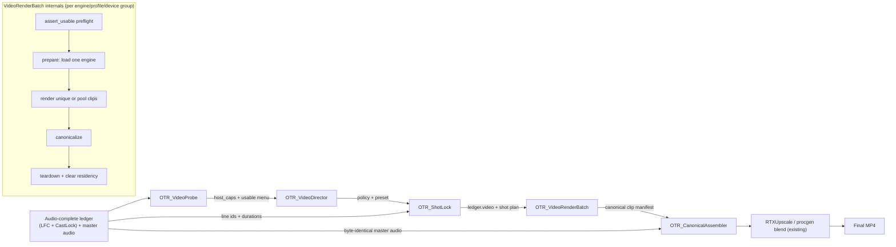
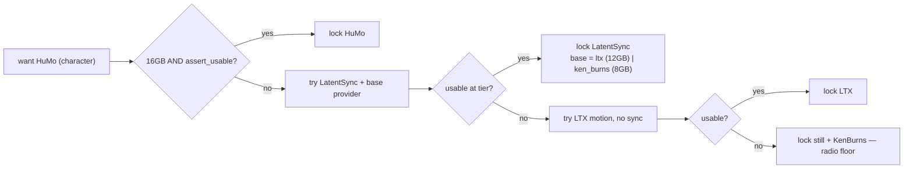

# OTR Video Engine Architecture — CONSOLIDATED FINAL

**What this is:** the distilled decision from the round-robin (Claude v1 + Perplexity + Report-1 + Report-25), reconciled into one lean, build-ready plan. Architecture only — audio is shipped and is not reopened.

**Where the four voices agreed (locked spine):** a **stable shell workflow** + a **registry of video engines** + **thin per-model adapters** + **declarative profile rows** + a **`ShotLock`** that stamps a `video` section into the one ledger after audio timing is known + **one generic render node** (load → render group → canonicalize → teardown, single-residency) + an **engine-agnostic canonical assembler** that composites silent normalized clips against the byte-identical master audio. Adding a model = adapter file + profile row(s), never graph surgery.

**Deltas merged in (mostly from Report-25, the most rigorous):** split user policy (`VideoDirector`) from the deterministic stamp (`ShotLock`); name the real ComfyUI primitives (`IS_CHANGED`, `VALIDATE_INPUTS`, lazy + `check_lazy_status`, `ExecutionBlocker`, node expansion + `GraphBuilder`); add a `prepare()` phase to the contract (MuseTalk-style avatar prep); store **published vs host-validated** requirements as separate profile fields; make **licensing first-class profile data**; use **layered cache keys** separating *generation identity* from *timeline binding*; and adopt the cost insight that **strategy dominates engine** for wall-clock. Pruned: the node-engine vendor survey, k8s/BYOF, symlink and OBS tangents, and all dynamic-JS-widget proposals (rejected — see §6).

---

## 1. The decision in one paragraph

Keep the visible ComfyUI graph **static and tiny** — five shell nodes plus the registry. All model identity lives in **Python adapters + a `video_profiles.yaml`**, resolved at runtime by a **capability probe** (self-limits the menu per machine) and locked into the ledger by **`ShotLock`** (the video analogue of the shipped `OTR_CastLock`). One generic **`VideoRenderBatch`** node groups shots by `(engine, profile, device_plan)`, loads one heavy engine at a time, renders, canonicalizes, and tears down — reusing your existing deferred-loader + `OTR_UnloadAll` + `gate_in/done` discipline. A future video model is **one adapter file + one or more profile rows** (and, if it is a lip-sync engine, one base-clip-provider declaration). The ledger stays the single source of truth; audio bytes are never touched; video is best-effort-deterministic via per-shot seeds carried in the cache key.

---

## 2. Shell topology (the only nodes the user sees)

| Shell node (OTR_ name) | Responsibility | Replaces / extends |
|---|---|---|
| `OTR_VideoProbe` | Detect installed adapters, present weights + transitive assets, ffmpeg, VRAM, CUDA/torch build, `flash_attn`/`sage`. Run each engine's `assert_usable`. Emit `host_caps` + the **usable** engine menu. | new (surface report via existing `OTR_WorkflowValidator`) |
| `OTR_VideoDirector` | Capture **policy only**: preset, per-role engine, clip strategy, pool size, canvas, fps, seed mode, fallback policy. Shows only probe-validated engines. | new (one clean policy surface, no model-spaghetti widgets) |
| `OTR_ShotLock` | After audio timing is frozen, resolve degradation + base-clip providers and **stamp `ledger['video']`** (one row per shot, generation-identity separated from timeline-binding). | analogue of `OTR_CastLock` |
| `OTR_VideoRenderBatch` | Group by `(engine, profile, device_plan)`; `prepare → render_clip(s) → canonicalize → teardown`; one heavy engine resident at a time. | replaces `OTR_BatchHumoRender` / `OTR_BatchLTXRender` / `OTR_HuMoTierLoader` / branch gates as the *public* topology |
| `OTR_CanonicalAssembler` | Composite normalized **silent** clips + procgen background + overlays; loop/retime per coverage map; mux against master audio. | upgrade of `OTR_VideoComposite` (1472×832, 512px pillar) + `OTR_EpisodeAssembler` |



**Roles are policy, not pipelines.** Do not mirror audio roles too literally. Role *types*: `character_video`, `announcer_visual`, `music_visual`, `scene_broll`, `background_abstract`. Each is a menu filter + default engine + default strategy in a profile row — the rendering stack is identical. (Convergent across all four reports.)

---

## 3. The engine contract (this is what makes it model-agnostic)

**Reframe that resolves the crux:** do **not** force one input signature. Normalize the **output** (`CanonicalClip`) and the **resolved request**; let the planner satisfy each engine's declared inputs first (inserting a base-clip *provider* when needed). The uniform surface is the five methods below, not the inputs.

```python
class VideoEngineProtocol:
    engine_id: str
    family: str  # audio_driven_face | lipsync_overlay | image_to_video | static_motion | abstract

    def assert_usable(self, host_caps, profile, request_template=None) -> UsabilityReport:
        """usable | usable_with_degradation | unusable + typed reason."""

    def prepare(self, host_caps, profile, session_ctx) -> PreparedSession:
        """Load weights / avatar state / schedulers. (MuseTalk-style prep is reusable.)"""

    def render_clip(self, request: VideoRequest, prepared: PreparedSession) -> RawClip:
        """Render ONE unique clip or ONE pool prototype."""

    def canonicalize(self, raw: RawClip, request: VideoRequest, profile) -> CanonicalClip:
        """Normalize fps / aspect policy / duration / metadata. Engine-side, declared by profile."""

    def teardown(self, prepared: PreparedSession) -> None:
        """Release VRAM, handles, temp state."""
```

**Family → required inputs (the four families behind one contract):**

| Family | Examples | `required_inputs` | base-clip provider? | `prepare()` matters | audio use |
|---|---|---|---|---|---|
| `audio_driven_face` | HuMo | `audio_ref`, `image_ref`(opt), `text_ref`(opt) | no | warmup | drives motion |
| `lipsync_overlay` | MuseTalk, LatentSync | **`base_clip_ref`** + `audio_ref` | **yes** (planner inserts) | **avatar prep reusable** | drives mouth |
| `image_to_video` | LTX-Video | `image_ref`(±`base_clip_ref`) | no | config | ignored (can serve as a provider) |
| `static_motion` | still + Ken Burns | `image_ref` or none | no | none | ignored |
| `abstract` | visualizer / station card / CRT | none or `image_ref` | no | none | ignored |

**Adapter descriptor** (what each adapter declares; `adapter_api_version` exists to prevent cache poisoning when semantics change): `engine_id, adapter_api_version, family, roles, required_inputs, optional_inputs, prepare_semantics, canonicalizer, supports_audio_output`. The `supports_audio_output` flag covers future joint-A/V models (LTX-2 class): the policy layer **discards** any generated audio so the master stays byte-identical.

**Normalized `VideoRequest`** (broad enough for every family, no model-native names leak into the graph): `request_id, shot_id, role, family_hint, profile_id, intent{premium|fast|fallback}, text_prompt?, image_ref?, audio_ref?, base_clip_ref?, timing{source_line_ids, target_duration_s, start_s}, canvas{w,h,fps,aspect_policy}, strategy{mode, pool_key, pool_size}, seed_bundle{episode_seed, request_seed, variation_seed}, quality{steps, guidance, motion_strength}, policy{mute_generated_audio, allow_auto_fallback, strict_sync_required}`.

**`CanonicalClip`** (what the assembler consumes — always silent): `clip_id, path, container, codec, pixel_format, w, h, fps, frame_count, duration_s, has_audio=false, alpha, engine_id, profile_id, family, request_hash, asset_hashes[], qc{render_status, warnings, fallback_applied}`.

---

## 4. Ledger obedience (the "must obey the ledger" requirement)

**`OTR_ShotLock` stamps a `video` section into the one ledger** after audio timing is frozen. No separate video ledger (avoids drift). The stamp **separates generation identity from timeline binding** so a loop-pool clip is generated once and bound to many lines:

```json
{ "video": {
  "video_revision": 3,
  "canonical_canvas": [1472, 832], "fps": 25,
  "locked_against_audio_rev": 7,
  "roles": { "character_video": {"default_strategy": "unique_per_line"},
             "music_visual": {"default_strategy": "loop_pool"} },
  "shots": [ {
    "shot_id": "s0042", "source_line_ids": ["l0042"],
    "engine_id": "latentsync", "profile_id": "latentsync_1_5", "family": "lipsync_overlay",
    "strategy": {"mode": "loop_pool", "pool_key": "char_anna_a", "variant": 2},
    "base_provider": "ken_burns",            // inserted by ShotLock at this tier
    "request_seed": 2198481, "target_duration_s": 5.84,
    "render_request_hash": "sha256:…", "binding_hash": "sha256:…",
    "cache_keys": {"base_motion":"…","overlay_render":"…","canonical_clip":"…"},
    "degradation_trail": ["humo:FAIL(vram<16)", "latentsync:OK"]
  } ] } }
```

`locked_against_audio_rev` ties video to the audio revision it was planned against — if audio is re-frozen, ShotLock invalidates. Audio is only **read**, never altered.

**Layered cache keys** (not one monolithic key — this is what makes loop-pool and overlay reuse correct):

| Layer | Key includes | Invalidated by |
|---|---|---|
| Asset | weight + asset hashes | any weight/asset change |
| Preprocess | portrait/audio-feature hash + preprocess version | crop / fps / feature extractor change |
| Pool prototype | normalized request **minus timeline binding** + seed + profile + model hash | profile / seed / input / prototype change |
| Overlay | base-clip hash + audio-feature hash + overlay params | base clip or audio change |
| Canonical | raw-clip hash + canonicalization policy | canvas / fps / duration / aspect change |
| Assembly | ordered clip manifest + timeline + overlays + master-audio hash | any clip or timeline change |

`IS_CHANGED` on the shell render node returns a digest over (normalized request JSON + profile_id + adapter_api_version + model/asset hashes + seed bundle) — never wall-clock. Where node expansion is used, `GraphBuilder` **deterministic subgraph IDs** keep partial reruns cache-correct.

---

## 5. Profiles = data (one adapter, many profiles)

`video_profiles.yaml` is where weights, defaults, requirements, licensing, and fallback order live. Two requirement modeling rules that kill the biggest risks:

1. **`published_requirements` and `host_validated_requirements` are separate fields.** Upstream README VRAM numbers ≠ local Comfy-wrapper behavior. The probe fills `host_validated` from local pilots; the planner trusts host-validated, treats published as a hint. (Kills "host drift" + "one VRAM class is too coarse.")
2. **Licensing is first-class** — `code_license`, `weight_license`, `transitive_asset_licenses`, `commercial_use`, `redistribution_ok`, `source_hashes`. Real because MuseTalk bundles Whisper/VAE/DWPose/S3FD under different terms; HuMo pulls Wan/Whisper; LTX checkpoint terms differ from its Apache code. A `license_blocked` profile is hidden or forced to fallback.

Each profile also carries `defaults` (fps/steps/guidance/size), an `asset_manifest` (weights + transitive assets with hashes), and a `fallback_chain`. Example fallback ladders: `humo → latentsync → musetalk → still_kenburns`; `latentsync → still_kenburns`; `still_kenburns → []`.

---

## 6. Master-workflow mechanism (decision + rejected alternatives)

**Decision: static shell graph + lazy evaluation + `VALIDATE_INPUTS` preflight + (optional) node expansion via `GraphBuilder`, strictly inside the render-node boundary.** The generic render node *either* calls adapter code directly (default — portable) *or* expands into a hidden internal subgraph when an engine is genuinely better as native Comfy nodes (e.g., a kijai WanVideoWrapper HuMo graph). Reserve the **headless emitter** for the opt-in inspectable path only; it reads the same registry so it can't drift.

ComfyUI primitives, mapped:
- `IS_CHANGED` → content-hash cache invalidation (§4).
- `VALIDATE_INPUTS` → preflight impossible preset/device/profile combos before any GPU work.
- lazy inputs + `check_lazy_status` → unused engine branches never evaluate (no manual muting).
- `ExecutionBlocker` → cleanly disable an impossible branch when a fallback is chosen.
- node expansion + `GraphBuilder` → materialize an engine subgraph with deterministic IDs, cached separately, without changing the visible graph.

**Rejected:**
- *A pile of per-GPU JSONs* — unmaintainable; violates "runs on any ComfyUI."
- *One fat static graph that branches for every engine* — bloats validation + cache, fights single-residency, grows with every model.
- *Dynamic JS frontend widgets that rewrite sockets per model (Report-1's lean)* — Report-1's own analysis shows dynamically created **unwired** sockets throw fatal "missing inputs" at pre-execution validation; mitigations (wildcards, registerExtension hooks) are fragile and version-coupled. Keep the shell static; model variability goes into adapter code + profiles. Advanced model-native knobs live only in an optional detail panel, never in the load-bearing path. (Also consistent with ComfyUI's UI-subgraph feature still being buggy/version-fragile — do not depend on it.)

---

## 7. Single-residency + graceful degradation

`OTR_VideoRenderBatch` groups work by `(engine_id, profile_id, device_plan)` and enforces **one resident heavy engine**: load → render every shot/prototype in the group → canonicalize → `teardown` → clear residency → next group. This reuses your shipped deferred-loader + `OTR_UnloadAll` pattern; the `gate_in/done` STRING chain serializes groups exactly as it serializes your audio roles today.

**Degradation** is resolved at ShotLock against tier + `assert_usable`, walking each role's `fallback_chain` and locking the first engine whose `host_validated_requirements` pass — recording `degradation_trail`. No manual rewiring.

**The base-clip seam (overlay engines on low VRAM)** is a tier-driven provider choice, not a contract problem: on 12 GB+, MuseTalk/LatentSync get an **LTX motion** base clip; on 8 GB / radio, they get a **Ken-Burns-on-portrait** base clip (zero VRAM). Same overlay engine, different `base_provider`. **Provider recursion is bounded:** providers are drawn only from `{image_to_video, static_motion}` — never another overlay — so resolution can't loop.

**Failure taxonomy → action** (deterministic): `dependency_missing|asset_missing|license_blocked` → fail fast before render, walk fallback; `insufficient_vram`/OOM-at-runtime → abort group safely, retry once with reduced batch if defined, else downshift profile/family; `corrupt_output` → retry once same seed, else reseed/fallback; `transient_io` → bounded retry; `engine_bug_on_host` → quarantine profile in a host-local blacklist until the probe changes.



---

## 8. Strategy & scaling (your loop lever)

Clip creation is a **policy choice resolved at plan time**, executed as **coverage at compositing**, not extra generation:

- `unique_per_line` — one generated clip per audio line. Highest quality/cost. Character default.
- `unique_per_scene` / **`hybrid_anchor`** — generate strong anchor clips, derive adjacent beats by trim/retime/in-out variants; reserve fresh generation for scene changes / semantic pivots, reuse for low-salience beats. (Perplexity + Report-25.)
- `loop_pool(pool_size)` — generate `pool_size` clips **once**; the assembler tiles/crossfades them across the timeline to cover line durations from the ledger. Cheapest. Music default (e.g. 3–4).
- `still_only` — one still/Ken-Burns held for the role. Announcer card default; the honest CPU/radio-tier floor for character.

**Cost model — strategy dominates engine for wall-clock:** a premium model in a 4-clip loop pool is often *cheaper* than a small model doing unique-per-beat. Model cost as `Σ warmups + Σ unique-render + Σ overlay-pass + Σ canonicalization + assembly − cache_saved`, not "which engine." `OTR_VideoDirector` exposes a **dry-run estimate** (engine, clip count, est. peak VRAM, est. render-sec/output-sec) before rendering, plus the key run metrics: peak VRAM by group, unique-clip ratio, pool-reuse factor, cache-hit ratio by layer, fallback frequency.

---

## 9. The add-a-model contract (the headline — zero graph surgery)

A future video model is:
1. **One adapter file** implementing the five-method `VideoEngineProtocol`; declare `family`, `required_inputs`, `prepare_semantics`, `canonicalizer`, `supports_audio_output`; implement `assert_usable`.
2. **One or more profile rows** in `video_profiles.yaml` (weights, defaults, `published`/`host_validated` requirements, `asset_manifest`, `license_manifest`, `fallback_chain`).
3. `register("newmodel", NewModelEngine)` → it appears in every eligible role menu the probe validates.
4. **If `lipsync_overlay`:** name the base-clip it needs so ShotLock attaches a provider. **If better as native nodes:** ship an optional expansion blueprint the render node materializes via `GraphBuilder`.

The shell graph, ShotLock, render node, and assembler are **never edited** to add a model. This is the exact mirror of how you add an audio engine today.

---

## 10. Build order + top risks

**Staged roadmap (prove the contract on cheap families first):**
1. **Registry scaffold** — registry, adapter loader, profile parser, `OTR_VideoProbe`. Exit: lists installed engines, filters menu per host.
2. **Policy shell** — `OTR_VideoDirector` + `OTR_ShotLock` stamping `ledger['video']`. Exit: policies serialize, stable request hashes.
3. **Low-risk families** — `still_kenburns`, `visualizer`, `abstract` + `OTR_CanonicalAssembler`. Exit: whole shell runs end-to-end with **no heavy models**.
4. **Overlay path** — MuseTalk/LatentSync + the base-clip provider interface. Exit: overlay runs with no graph edits. *(Solve overlay before HuMo — it proves the contract spans the hardest seam.)*
5. **i2v path** — LTX + loop-pool. Exit: one family supports unique and pool.
6. **Heavy multimodal** — HuMo last (heaviest, most config-rich; most likely to expose weak probe/tier assumptions).
7. **Hardening** — retry taxonomy, metrics, licensing manifest, host-local pilot DB. Optional: feed the package through your existing `comfyui-custom-node-survival-guide` regression vectors (ghost-node, VRAM-leak, widget-serialization, pipe-deadlock).

**Top risks (architectural, not cosmetic):**
- **Host drift** — mitigated by published-vs-host-validated requirement fields (§5).
- **Cache poisoning** — a clip reused after an upstream change because a transitive-asset hash was omitted; mitigated by `asset_hashes[]` in every key + `adapter_api_version`.
- **Graph sprawl by stealth** — if node expansion leaks past the render-node boundary, you slowly rebuild the hardwire you retired; keep expansion strictly internal.
- **License opacity** — code ≠ weights ≠ transitive assets; every profile surfaces all three.

---

## 11. Node set + what stays unchanged

**New / changed:** `OTR_VideoProbe`, `OTR_VideoDirector`, `OTR_ShotLock`, `OTR_VideoRenderBatch` (generic, replaces the per-model batch/loader/branch-gate nodes as public topology), `OTR_CanonicalAssembler` (upgrades `OTR_VideoComposite` + `OTR_EpisodeAssembler` with canonical-canvas + `fit_mode` + loop/coverage). Adapters (one file each): `humo`, `latentsync`, `musetalk`, `ltx_video`, `still_kenburns`, `visualizer`, `station_card`. Plus `video_profiles.yaml`; `register/get_engine/engines_for_role` reused from audio.

**Unchanged (the video layer slots beside the shipped audio registry):** `OTR_LedgerFreezeCascade`, `OTR_CastLock`, the audio role nodes, the `gate_in/done` chain, deferred/gate-bound loaders, `OTR_UnloadAll`, `OTR_RTXUpscale`, `OTR_SignalLostVideo` / procgen blend. Audio bytes are never touched.
