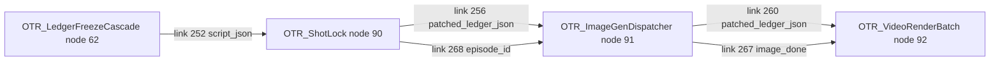

# `init_image` Contract Gap -- Fact-Checked Root Cause And Fix

## Problem

`humo_1.7B_169` is family `audio_driven_face`. That family requires both
`audio_ref` and `init_image`. When a final render request reaches HuMo with
`audio_ref` but without `asset_refs.init_image`, `_assert_family_inputs_satisfiable()`
raises `FamilyInputGap`. `render_shot()` wraps that as `RenderError` and re-raises.
There is no fallback chain in the current no-fallbacks renderer.

The operator-facing text says "LOUD skip down the chain", but in current code
that wording is stale: operationally it is a hard render failure.

## Confirmed Code Facts

- `FAMILY_REQUIRED_INPUTS["audio_driven_face"] == ("audio_ref", "init_image")`
  in `nodes/_otr_video_engines/schemas.py`.
- `_present_request_tokens()` reports `init_image` only when
  `"init_image" in request["asset_refs"]`.
- `build_request()` emits `asset_refs={"init_image": path}` only when the path is
  truthy; otherwise it emits `{}`.
- `_portrait_index()` accepts only image rows whose `kind` is `"portrait"` or
  empty/absent for legacy ledgers. It keys rows by `object_id` first, then
  `char_id`.
- `FamilyInputGap` is not caught by a fallback resolver. `render_shot()` catches
  it as `Exception`, classifies it as `DEPENDENCY_MISSING`, wraps it in
  `RenderError`, and re-raises.

## Real Workflow Order

From `workflows/otr_scifi_16gb_full.json`:

ShotLock is pre-image-dispatch. RenderBatch is post-image-dispatch. ShotLock's
optional `image_done` input is not wired in the saved workflow.

## Where The Contract Breaks

There are two separable failure modes that can surface the same missing
`init_image` text.

1. **Cast-time false halt.** ShotLock's
   `_assert_family_inputs_satisfiable_cast_time()` validates a request built from
   the pre-image ledger. At that phase, portraits, scene stills, radio-face
   stills, and mesh fodder may not exist in `ledger["images"]["images"]` yet.
   Treating their absence as a structural impossibility is a phase-order bug.

2. **Effective-engine mismatch.** A raw policy pick can differ from the engine
   render will actually use. For example, when `OTR_ENABLE_HUMO_HOSTS` is off,
   a HuMo-family `announcer_visual` or `music_visual` pick is structurally
   redirected to `ltx_audio_in`. A cast-time check that validates the raw HuMo
   family can falsely halt on a missing HuMo portrait even though render will use
   LTX and require different image assets.

The image dispatcher is not the normal HuMo portrait skip gap. Its
`_still_needed_for_role()` resolves the role's engine, honors
`OTR_FORCE_ENGINE_MAP`, mirrors the radio-is-host redirect, and then calls
`engine_consumes_still()`. HuMo-family engines consume still/init inputs, so a
character HuMo pick asks the image phase to mint a portrait.

## Important Nuance

`init_image` is not always a cast portrait keyed by `char_id`.

- Character HuMo uses a cast portrait keyed by `char_id`.
- HuMo host bookends under `OTR_ENABLE_HUMO_HOSTS=1` use
  `radio_host_portrait`, even when the beat has no `char_id`.
- Talking `ltx_audio_in` announcer bookends use the wide
  `still_announcer_visual_radio_face_169`.
- Scene-init engines use per-beat scene stills.
- Mesh engines use mesh_fodder / background-plate routing.

Therefore the cast-time fix must be phase-aware, not merely
`if beat.char_id: stub init_image`.

## Code-Ready Fix Shape

The fix is localized to `nodes/otr_shot_lock.py`:

1. Resolve the effective cast-time engine before validation:
   apply `OTR_FORCE_ENGINE_MAP`, then mirror the radio-is-host redirect for
   HuMo-family announcer/music roles when `OTR_ENABLE_HUMO_HOSTS` is off.
2. Check invocability on that effective engine.
3. Build the request with `build_request_from_shot()` so normal render routing
   and prompt/audio logic remain shared.
4. If the builder raises a known pre-image asset gap, build a cast-time request
   with `__cast_time_image__` and continue checking the remaining non-image
   tokens.
5. Keep the existing cast-time `audio_ref` and `base_clip_ref` stubs.
6. If `init_image` is the only missing family token after those stubs, defer it
   to ImageGenDispatcher/render-time validation and log loudly.
7. Leave render-time validation unchanged. A final HuMo request without
   `asset_refs.init_image` must still raise `RenderError`.

This preserves the no-fallbacks rule: no wrong-shaped request is fed to HuMo.
It only stops ShotLock from demanding downstream image-phase files before the
image phase has run.

## Verification To Run Before Commit

- Focused ShotLock regressions:
  - raw HuMo bookend pick validates against effective redirected `ltx_audio_in`
  - redirected announcer missing wide radio-face still defers at ShotLock time
  - character HuMo missing portrait defers at ShotLock time
  - render-time HuMo without `init_image` remains terminal
- Nearby routing suites:
  - `tests/test_video_platform_aseam.py`
  - `tests/test_brief_radio_host.py`
  - `tests/test_video_render_driver_perbeat_audio.py::TestRadioIsHostGuard`
  - `tests/test_ltx_audio_in_routing.py`
- Full repo suite:
  `C:\Users\jeffr\Documents\ComfyUI\.venv\Scripts\python.exe -m pytest -q -p no:cacheprovider`
- Bug Bible from
  `C:\Users\jeffr\Documents\ComfyUI\comfyui-custom-node-survival-guide` using
  the relative path `tests\bug_bible_regression.py`.
