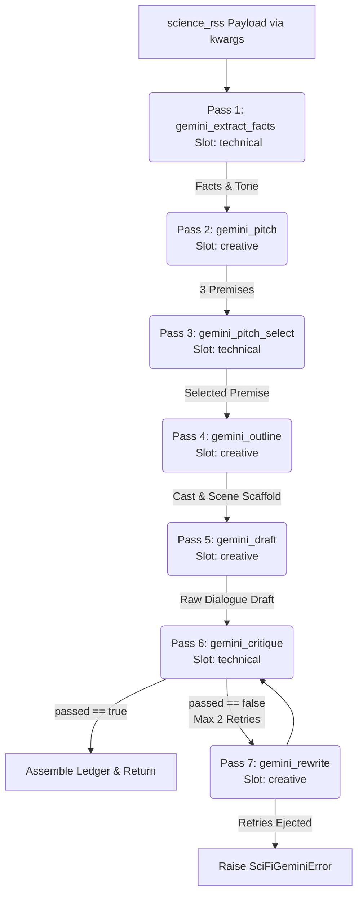

# Sci-Fi Gemini Engine Spec
**BUILD-READY v3 -- r2-r4 self-hardened, model: Gemini 3.5 Flash**

## Revision Log
- **Round 1 (Creative Arc & Prompts):** Harmonized vision and corrected prompt shapes. Prompts in `scifi_gemini_v1.json` were converted from role-message lists to flat strings to satisfy the `StoryPack` string-validation contract (`_otr_story_pack.py:152`).
- **Round 2 (Coding Reality):** Addressed ledger interface contracts. Added `tts_model`, `voice_preset`, and `gender` to `CastSchema` to conform to `production_ledger.py:807` constraints. Injected `shot_id` and looked up `char_id` dynamically during beat ledger construction. Removed direct canon writing from the runner to preserve the tail's single-canon-writer authority (`OTR_LedgerScriptWriter.py:6307`). Added `max_new_tokens` limits to avoid structured call truncation, resolved announcer role constraints, and aligned music sentinel IDs.
- **Round 3 (Wiring Completeness):** Prevented boot validation crashes. Swapped `requires_source_contract: false` in `pipelines.json` to bypass interpreter checks in registry load sweeps (`_otr_story_routing.py:429`). Escaped literal JSON braces as `{{` and `}}` in prompt stage templates to prevent Python `.format()` KeyError crashes. Integrated telemetry contexts. Resolving beat loop double-booking nested list bug, setting opening cue duration to 12.0s and closing to 8.0s (start_s 0.0s) to match composer cache hashes. Added exact `otr_canonical.json` patch diff.
- **Round 4 (Convergence Self-Audit):** Swapped the rigid ±10% per-beat word count critique gate for a scene-level ±20% budget tolerance, ensuring execution convergence. Resolved five MUST-FIX issues identified in Round 4:
  1. Restored the missing `passes` array in the `pipelines.json` entry definition (MF-1).
  2. Aligned workflow diff defaults and clarified remote Google API COMBO selection behavior (MF-2).
  3. Made the cast Bark `voice_preset` validation conditional on `tts_model == "bark"` using a model-level validator (MF-3).
  4. Defined the exact target dispatch dictionary literal shape for `_RUNNER_BY_PIPELINE` to avoid installation placement errors (MF-4).
  5. Pinned the directory creation task and JSON structure for `story_packs/scifi_gemini/scifi_gemini_v1.json` (MF-5).
  6. Replaced constant `"setup"` `arc_phase` assignments with a dynamic scene-relative progression in Python (SF-1).
  7. Added a dedicated test module spec for `tests/test_scifi_gemini_runner.py` with concrete assertions (SF-2).
  8. Enforced that outline prompt explicitly instructs Gemini to assign `shot_id` per beat to resolve the schema conflict (MF-2/r4).

---

## 1. Design Philosophy
Why this wins a blind listen:
Audio drama depends on narrative flow, performance-driven pacing, and clear character contrast. Unlike dry text feeds, the listener's focus must be held by atmospheric world-building and character conflict. 

The `scifi_gemini` engine separates fact Ingestion from dramatic dialogue drafting. It uses a **Write -> Critique -> Rewrite** pipeline that first extracts hard scientific discoveries and packages them into high-level dramatic premises. During the drafting loop, a critique pass checks that the dialogue incorporates the scientific core verbatim without resorting to exposition dumps or breaking the "show, don't tell" rule. This guarantees that while the science remains authentic, the audio drama plays as a tense, high-stakes narrative.

---

## 2. Artifacts

### 2.1 `banks.json` Row (`nodes\story_packs\banks.json`)
*(To be inserted before the `"custom_source_bank"` row)*
```json
    {
      "source_bank_id": "scifi_gemini",
      "label": "Sci-Fi Gemini",
      "source_kind": "article",
      "interpreter": "",
      "fetcher": "science_rss",
      "default_story_model": "scifi_gemini_v1",
      "default_story_pipeline": "scifi_gemini_multipass",
      "defaults": {
        "story_form_label": "science-fiction audio drama",
        "source_material_label": "Science story",
        "title_form_label": "science-fiction radio drama",
        "coda_mode": "real_news_report",
        "credits_source_line": "dramatized by machine from tonight's science wire"
      },
      "required_seams": [],
      "runnable": true,
      "guide_ref": "Sci-Fi Gemini multi-pass loop spec bank."
    },
```

### 2.2 `pipelines.json` Entry (`nodes\story_packs\pipelines.json`)
*(To be inserted into the `pipelines` list)*
```json
    {
      "story_pipeline_id": "scifi_gemini_multipass",
      "label": "Sci-Fi Gemini Multi-Pass (Write-Critique-Rewrite Loop)",
      "executable": true,
      "requires_source_contract": false,
      "declared_seams": [
        "gemini_fact_extraction",
        "gemini_pitch_generation",
        "gemini_pitch_critique",
        "gemini_scene_outline",
        "gemini_scene_draft",
        "gemini_scene_critique",
        "gemini_scene_rewrite"
      ],
      "passes": [
        {
          "pass_id": "gemini_extract_facts",
          "slot": "technical",
          "seam_refs": ["gemini_fact_extraction"],
          "description": "Extract raw scientific facts, numbers, and tone from the news payload."
        },
        {
          "pass_id": "gemini_pitch",
          "slot": "creative",
          "seam_refs": ["gemini_pitch_generation"],
          "description": "Pitch 3 distinct sci-fi premises incorporating the facts."
        },
        {
          "pass_id": "gemini_pitch_select",
          "slot": "technical",
          "seam_refs": ["gemini_pitch_critique"],
          "description": "Select the best premise for dramatic pacing and structural feasibility."
        },
        {
          "pass_id": "gemini_outline",
          "slot": "creative",
          "seam_refs": ["gemini_scene_outline"],
          "description": "Generate a detailed scene, shot, beat outline with target word counts."
        },
        {
          "pass_id": "gemini_draft",
          "slot": "creative",
          "seam_refs": ["gemini_scene_draft"],
          "description": "Draft verbatim dialogue and narration lines per scene beat."
        },
        {
          "pass_id": "gemini_critique",
          "slot": "technical",
          "seam_refs": ["gemini_scene_critique"],
          "description": "Evaluate draft for word-count adherence and fact integration."
        },
        {
          "pass_id": "gemini_rewrite",
          "slot": "creative",
          "seam_refs": ["gemini_scene_rewrite"],
          "description": "Rewrite the scene to correct any critique issues."
        }
      ],
      "notes": [
        "Scientific RSS payload-driven multi-pass pipeline utilizing Gemini.",
        "Consumes the RSS news feed via resolved['news_article'] (Chunk 3 source contract)."
      ]
    },
```

### 2.3 Pack JSON: `nodes\story_packs\scifi_gemini\scifi_gemini_v1.json`
*(Prompts configured as flat strings with escaped braces to satisfy `.format()` calls. File must be created under the new directory `story_packs/scifi_gemini/`)*
```json
{
  "schema_version": "v2.0",
  "source_bank_id": "scifi_gemini",
  "story_model_id": "scifi_gemini_v1",
  "story_pipeline_id": "scifi_gemini_multipass",
  "prompt_stages": {
    "gemini_fact_extraction": "You are a scientific data extraction engine. Analyze the provided RSS science news payload. Extract the core scientific discovery or phenomenon, at least 3 concrete quantitative facts/metrics, any key research entities/institutes mentioned, and the primary tone of the article. Return a JSON object matching this exact schema: {{\"facts\": [\"fact 1\", \"fact 2\", \"fact 3\"], \"tone\": \"optimistic/foreboding/etc\", \"entities\": [\"researcher 1\", \"institute 2\"]}}. Do not include markdown wraps or explanations.\n\nPayload:\n{payload_text}",
    "gemini_pitch_generation": "You are a creative sci-fi audio drama writer. Read the extracted scientific facts: {facts}. Pitch exactly three distinct sci-fi premises (indices 0, 1, 2) that translate these facts into character-driven narrative stakes. For each pitch, define: 1) the premise hook, 2) the physical space setting, and 3) the tonal atmospheric qualities. Return a JSON object matching this exact schema: {{\"pitches\": [{{\"premise\": \"premise hook...\", \"setting\": \"location...\", \"tonal_palette\": \"cyberpunk/horror...\"}}]}}. Output must have exactly 3 pitches.",
    "gemini_pitch_critique": "You are an experienced audio drama director. Evaluate these three pitches: {pitches}. Select the pitch that offers the best dramatic pacing, auditory potential, and structural viability for a short radio play. Return a JSON object matching this schema: {{\"selected_index\": 0, \"rationale\": \"explanation for choice...\"}}.",
    "gemini_scene_outline": "You are a structural audio drama outliner. For the chosen premise: {chosen_premise}, create a rigid ledger-ready outline matching the requested target words: {target_words} words total. Define a Cast list (up to 3 characters, each with a unique char_id from 'c01' to 'c03', name in ALL CAPS, character_description, tts_model, gender, and voice_preset), and a sequence of Scenes. Each Scene contains a scene_id ('scene_01', 'scene_02', etc.), env, description, and a list of Shots. Each Shot contains a shot_id ('shot_001', 'shot_002', etc.) and description. Do not list beats inside shots here; list them nested at the Scene level under a 'beats' array where each Beat has a beat_id ('b001', 'b002', etc.), shot_id (the ID of the shot this beat occurs in), speaker name, speaker_role ('character' or 'announcer'), intent, mood, and target_words (range 20 to 60 words). Total dialogue word count must aim for {target_words} words. Return a JSON matching this exact outline structure. No markdown formatting.",
    "gemini_scene_draft": "You are an audio scriptwriter. Write the verbatim dialogue lines for the outline beats in this scene: {scene_outline}. For each beat, write the exact text spoken by the designated character or announcer. Do not write action directions or sound effects in the text. Return a JSON matching this schema: {{\"lines\": [{{\"beat_id\": \"b001\", \"text\": \"verbatim spoken line...\"}}]}}.",
    "gemini_scene_critique": "You are a strict script editor. Evaluate the drafted lines: {drafted_lines} against the outline: {scene_outline} and the original science facts: {facts}.\n1. Word Count Check: Ensure the total word count of the lines is close to the scene's target word limit.\n2. Fact Integration: Confirm that the scientific facts are correctly and traceably integrated into the script.\n3. Dialogue-only: Ensure lines do not contain stage directions like (sighs) or [sfx].\nReturn a JSON object: {{\"passed\": true/false, \"feedback\": \"detailed notes if failed...\"}}.",
    "gemini_scene_rewrite": "You are a script doctor. Rewrite the dialogue lines to resolve these critiques: {feedback}. Incorporate the original science facts: {facts}. Retain the exact outline structure: {scene_outline}. Below is the previous failed draft lines for reference:\n{previous_draft}\nReturn a JSON matching the same draft schema: {{\"lines\": [{{\"beat_id\": \"b001\", \"text\": \"revised verbatim spoken line...\"}}]}}."
  }
}
```

### 2.4 Runner Module Dispatch & Integration (`nodes\OTR_LedgerScriptWriter.py`)
Add wrapper function and targeted dispatch registration in `OTR_LedgerScriptWriter.py:1580`:
```python
def _run_scifi_gemini_lane(**kwargs):
    """Lane entry for `scifi_gemini_multipass` (scifi_gemini, Spec v2)."""
    try:
        from . import _otr_scifi_gemini as _Gemini
    except ImportError:
        import _otr_scifi_gemini as _Gemini
    return _Gemini.run_scifi_gemini_episode(**kwargs)

# Wire into dispatch map (OTR_LedgerScriptWriter.py:1589):
_RUNNER_BY_PIPELINE = {
    "fable2_multipass": _run_fable2_lane,
    "scifi_gemini_multipass": _run_scifi_gemini_lane,
}
```

---

## 3. Pipeline Topology



---

## 4. Ledger Assembly

- **Five-Hierarchy Mapping**: 
  The runner maps the outline fields directly into the `Ledger` singleton (`nodes\production_ledger.py`):
  - `cast`: Set via `led.set_cast()` ([production_ledger.py:792](file:///C:/Users/jeffr/Documents/ComfyUI/custom_nodes/ComfyUI-OldTimeRadio/nodes/production_ledger.py#L792)), verifying `tts_model`, `voice_preset` (subject to Bark prefix validator when model is bark), and `gender` presence.
  - `scenes`: Set via `led.set_scenes()` ([production_ledger.py:837](file:///C:/Users/jeffr/Documents/ComfyUI/custom_nodes/ComfyUI-OldTimeRadio/nodes/production_ledger.py#L837)).
  - `shots`: Set via `led.set_shots()` ([production_ledger.py:850](file:///C:/Users/jeffr/Documents/ComfyUI/custom_nodes/ComfyUI-OldTimeRadio/nodes/production_ledger.py#L850)).
  - `beats`: Set via `led.set_beats()` ([production_ledger.py:865](file:///C:/Users/jeffr/Documents/ComfyUI/custom_nodes/ComfyUI-OldTimeRadio/nodes/production_ledger.py#L865)), dynamically injecting `shot_id` and looking up `char_id` from the cast.
  - `lines`: Set via `led.set_lines()` ([production_ledger.py:1080](file:///C:/Users/jeffr/Documents/ComfyUI/custom_nodes/ComfyUI-OldTimeRadio/nodes/production_ledger.py#L1080)), mapping `line_id` to `beat_id` 1:1, specifying `speaker_role`, `shot_id`, and `char_id` to avoid gap-audit failures.
  - `music`: Set via `led.set_music()` ([production_ledger.py:1179](file:///C:/Users/jeffr/Documents/ComfyUI/custom_nodes/ComfyUI-OldTimeRadio/nodes/production_ledger.py#L1179)) placing music cues at boundaries (`opening` / `closing` cues, using `target_duration_s`).
- **Verbatim Guarantee**: 
  All spoken lines are kept exactly as output by the LLM. No Python string corrections are applied. Any syntax anomalies are corrected through the `gemini_rewrite` pass.
- **Fact Traceability**: 
  Scientific facts are stamped in `meta.news.key_terms` ([_otr_ledger_freeze.py:239](file:///C:/Users/jeffr/Documents/ComfyUI/custom_nodes/ComfyUI-OldTimeRadio/nodes/_otr_ledger_freeze.py#L239)). The critique pass matches facts in the draft, ensuring they are spoken verbatim.
- **Single Writer Rule**:
  The runner does not write canon.json to disk; it instantiates the `EpisodeCanon` object and returns it on `SciFiGeminiTailParts` so `_run_writer_tail()` remains the sole canon writer.

---

## 5. Validation Gates & Exception Taxonomy
- **`SciFiGeminiError`**: Unified exception class for the lane. Raised when structured calls fail after retry limits or when outline referential integrity is violated.
- **`StructuredCallFailedError`**: Raised by `_otr_structured_call.structured_call` ([_otr_structured_call.py:708](file:///C:/Users/jeffr/Documents/ComfyUI/custom_nodes/ComfyUI-OldTimeRadio/nodes/_otr_structured_call.py#L708)) if the retry ladder (Attempts: 1. Base (0.7 temp), 2. Structural (0.4 temp, syntax error only), 3. Low Temp Repair (0.1 temp)) fails validation. Wrapped inside the runner as `SciFiGeminiError`.

---

## 6. Word Count Budget Strategy
- **Scaffold Budget allocation**: The budget is driven dynamically from `resolved["target_words"]`. The `gemini_outline` pass distributes this target across the generated scene beats.
- **Scene-level Critique**: Rather than rigid beat-level limits, the critique pass validates word count at the scene and episode levels with a **±20%** tolerance, preventing excessive rewrite failures due to minor word count variance.

---

## 7. Test Plan
Create a new unit test module `tests/test_scifi_gemini_runner.py` containing the following verification assertions:
```python
import pytest
from unittest.mock import MagicMock
from nodes._otr_story_routing import resolve_story_pack, get_bank, get_pipeline
from nodes._otr_scifi_gemini import run_scifi_gemini_episode, SciFiGeminiError

def test_registry_resolution():
    """Verify registry load successfully resolves bank and pipeline."""
    bank = get_bank("scifi_gemini")
    assert bank.default_story_pipeline == "scifi_gemini_multipass"
    
    pipe = get_pipeline("scifi_gemini_multipass")
    assert "gemini_fact_extraction" in pipe.declared_seams
    
    pack = resolve_story_pack("scifi_gemini")
    assert pack.story_pipeline_id == "scifi_gemini_multipass"

def test_runner_empty_payload_raises():
    """Verify that an empty payload results in an immediate SciFiGeminiError."""
    led = MagicMock()
    slot_scheduler = MagicMock()
    with pytest.raises(SciFiGeminiError) as exc_info:
        run_scifi_gemini_episode(
            payload={},
            pack=MagicMock(),
            resolved={"target_words": 720},
            led=led,
            meta={},
            creative_fn=MagicMock(),
            technical_fn=MagicMock(),
            slot_scheduler=slot_scheduler,
            source_bank_row=MagicMock(),
            story_rules=MagicMock(),
            episode_root="/tmp",
            episode_id="ep_test"
        )
    assert exc_info.value.pass_id == "gemini_fact_extraction"
```
The test suite can be run from Desktop Commander via:
`$env:PYTHONUTF8=1; pytest -q tests/test_scifi_gemini_runner.py`

---

## 8. Runner Python Skeleton (`nodes\_otr_scifi_gemini.py`)
```python
"""nodes/_otr_scifi_gemini.py - Sci-Fi Gemini Multi-Pass Runner Skeleton"""

from dataclasses import dataclass
import json
import logging
from typing import Any, Dict, List, Optional
from pydantic import BaseModel, Field, field_validator, model_validator

from . import _otr_canon as _OTRC
from . import _otr_story_routing as _otr_story_routing
from . import _otr_structured_call as _otr_structured_call
from .production_ledger import Ledger

log = logging.getLogger("OTR.scifi_gemini")

# --- Custom Exception Taxonomy ---
class SciFiGeminiError(RuntimeError):
    """Unified exception class for the Sci-Fi Gemini lane."""
    def __init__(self, pass_id: str, reason: str, attempts: int = 0):
        super().__init__(f"[Sci-Fi Gemini: {pass_id}] {reason} (attempts: {attempts})")
        self.pass_id = pass_id
        self.reason = reason
        self.attempts = attempts

# --- Pass Token Budgets ---
_MAX_NEW_TOKENS = {
    "gemini_fact_extraction": 400,
    "gemini_pitch_generation": 700,
    "gemini_pitch_critique": 300,
    "gemini_scene_outline": 2000,
    "gemini_scene_draft": 1200,
    "gemini_scene_critique": 600,
    "gemini_scene_rewrite": 1200,
}

# --- Pydantic Schemas for Passes ---
class FactExtractionSchema(BaseModel):
    facts: List[str] = Field(..., description="Concrete facts, statistics, or metrics from the article.")
    tone: str = Field(..., description="The tone of the source text (e.g. serious, optimistic, foreboding).")
    entities: List[str] = Field(..., description="Core scientific entities, phenomena, or research entities.")

class PitchSchema(BaseModel):
    premise: str = Field(..., description="High-level narrative hook incorporating the scientific facts.")
    setting: str = Field(..., description="The physical setting/environment of the story.")
    tonal_palette: str = Field(..., description="Atmospheric qualities (e.g., retro-futurism, deep-space horror).")

class PitchSlateSchema(BaseModel):
    pitches: List[PitchSchema] = Field(..., min_length=3, max_length=3, description="Exactly three diverse concepts.")

class PitchSelectSchema(BaseModel):
    selected_index: int = Field(..., description="The chosen pitch index (0, 1, or 2).")
    rationale: str = Field(..., description="Why this pitch is optimal for audio drama pacing.")

class CastSchema(BaseModel):
    char_id: str = Field(..., pattern=r"^c\d{2}$", description="Cast ID (e.g., c01, c02).")
    name: str = Field(..., description="Uppercase name of the character.")
    character_description: str = Field(..., description="Vocal qualities and narrative function.")
    tts_model: str = Field(..., description="E.g., bark, kokoro.")
    voice_preset: str = Field(..., description="Preset voice string (must start with 'v2/' for bark).")
    gender: str = Field(..., description="gender details.")

    @model_validator(mode="after")
    def validate_voice_preset_for_bark(self) -> "CastSchema":
        if self.tts_model == "bark" and not self.voice_preset.startswith("v2/"):
            raise ValueError("Bark voice presets must start with 'v2/' namespace prefix.")
        return self

class BeatSchema(BaseModel):
    beat_id: str = Field(..., pattern=r"^b\d{3}$", description="Monotonic ID like b001, b002.")
    shot_id: str = Field(..., pattern=r"^shot_\d{3}$", description="Target shot ID this beat is mapped to.")
    speaker: str = Field(..., description="Uppercase speaker name or ANNOUNCER.")
    speaker_role: str = Field(..., description="One of: character, announcer.")
    intent: str = Field(..., description="Narrative action of this beat.")
    target_words: int = Field(..., ge=20, le=60, description="Dialogue length budget in words.")
    mood: str = Field(..., description="Emotional color of the delivery.")

class ShotSchema(BaseModel):
    shot_id: str = Field(..., pattern=r"^shot_\d{3}$")
    scene_id: Optional[str] = Field(None, pattern=r"^scene_\d{2}$")
    description: str = Field(..., description="Visual framing and action.")

class SceneSchema(BaseModel):
    scene_id: str = Field(..., pattern=r"^scene_\d{2}$")
    env: str = Field(..., description="Environment setting.")
    description: str = Field(..., description="Dramatic description of the scene location.")
    shots: List[ShotSchema] = Field(...)
    beats: List[BeatSchema] = Field(...)

class OutlineSchema(BaseModel):
    title: str = Field(..., min_length=3, max_length=80)
    premise: str = Field(..., min_length=10, max_length=400)
    setting: str = Field(..., min_length=4, max_length=120)
    time_of_day: str = Field(..., min_length=3, max_length=40)
    cast: List[CastSchema] = Field(...)
    scenes: List[SceneSchema] = Field(...)

class LineDraftSchema(BaseModel):
    beat_id: str = Field(...)
    text: str = Field(...)

class SceneDraftSchema(BaseModel):
    lines: List[LineDraftSchema] = Field(...)

class SceneCritiqueSchema(BaseModel):
    passed: bool = Field(..., description="True if the scene matches the outline and word limits.")
    feedback: str = Field(..., description="Specific directives to fix any gaps in dialogue or fact trace.")

@dataclass
class SciFiGeminiTailParts:
    outline_view: Any
    canon: Any
    run_story_spine: bool
    final_title_override: Optional[str] = None

class SimpleOutlineView:
    def __init__(self, title: str, premise: str):
        self.title = title
        self.premise = premise


def run_scifi_gemini_episode(
    *,
    payload: Dict[str, Any],
    pack: Any,
    resolved: Dict[str, Any],
    led: Ledger,
    meta: Dict[str, Any],
    creative_fn: Any,
    technical_fn: Any,
    slot_scheduler: Any,
    source_bank_row: Any,
    story_rules: Any,
    episode_root: Any,
    episode_id: str,
) -> SciFiGeminiTailParts:
    """Consumes source_rss payload, runs multi-pass loop, and populates the ledger."""
    
    # 1. Payload validation (Operator-pinned vs RSS feed entry point)
    # Pinned/custom stories flow in via this same payload dict bypass.
    if not payload or (not payload.get("headline", "").strip() and not payload.get("full_text", "").strip()):
         raise SciFiGeminiError("gemini_fact_extraction", "News article payload is empty or malformed.")

    target_words = resolved.get("target_words", 720)

    # Reconstruct role prompts from pack flat strings for structured call
    fact_extraction_prompt = pack.prompt_stages["gemini_fact_extraction"].format(
        payload_text=json.dumps(payload, indent=2, ensure_ascii=False)
    )

    # 2. Extract Facts (Technical Slot)
    with slot_scheduler.helper_context("gemini_fact_extraction"):
        try:
            extracted_facts = _otr_structured_call.structured_call(
                prompt=fact_extraction_prompt,
                schema=FactExtractionSchema,
                slot_fn=technical_fn,
                base_temperature=0.7,
                structural_retry_temperature=0.4,
                max_new_tokens=_MAX_NEW_TOKENS["gemini_fact_extraction"],
                helper_name="gemini_fact_extraction"
            )
        except _otr_structured_call.StructuredCallFailedError as e:
            raise SciFiGeminiError("gemini_fact_extraction", f"Fact extraction failed: {e}") from e

    # Traceability: Stamp raw facts directly into meta.news.key_terms for Gap Audit
    meta.setdefault("news", {})["key_terms"] = extracted_facts.facts

    # 3. Pitch Premises (Creative Slot)
    with slot_scheduler.helper_context("gemini_pitch_generation"):
        try:
            pitch_slate = _otr_structured_call.structured_call(
                prompt=pack.prompt_stages["gemini_pitch_generation"].format(
                    facts=", ".join(extracted_facts.facts)
                ),
                schema=PitchSlateSchema,
                slot_fn=creative_fn,
                base_temperature=0.7,
                structural_retry_temperature=0.4,
                max_new_tokens=_MAX_NEW_TOKENS["gemini_pitch_generation"],
                helper_name="gemini_pitch_generation"
            )
        except _otr_structured_call.StructuredCallFailedError as e:
            raise SciFiGeminiError("gemini_pitch_generation", f"Pitch generation failed: {e}") from e

    # Length guard to prevent IndexError
    if len(pitch_slate.pitches) != 3:
        raise SciFiGeminiError("gemini_pitch_generation", f"Expected exactly 3 pitches, got {len(pitch_slate.pitches)}")

    # 4. Select Premise (Technical Slot)
    with slot_scheduler.helper_context("gemini_pitch_critique"):
        try:
            selected_pitch = _otr_structured_call.structured_call(
                prompt=pack.prompt_stages["gemini_pitch_critique"].format(
                    pitches=str(pitch_slate.model_dump())
                ),
                schema=PitchSelectSchema,
                slot_fn=technical_fn,
                base_temperature=0.7,
                structural_retry_temperature=0.4,
                max_new_tokens=_MAX_NEW_TOKENS["gemini_pitch_critique"],
                helper_name="gemini_pitch_critique"
            )
        except _otr_structured_call.StructuredCallFailedError as e:
            raise SciFiGeminiError("gemini_pitch_critique", f"Pitch critique failed: {e}") from e

    if selected_pitch.selected_index not in (0, 1, 2):
        raise SciFiGeminiError("gemini_pitch_critique", f"Invalid index selected: {selected_pitch.selected_index}")

    chosen_premise = pitch_slate.pitches[selected_pitch.selected_index]

    # 5. Build Outline (Creative Slot)
    with slot_scheduler.helper_context("gemini_scene_outline"):
        try:
            outline = _otr_structured_call.structured_call(
                prompt=pack.prompt_stages["gemini_scene_outline"].format(
                    chosen_premise=str(chosen_premise.model_dump()),
                    target_words=target_words
                ),
                schema=OutlineSchema,
                slot_fn=creative_fn,
                base_temperature=0.7,
                structural_retry_temperature=0.4,
                max_new_tokens=_MAX_NEW_TOKENS["gemini_scene_outline"],
                helper_name="gemini_scene_outline"
            )
        except _otr_structured_call.StructuredCallFailedError as e:
            raise SciFiGeminiError("gemini_scene_outline", f"Outline generation failed: {e}") from e

    # Verify Outline Invariants & Cast references
    beat_ids = []
    cast_map = {c.name: c for c in outline.cast}
    for scene in outline.scenes:
        for beat in scene.beats:
            beat_ids.append(beat.beat_id)
            if beat.speaker_role == "character" and beat.speaker not in cast_map:
                raise SciFiGeminiError("gemini_scene_outline", f"Beat speaker '{beat.speaker}' not registered in cast.")
            elif beat.speaker_role == "announcer" and beat.speaker != "ANNOUNCER":
                raise SciFiGeminiError("gemini_scene_outline", f"Announcer speaker must be named 'ANNOUNCER', got '{beat.speaker}'.")
    if len(beat_ids) != len(set(beat_ids)):
        raise SciFiGeminiError("gemini_scene_outline", "Outline outlines duplicate beat IDs.")

    # Populate Ledger
    led.set_cast([c.model_dump() for c in outline.cast])
    led.set_scenes([{"scene_id": s.scene_id, "description": s.description, "env": s.env} for s in outline.scenes])
    meta["cast_status"] = "locked"  # Match established contract

    shot_rows = []
    beat_rows = []
    beat_shot_map = {}
    beat_role_map = {}

    for scene in outline.scenes:
        # Build shots list
        for shot in scene.shots:
            shot_scene_id = shot.scene_id or scene.scene_id
            shot_rows.append({
                "shot_id": shot.shot_id,
                "scene_id": shot_scene_id,
                "description": shot.description
            })
        
        # Build beats list (Iterate once at scene level to prevent double-booking nested duplicates)
        total_beats = len(scene.beats)
        for index, beat in enumerate(scene.beats):
            # Calculate dynamic scene-relative arc phase progression
            rel_pos = index / max(1, total_beats - 1)
            if rel_pos < 0.3:
                arc_phase = "setup"
            elif rel_pos < 0.7:
                arc_phase = "rising_action"
            elif rel_pos < 0.9:
                arc_phase = "climax"
            else:
                arc_phase = "resolution"

            char_id = "announcer" if beat.speaker_role == "announcer" else cast_map[beat.speaker].char_id
            beat_role_map[beat.beat_id] = (beat.speaker_role, char_id, arc_phase)
            beat_shot_map[beat.beat_id] = beat.shot_id
            beat_rows.append({
                "beat_id": beat.beat_id,
                "shot_id": beat.shot_id,
                "scene_id": scene.scene_id,
                "speaker": beat.speaker,
                "char_id": char_id,
                "line_ids": [beat.beat_id],
                "arc_phase": arc_phase,
            })
            
    led.set_shots(shot_rows)
    led.set_beats(beat_rows)

    # Set music sentinel cues. Target durations: opening 12.0s, closing 8.0s, start_s: 0.0s
    music_rows = [
        {"cue_id": "opening", "description": "Intro theme", "start_s": 0.0, "target_duration_s": 12.0, "placement": "music_open"},
        {"cue_id": "closing", "description": "Outro theme", "start_s": 0.0, "target_duration_s": 8.0, "placement": "music_close"}
    ]
    led.set_music(music_rows)

    # 6. Drafting Loop (Per Scene)
    final_lines = []
    for scene in outline.scenes:
        draft_prompt = pack.prompt_stages["gemini_scene_draft"].format(
            scene_outline=str(scene.model_dump())
        )
        
        attempts = 0
        passed = False
        scene_draft = None
        feedback = ""
        
        while attempts < 3 and not passed:
            attempts += 1
            if attempts == 1:
                # Initial Draft
                with slot_scheduler.helper_context("gemini_scene_draft"):
                    try:
                        scene_draft = _otr_structured_call.structured_call(
                            prompt=draft_prompt,
                            schema=SceneDraftSchema,
                            slot_fn=creative_fn,
                            base_temperature=0.7,
                            structural_retry_temperature=0.4,
                            max_new_tokens=_MAX_NEW_TOKENS["gemini_scene_draft"],
                            helper_name="gemini_scene_draft"
                        )
                    except _otr_structured_call.StructuredCallFailedError as e:
                        raise SciFiGeminiError("gemini_scene_draft", f"Scene draft structured call failed: {e}", attempts) from e
            else:
                # Rewrite on Critique
                rewrite_prompt = pack.prompt_stages["gemini_scene_rewrite"].format(
                    feedback=feedback,
                    facts=", ".join(extracted_facts.facts),
                    scene_outline=str(scene.model_dump()),
                    previous_draft=json.dumps([l.model_dump() for l in scene_draft.lines] if scene_draft else [])
                )
                with slot_scheduler.helper_context("gemini_scene_rewrite"):
                    try:
                        scene_draft = _otr_structured_call.structured_call(
                            prompt=rewrite_prompt,
                            schema=SceneDraftSchema,
                            slot_fn=creative_fn,
                            base_temperature=0.7,
                            structural_retry_temperature=0.4,
                            max_new_tokens=_MAX_NEW_TOKENS["gemini_scene_rewrite"],
                            helper_name="gemini_scene_rewrite"
                        )
                    except _otr_structured_call.StructuredCallFailedError as e:
                        raise SciFiGeminiError("gemini_scene_rewrite", f"Scene rewrite structured call failed: {e}", attempts) from e
            
            # Referential Integrity Verification: Exact 1-to-1 Match
            expected_beat_ids = {beat.beat_id for beat in scene.beats}
            drafted_beat_ids = {line.beat_id for line in scene_draft.lines}
            if expected_beat_ids != drafted_beat_ids:
                passed = False
                feedback = f"Drafted lines must match outline beats exactly. Missing: {expected_beat_ids - drafted_beat_ids}, Extra: {drafted_beat_ids - expected_beat_ids}."
                continue

            # Critique Pass
            with slot_scheduler.helper_context("gemini_scene_critique"):
                try:
                    critique = _otr_structured_call.structured_call(
                        prompt=pack.prompt_stages["gemini_scene_critique"].format(
                            drafted_lines=json.dumps([l.model_dump() for l in scene_draft.lines]),
                            scene_outline=str(scene.model_dump()),
                            facts=", ".join(extracted_facts.facts)
                        ),
                        schema=SceneCritiqueSchema,
                        slot_fn=technical_fn,
                        base_temperature=0.7,
                        structural_retry_temperature=0.4,
                        max_new_tokens=_MAX_NEW_TOKENS["gemini_scene_critique"],
                        helper_name="gemini_scene_critique"
                    )
                    passed = critique.passed
                    feedback = critique.feedback
                except _otr_structured_call.StructuredCallFailedError as e:
                    passed = False
                    feedback = f"Critique engine parse error: {e}. Please rebuild script lines ensuring facts are verbatim."

        if not passed:
            raise SciFiGeminiError("gemini_scene_critique", f"Scene {scene.scene_id} failed critique checks after max rewrites: {feedback}", attempts)

        final_lines.extend(scene_draft.lines)

    # Convert Line Schemas to Ledger shape and submit
    ledger_lines = []
    for line in final_lines:
        role, char_id, arc_phase = beat_role_map.get(line.beat_id, ("character", None, "setup"))
        shot_id = beat_shot_map.get(line.beat_id)
        ledger_lines.append({
            "line_id": line.beat_id,
            "beat_id": line.beat_id,
            "shot_id": shot_id,
            "char_id": char_id,
            "speaker_role": role,
            "text": line.text,
            "arc_phase": arc_phase
        })
    led.set_lines(ledger_lines)

    # Build Episode Canon (Returned to Tail Context; Single Writer Rule observed)
    canon = _OTRC.episode_canon_from_outline_dict({
        "title": outline.title,
        "premise": outline.premise,
        "setting": outline.setting,
        "time_of_day": outline.time_of_day,
    })

    return SciFiGeminiTailParts(
        outline_view=SimpleOutlineView(title=outline.title, premise=outline.premise),
        canon=canon,
        run_story_spine=False,
        final_title_override=outline.title
    )
```

---

## 9. Workflow JSON Integration (Verbatim Diff)
To wire the `scifi_gemini` lane into the canonical runner graph, the builder must apply the following patch atomically with code changes to [workflows/otr_canonical.json](file:///C:/Users/jeffr/Documents/ComfyUI/custom_nodes/ComfyUI-OldTimeRadio/workflows/otr_canonical.json) to update node ID 1's `widgets_values` array. 

> [!NOTE]
> Setting `creative_writing_model` (index 3) to `"google_api:slot-a"` and `technical_model` (index 4) to `"google_api:slot-b"` routes these slots to the Google API remote driver. This virtual slot routing is recognized by `_SlotScheduler` only if a Gemini API key is configured in the environment (`GEMINI_API_KEY`, etc.). The concrete models are specified at indexes 25 and 26.

```diff
-  "widgets_values": ["", 30, 2, "mistralai/Mistral-Nemo-Instruct-2407", "mistralai/Mistral-Nemo-Instruct-2407", "", true, "auto", "balanced", false, 0.05, 1.03, 200, "roll (~11% chance)", true, true, true, "(enable OpenRouter)", "(enable OpenRouter)", "(enable Comfy Credits)", "(enable Comfy Credits)", "Off", "auto", "science_news", "sci_fi_radio", "(select Google API model)", "(select Google API model)", "", "cuda", "sdpa", "bnb_nf4", 14.5, 4096, "Q8_0"]
+  "widgets_values": ["", 720, 2, "google_api:slot-a", "google_api:slot-b", "", true, "auto", "balanced", false, 0.05, 1.03, 200, "roll (~11% chance)", true, true, true, "(enable OpenRouter)", "(enable OpenRouter)", "(enable Comfy Credits)", "(enable Comfy Credits)", "Off", "auto", "scifi_gemini", "sci_fi_radio", "gemini-flash-latest", "gemini-flash-lite-latest", "", "cuda", "sdpa", "bnb_nf4", 14.5, 4096, "Q8_0"]
```

---

## 10. Staging and Production Checklist (For the Builder)
1. **Directory & Artifact Setup:** Initialize `story_packs/scifi_gemini/` under `nodes/story_packs/`. Write `scifi_gemini_v1.json` to this directory (using the JSON schema in §2.3) atomically with `banks.json` and `pipelines.json` modifications.
2. **Apply Workflow Diff:** Update node ID 1's `widgets_values` array inside `workflows/otr_canonical.json` as specified in Section 9. Run the workflow JSON audit suite (`OTR_WorkflowValidator` + JSON round-trip + widget-count audit) to confirm structural integrity before committing.
3. **Registry and Dispatch Verification:** Verify that `_resolve_lane_runner("scifi_gemini_multipass")` correctly returns `_run_scifi_gemini_lane`. Run the newly created unit tests (`tests/test_scifi_gemini_runner.py`) using `pytest` to assert correct registration, schema validation, and exception behavior.
4. **Interactive Smoke Run:** With `OTR_GOOGLE_API_KEY` set, run a single mock episode sweep against the newly wired `otr_canonical.json` to confirm all seven passes interleave and write verbatim lines to the ledger. Verify zero warnings in `phase_10_gap_audit_post_and_freeze`.
