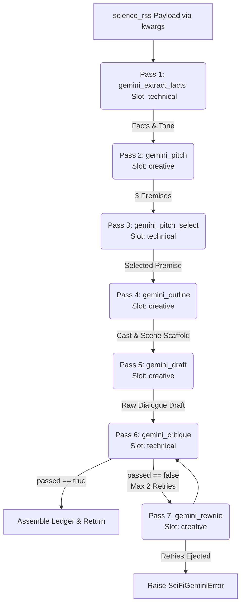

# Sci-Fi Gemini Engine Spec — CODE-READY v4 -- technical rewrite by Codex GPT-5, creative content unmodified


## Revision Log

- **v4 (final technical rewrite):** Removes the duplicate v2 skeleton and
  makes §4 the only Gemini runner authority. It converts the word blueprint
  to advisory centers/recorded actual counts; adds clean-critique, cast-lock,
  reject-only spoken-text, music-skip, payload/pin, finalizer, and freeze
  corrections cited in §4. The philosophy, topology, pack prompt wording,
  examples, and exactly-three-pitch creative design remain unmodified.
## 1. Design Philosophy
Why this wins a blind listen:
Audio drama depends on narrative flow, performance-driven pacing, and clear character contrast. Unlike dry text feeds, the listener's focus must be held by atmospheric world-building and character conflict.

The `scifi_gemini` engine separates fact Ingestion from dramatic dialogue drafting. It uses a **Write -> Critique -> Rewrite** pipeline that first extracts hard scientific discoveries and packages them into high-level dramatic premises. During the drafting loop, a critique pass checks that the dialogue incorporates the scientific core verbatim without resorting to exposition dumps or breaking the "show, don't tell" rule. This guarantees that while the science remains authentic, the audio drama plays as a tense, high-stakes narrative.

---

## 2. Artifacts

### 2.1 `banks.json` Row (`nodes\story_packs\banks.json`)
*(To be inserted before the `"custom_source_bank"` row)*
```json
    {
      "source_bank_id": "scifi_gemini",
      "label": "Sci-Fi Gemini",
      "source_kind": "article",
      "interpreter": "",
      "fetcher": "science_rss",
      "default_story_model": "scifi_gemini_v1",
      "default_story_pipeline": "scifi_gemini_multipass",
      "defaults": {
        "story_form_label": "science-fiction audio drama",
        "source_material_label": "Science story",
        "title_form_label": "science-fiction radio drama",
        "coda_mode": "real_news_report",
        "credits_source_line": "dramatized by machine from tonight's science wire"
      },
      "required_seams": [],
      "runnable": false,
      "guide_ref": "Sci-Fi Gemini multi-pass loop spec bank."
    }
```

### 2.2 `pipelines.json` Entry (`nodes\story_packs\pipelines.json`)
*(To be inserted into the `pipelines` list)*
```json
    {
      "story_pipeline_id": "scifi_gemini_multipass",
      "label": "Sci-Fi Gemini Multi-Pass (Write-Critique-Rewrite Loop)",
      "executable": false,
      "requires_source_contract": false,
      "declared_seams": [
        "gemini_fact_extraction",
        "gemini_pitch_generation",
        "gemini_pitch_critique",
        "gemini_scene_outline",
        "gemini_scene_draft",
        "gemini_scene_critique",
        "gemini_scene_rewrite"
      ],
      "passes": [
        {
          "pass_id": "gemini_extract_facts",
          "slot": "technical",
          "seam_refs": ["gemini_fact_extraction"],
          "description": "Extract raw scientific facts, numbers, and tone from the news payload."
        },
        {
          "pass_id": "gemini_pitch",
          "slot": "creative",
          "seam_refs": ["gemini_pitch_generation"],
          "description": "Pitch 3 distinct sci-fi premises incorporating the facts."
        },
        {
          "pass_id": "gemini_pitch_select",
          "slot": "technical",
          "seam_refs": ["gemini_pitch_critique"],
          "description": "Select the best premise for dramatic pacing and structural feasibility."
        },
        {
          "pass_id": "gemini_outline",
          "slot": "creative",
          "seam_refs": ["gemini_scene_outline"],
          "description": "Generate a detailed scene, shot, beat outline with advisory word-band centers."
        },
        {
          "pass_id": "gemini_draft",
          "slot": "creative",
          "seam_refs": ["gemini_scene_draft"],
          "description": "Draft verbatim dialogue and narration lines per scene beat."
        },
        {
          "pass_id": "gemini_critique",
          "slot": "technical",
          "seam_refs": ["gemini_scene_critique"],
          "description": "Evaluate fact integration, locked roster fidelity, dialogue-only safety, and SFW compliance."
        },
        {
          "pass_id": "gemini_rewrite",
          "slot": "creative",
          "seam_refs": ["gemini_scene_rewrite"],
          "description": "Rewrite the scene to correct any critique issues."
        }
      ],
      "notes": [
        "Scientific RSS payload-driven multi-pass pipeline utilizing Gemini.",
        "Consumes the RSS news feed via resolved['news_article'] (Chunk 3 source contract)."
      ]
    }
```

### 2.3 Pack JSON: `nodes\story_packs\scifi_gemini\scifi_gemini_v1.json`
*(Prompts are flat strings. The runner sends the named seam text verbatim as its system message and the typed artifact/schema payload as a separate canonical-JSON user message; it never uses `.format()` or Python-authored prompt prose. File must be created under the new directory `story_packs/scifi_gemini/`.)*
```json
{
  "schema_version": "v2.0",
  "source_bank_id": "scifi_gemini",
  "story_model_id": "scifi_gemini_v1",
  "story_pipeline_id": "scifi_gemini_multipass",
  "prompt_stages": {
    "gemini_fact_extraction": "You are a scientific data extraction engine. Analyze the provided RSS science news payload. Extract the core scientific discovery or phenomenon, every concrete quantitative fact/metric actually present (an empty numbers array is valid when none occurs), any key research entities/institutes mentioned, and the primary tone of the article. Return a JSON object matching this exact schema: {{\"facts\": [{{\"fact_id\": \"F01\", \"claim\": \"fact 1\", \"source_spans\": [{{\"field\": \"full_text\", \"start\": 0, \"end\": 6, \"quote\": \"fact 1\"}}]}}], \"numbers\": [], \"tone\": \"optimistic/foreboding/etc\", \"entities\": []}}. Do not include markdown wraps or explanations.\n\nPayload:\n{payload_text}",
    "gemini_pitch_generation": "You are a creative sci-fi audio drama writer. Read the extracted scientific facts: {facts}. Pitch exactly three distinct sci-fi premises (indices 0, 1, 2) that translate these facts into character-driven narrative stakes. For each pitch, define: 1) the premise hook, 2) the physical space setting, and 3) the tonal atmospheric qualities. Return a JSON object matching this exact schema: {{\"pitches\": [{{\"premise\": \"premise hook...\", \"setting\": \"location...\", \"tonal_palette\": \"cyberpunk/horror...\"}}]}}. Output must have exactly 3 pitches.",
    "gemini_pitch_critique": "You are an experienced audio drama director. Evaluate these three pitches: {pitches}. Select the pitch that offers the best dramatic pacing, auditory potential, and structural viability for a short radio play. Return a JSON object matching this schema: {{\"selected_index\": 0, \"rationale\": \"explanation for choice...\"}}.",
    "gemini_scene_outline": "You are a structural audio drama outliner. For the chosen premise: {chosen_premise}, create a rigid ledger-ready outline matching the requested target words: {target_words} words total. Define a Cast list containing ANNOUNCER (char_id 'announcer') plus the character IDs supplied in the word blueprint (c01 through c03 as applicable), with name in ALL CAPS, character_description, gender, tts_model, and voice_preset. Define a sequence of Scenes. Each Scene contains a scene_id ('scene_01', 'scene_02', etc.), env, description, and a list of Shots. Each Shot contains a shot_id ('shot_001', 'shot_002', etc.), description, and visual_prompt. Do not list beats inside shots here; list them nested at the Scene level under a 'beats' array where each Beat has a beat_id ('b001', 'b002', etc.), line_id, shot_id (the ID of the shot this beat occurs in), speaker name, speaker_role ('character' or 'announcer'), intent, mood, fact_ids, and the exact supplied target_words. Also return music_cues with cue_id, placement ('open', 'inter', or 'close'), description, generation_prompt, and anchor_beat_id. Total dialogue word count must equal {target_words} words. Return a JSON matching this exact outline structure. No markdown formatting.",
    "gemini_scene_draft": "You are an audio scriptwriter. Write the verbatim dialogue lines for the outline beats in this scene: {scene_outline}. For each beat, write the exact text spoken by the designated character or announcer and return its fact_ids from the supplied fact index. Do not write action directions or sound effects in the text. Return a JSON matching this schema: {{\"lines\": [{{\"beat_id\": \"b001\", \"text\": \"verbatim spoken line...\", \"fact_ids\": [\"F01\"]}}]}}.",
    "gemini_scene_critique": "You are a strict script editor. Evaluate the drafted lines: {drafted_lines} against the outline: {scene_outline} and the original science facts: {facts}.\n1. Word Count Check: Ensure the total word count of the lines equals the scene's target word limit.\n2. Fact Integration: Confirm that every audible scientific fact is correctly and traceably integrated into the script.\n3. Dialogue-only: Ensure lines do not contain stage directions like (sighs) or [sfx].\n4. Safety: Confirm all spoken text is SFW.\nReturn a JSON object: {{\"passed\": true/false, \"feedback\": \"detailed notes if failed...\", \"line_fact_ids\": {{\"b001\": [\"F01\"]}}, \"sfw_pass\": true}}.",
    "gemini_scene_rewrite": "You are a script doctor. Rewrite the dialogue lines to resolve these critiques: {feedback}. Incorporate the original science facts: {facts}. Retain the exact outline structure: {scene_outline}. Below is the previous failed draft lines for reference:\n{previous_draft}\nReturn a JSON matching the same draft schema: {{\"lines\": [{{\"beat_id\": \"b001\", \"text\": \"revised verbatim spoken line...\", \"fact_ids\": [\"F01\"]}}]}}."
  }
}
```


### 2.4 Runner Module Dispatch & Integration (`nodes\OTR_LedgerScriptWriter.py`) — v4

The build adds one lazy wrapper, preserving the existing map:
`"scifi_gemini_multipass": _run_scifi_gemini_lane` in
`_RUNNER_BY_PIPELINE` (`nodes/OTR_LedgerScriptWriter.py:1589-1617`). The map
call supplies `payload=dict(resolved["news_article"])`, routed pack, ledger,
metadata, and only the injected `creative_fn`/`technical_fn` at
`:3590-3604`; the writer then owns tail-context construction at `:3605-3624`.
The wrapper imports `run_scifi_gemini_episode(**kwargs)` and does nothing
else. This is a planned additive build change; the catalog JSON remains
`runnable:false` / `executable:false` until it ships. It uses the shared
TailFinalizer protocol named in the Codex v4 control plane, not a local
variant.
## 3. Pipeline Topology



---


## 4. v4 implementation control plane — sole technical authority

This replaces the earlier v2/v3 runner prose and skeletons in their entirety.
The §2 JSON artifacts, seven seams, topology, design philosophy, and all
prompt wording/examples are unchanged. There is exactly one runner source of
truth below; no archived `.format()` skeleton, second schema family, or
replacement-map code survives.

### v4 revision log

- Makes the largest-remainder word blueprint advisory only: `target_words`
  appears once in initial outline sizing, is never an acceptance/retry gate,
  and actual counts are recorded.
- Adds pre-tail reject-only spoken-text/roster validation and structural
  music skip stamps after `set_lines`, which drops those fields
  (`nodes/production_ledger.py:1080-1167`;
  `nodes/_otr_ledger_freeze.py:325-402`).
- Re-verifies map/payload wiring at
  `nodes/OTR_LedgerScriptWriter.py:1589-1617,3590-3624`, keeps exactly three
  pitches, and makes a clean `SceneCritiqueV4.feedback` valid when empty.
- References the one shared TailFinalizer protocol in
  `docs/2026-07-11-scifi-codex-engine-spec.md`, “Shared TailFinalizer
  protocol (canonical for all three lanes),” rather than declaring a variant.

### Input, slots, and word receipt

`validate_gemini_payload` calls
`_otr_source_payload.validate_source_payload(payload, origin="scifi_gemini")`
and requires exactly seven string keys: `headline`, `summary`, `full_text`,
`source`, `date`, `link`, `seed_text`
(`nodes/_otr_source_payload.py:80-133`). The RSS article is already built at
`nodes/OTR_LedgerScriptWriter.py:1081-1143` and supplied as
`dict(resolved["news_article"])` at `:3590-3594`; the runner never fetches.
Only `resolved["seed_source"] == "custom_premise"` identifies an
operator-pinned story—the writer constructs its normal seven-key payload at
`:1321-1335`. `science_rss` stamps `rss_fetch`
(`nodes/_otr_source_payload.py:424-434`). Other sources raise
`SciFiGeminiPayloadRouteError`; malformed/empty is
`SciFiGeminiPayloadContractError`; RSS below 80 split words/12 distinct
alphanumeric tokens and pinned input below 8/4 is
`SciFiGeminiPayloadThinError`. No alternate source is allowed.

`resolved["target_words"]` is a one-time integer 30–900 `WordSteerV4`.
`make_advisory_word_blueprint` applies largest remainder to the locked
voiced-beat order and emits `AdvisoryBeatBandV4.advisory_word_center` values.
P3 `gemini_outline` is the only model input carrying
`initial_outline_word_steer`; P4 may see bands embedded in the outline but
never the requested value, and P5/P6/repair never see either. Centers are not
targets: no validator compares text to them. Record only:

~~~text
meta.scifi_gemini.word_receipt = {
  requested_words: int,
  actual_split_words: int,
  actual_ledger_word_count: int
}
~~~

A valid 719-, 721-, or otherwise nonmatching-word result succeeds. The sole
count-related validator is tokenization safety needed to prevent freeze
warnings: reject isolated numerals/symbol-only tokens and require numbers
spelled as words so the ledger regex and split count agree
(`nodes/production_ledger.py:216-219,1143-1147`;
`nodes/_otr_ledger_freeze.py:372-388`). It is never a target gate.

The only model surface is the writer-injected `creative_fn` / `technical_fn`.
Each pass calls `structured_call` with `post_validator: Callable[[T], str |
None]` and the keyword-only repair factory contract
(`nodes/_otr_structured_call.py:147-173,482-535`). Every call has exactly
three attempts: base, lower JSON-syntax retry, then .10 typed repair for a
schema/post-validator failure (`:547-712`). System content is the named pack
seam verbatim and user content is canonical JSON; Python never `.format()`s a
seam, loads a model, or changes dialogue.

### Exact pass artifacts and validators

All types are strict, `extra="forbid"`, no aliases, and no text length clamps;
semantic checks use validator strings because tolerant parsing can clip text
(`nodes/_otr_structured_call.py:322-474`).

~~~text
GeminiPayloadV4 = {
  payload: SourcePayload7,
  source_mode: Literal["rss","operator_pinned"],
  payload_sha256: LowercaseSha256
}
SourceSpanV4 = {
  field: Literal["headline","summary","full_text","seed_text"],
  start: int >= 0, end: int > start, quote: Text
}
FactV4 = {fact_id:"F01".."F12", claim:Text,
          source_spans:list[SourceSpanV4], numeric_tokens:list[str]}
EntityV4 = {entity_id:"E01".."E12", name:Text,
            source_spans:list[SourceSpanV4]}
NumberV4 = {number_id:"N01".."N12", verbatim:Text, fact_id:str,
            source_span:SourceSpanV4}
FactIndexV4 = {facts:list[FactV4] (1..12), entities:list[EntityV4] (0..12),
               numbers:list[NumberV4] (0..12), tone:Text,
               payload_sha256:LowercaseSha256}
PitchV4 = {premise:Text, setting:Text, tonal_palette:Text}
PitchSlateV4 = {pitches:tuple[PitchV4,PitchV4,PitchV4]}
PitchSelectionV4 = {selected_index:Literal[0,1,2], rationale:Text}
CastV4 = {char_id:Literal["announcer","c01","c02","c03"], name:Text,
          character_description:Text, gender:Text}
AdvisoryBeatBandV4 = {beat_id:str, advisory_word_center:int}
ShotV4 = {shot_id:str, scene_id:str, description:Text, visual_prompt:Text}
BeatV4 = {beat_id:str, line_id:str, scene_id:str, shot_id:str, speaker:Text,
          char_id:Literal["announcer","c01","c02","c03"],
          speaker_role:Literal["character","announcer"], intent:Text,
          mood:Text, fact_ids:list[str], order:int}
MusicCueV4 = {cue_id:Literal["music_open","music_inter","music_close"],
              placement:Literal["open","inter","close"], description:Text,
              generation_prompt:Text, anchor_beat_id:str}
SceneV4 = {scene_id:str, env:Text, description:Text, shots:list[ShotV4],
           beats:list[BeatV4]}
OutlineV4 = {title:Text, premise:Text, setting:Text, time_of_day:Text,
             cast:list[CastV4], scenes:list[SceneV4],
             music_cues:list[MusicCueV4],
             advisory_word_bands:list[AdvisoryBeatBandV4]}
LineFactUseV4 = {fact_id:str, spoken_claim:Text}
DraftLineV4 = {beat_id:str, text:Text, fact_uses:list[LineFactUseV4],
               non_fact:bool}
SceneDraftV4 = {lines:list[DraftLineV4]}
SceneCritiqueV4 = {passed:bool, feedback:str,
                   line_fact_ids:dict[str,list[str]], sfw_pass:bool}
~~~

P0 requires `quote == payload[field][start:end]`, referenced facts/spans,
and a payload-supported number/entity; absence is valid only when none is in
the payload. P1 is **exactly three** pitches because the frozen seam/topology
requires it. P2 selects only 0/1/2.

P3 creates one nonempty scene→shot→beat→line graph and locks cast labels:
`announcer` is exactly `ANNOUNCER`, each other name is one canonical token,
and every beat's `speaker` equals the locked label for its `char_id`
verbatim. No later response introduces aliases/case variants, and Python does
not normalize them. ALL-CAPS applies to roster labels only; spoken text may
not contain all-caps lexical words. P3 emits the advisory bands but neither
`BeatV4` nor any draft has a target-count field. Music placements are unique
and each anchors a voiced beat.

P4 returns one `DraftLineV4` for each locked beat. The runner stamps line,
shot, char ID, and role from the immutable outline; it never infers a
speaker. A P5 clean result is exactly
`{passed:true, feedback:"", sfw_pass:true}`; P5 failed results require
nonempty feedback and a real issue. P6 returns a complete replacement for
that scene, preserves the exact beat set, and may run twice after P4. Neither
P5 nor P6 evaluates requested length.

Before accepting P4/P6 text, reject—not strip—newline/tab, brackets,
parentheticals, markdown/backticks/asterisks/fences, a leading cast/role
label, standalone stage/action cue, fully quoted line, all-caps lexical word
of two+ letters, or a line beginning with its own cast first name and a
vocative separator. Spoken acronyms use lowercase lexical form (for example
`nasa`). This validator returns an LLM repair error; Python never changes
text. It prevents the writer-tail scrubs/reattribution at
`nodes/OTR_LedgerScriptWriter.py:6006-6158`, so the final receipt remains
verbatim.

### Calls, ledger, finalizer, and skeleton

| Pass | slot | base / syntax / repair | max_new_tokens | bound |
|---|---|---|---:|---|
| P0 fact index | technical | .22 / .12 / .10 | 1,800 | one ladder |
| P1 pitch slate | creative | .72 / .36 / .10 | 1,400 | exactly three |
| P2 pitch selection | technical | .22 / .12 / .10 | 700 | one ladder |
| P3 outline | creative | .68 / .30 / .10 | 3,600 | only word-steer call |
| P4 scene draft | creative | .74 / .34 / .10 | 3,000 | one per scene |
| P5 scene critique | technical | .20 / .10 / .10 | 1,400 | one per scene |
| P6 scene rewrite | creative | .62 / .28 / .10 | 3,000 | ≤2 full replacements |

P4→P5 is mandatory; only `passed:false` invokes P6→P5. A still-failed
second rewrite raises `SciFiGeminiRewriteExhaustedError`. No word count starts
this loop.

~~~python
def run_scifi_gemini_episode(*, payload: dict[str, str], pack: Any,
    resolved: Mapping[str, Any], led: Ledger, meta: dict[str, Any],
    creative_fn: GenerateFn, technical_fn: GenerateFn, slot_scheduler: Any,
    source_bank_row: SourceBank, story_rules: Mapping[str, Any],
    episode_root: Path, episode_id: str) -> GeminiTailParts: ...
def validate_gemini_payload(payload: Mapping[str, Any],
    resolved: Mapping[str, Any]) -> GeminiPayloadV4: ...
def make_advisory_word_blueprint(requested_words:int,
    locked_beats:Sequence[str]) -> list[AdvisoryBeatBandV4]: ...
def invoke_gemini_structured(*, pass_id:str,
    slot:Literal["creative","technical"], slot_fn:GenerateFn, seam_ref:str,
    typed_inputs:Mapping[str,Any], result_type:type[T],
    post_validator:Callable[[T],str|None], base_temperature:float,
    structural_retry_temperature:float, max_new_tokens:int,
    journal:GeminiCallJournal) -> T: ...
def validate_spoken_text_and_lock(draft:SceneDraftV4, outline:OutlineV4,
    cast_lock:Mapping[str,CastV4]) -> None: ...
def stamp_music_skip_contract_after_set_lines(led:Ledger,
    music_line_ids:Sequence[str]) -> None: ...
def record_word_receipt(meta:MutableMapping[str,Any], requested_words:int,
    led:Ledger) -> None: ...
~~~

Assembly is exactly `set_cast`, `set_scenes`, `set_shots`, `set_beats`,
`set_lines`, post-setter music skip stamps, `set_music`,
`stamp_word_counts`; `clips=[]`. Use ANNOUNCER→`kokoro`/`bm_george` and
c01/c02/c03→`bark` with
`v2/en_speaker_6`/`v2/en_speaker_3`/`v2/en_speaker_0`; resolve every voice
before assembly. Because `set_lines` drops skip fields, stamp known music
sentinel rows `skip:true`, `text:""`, `tts_skip_reason:"music_cue"` afterward.
Character/announcer rows are non-skipped with nonempty LLM text. Music
anchors reference non-skipped lines. Setter shapes are
`nodes/production_ledger.py:792-1207`; legal roles are
`nodes/_otr_ledger_freeze.py:85-96`.

Persist P0 spans, line fact IDs, accepted raw creative responses, per-line
raw/text hashes, and call journal in `meta.scifi_gemini`, since `set_lines`
drops arbitrary per-line provenance (`nodes/production_ledger.py:1138-1157`).
Before tail, reparse receipts and require final in-memory equality plus a P0
mapping for every audible source fact. The shared Codex v4 TailFinalizer then
runs warning-free Phase 0/10 and saved-JSON identity/audit. It never edits
text.

Terminal errors: `SciFiGeminiPayloadContractError`,
`SciFiGeminiPayloadRouteError`, `SciFiGeminiPayloadThinError`,
`SciFiGeminiTargetRangeError`, `SciFiGeminiPackContractError`,
`SciFiGeminiPassError`, `SciFiGeminiRewriteExhaustedError`,
`SciFiGeminiVoiceInventoryError`, `SciFiGeminiSpokenTextError`,
`SciFiGeminiGraphError`, `SciFiGeminiProvenanceError`,
`SciFiGeminiPreTailAuditError`, `SciFiGeminiTailFinalizerMissingError`,
`SciFiGeminiLedgerSaveError`, and `SciFiGeminiSavedLedgerAuditError`;
`FreezeAssertionError` propagates. There is no word-budget error, fallback,
warning acceptance, or Python text surgery.

### v4 test plan

1. Load catalog/pack JSON and assert global IDs, paths, prefixes, and seams
   are unique.
2. Run RSS and `custom_premise` payload fixtures through the map handoff;
   pin detection must use `resolved["seed_source"]`, never a fetch.
3. Spy on P0–P6: only injected slots run, tabled bounds apply, P3 alone gets
   the steer, and a valid non-720 count never invokes P6.
4. Assert exactly three pitches and both legal critique forms, including
   clean `passed:true, feedback:""`.
5. Parameterize every rejected spoken decoration/casing/self-vocative/token
   form; assert LLM repair only and zero tail text mutation for accepted text.
6. Build the full five-hierarchy ledger with locked cast, music skip reasons,
   anchors, source spans/receipts, and verify warning-free Phase 0/10 plus
   saved UTF-8/no-BOM parity.
7. Corrupt a span, fact map, receipt hash, role, anchor, or skip reason and
   assert the typed failure before output.
## 9. Workflow and model-binding scope

No workflow JSON edit is implied or authorized by this source-bank spec. The
operator binds local models to the writer's existing `creative` and `technical`
slots; this lane receives only their `generate_fn` closures. The bank becomes
selectable through its additive registry/map implementation, not by changing a
widget default, remote-provider setting, or environment variable.

---

## 10. Staging and Production Checklist (For the Builder)
1. **Directory & Artifact Setup:** Initialize `story_packs/scifi_gemini/` under `nodes/story_packs/`. Write `scifi_gemini_v1.json` to this directory (using the JSON schema in §2.3) atomically with `banks.json` and `pipelines.json` modifications.
2. **Registry and Dispatch Verification:** Verify that `_resolve_lane_runner("scifi_gemini_multipass")` correctly returns `_run_scifi_gemini_lane`, and that the common tail-finalizer hook is present with default `None` behavior for every existing lane. Run the new unit tests using stubbed supplied slot functions; no external model/provider configuration is required.
3. **Contract Smoke:** Run valid RSS and pinned fixtures at targets 30, 720, and 900. Assert all seven creative/technical passes use only the injected closures, every spoken row is receipt-backed, Phase 10 is frozen_clean after tail/save, and a malformed, thin, untraceable, warning, or save-failure fixture stops loud before an output is returned.

---


## 11. v4 revision ledger and convergence self-audit

| Hard contract | v4 verdict | Enforcement |
|---|---|---|
| Additive only | PASS | New registry rows, pack, runner map key, and shared optional finalizer only; no workflow/fetcher/network change. |
| science_rss payload first and pinned path | PASS | Seven-key payload is supplied before P0; `seed_source` lives in `resolved`; malformed/thin inputs stop typed. |
| Only creative/technical closures | PASS | P0–P6 use only the injected slot callable through `structured_call`. |
| Complete five-hierarchy ledger and freeze | PASS | Setter order, cast lock, legal roles, skipped music reasons, anchors, Phase 0/10, and saved audit are all mandatory. |
| Verbatim LLM dialogue | PASS | Pre-tail rejection prevents the live tail from changing accepted text; receipts prove final/saved equality. |
| Traceable news facts | PASS | P0 exact spans plus per-line fact maps and receipt hashes are persisted and audited. |
| 720 strategy | PASS | 720 is an advisory P3 steer; actual split/ledger counts are recorded, never accepted/rejected against it. |
| Multi-pass/no text surgery/fail loud | PASS | P4→P5→P6 is bounded only by content defects; typed failure has no source/model/voice/text fallback. |
| SFW, UTF-8 no BOM, placeholder-name rule | PASS | Frozen seam guardrails and v4 tests cover all three. |
### Open questions for the operator

1. The fixed ANNOUNCER and Bark preset values must be resolver-tested on the
   build machine. An unavailable value is a typed inventory failure; this spec
   intentionally does not authorize selecting a substitute.
2. The optional TailFinalizer/title-source hook is a required additive writer
   extension for all three source-bank builds. It preserves existing lanes by
   defaulting to `None`; if the operator declines that extension, a mapped
   runner cannot prove the final saved ledger after tail mutation, so this lane
   must remain non-runnable.
