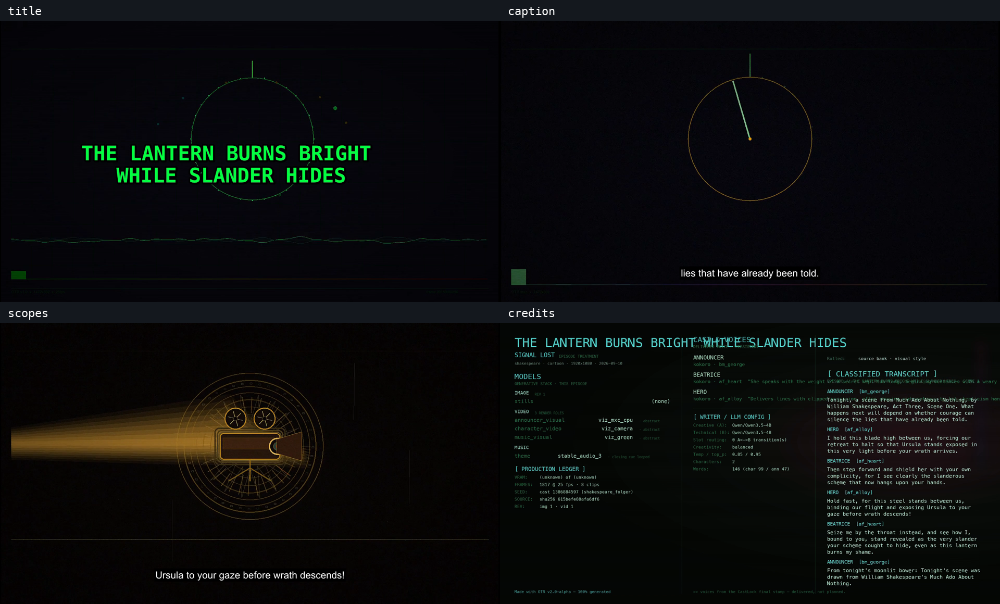

# Mac final font proof and rental handoff — 2026-09-10

The operator accepted the rendered title and credits and closed the Mac font
check. This is a live canonical publication receipt, using the already shipped
font fixes at code HEAD `6f9a5586cff084489fbb0aea257eb1f6761af615`.

No production code, canonical JSON, profile, model recipe, or credits layout
was changed in this final verification. GPT-6 Astra drove in the standing
ladder's rung 5 coder/sole-judge role (the historical table names Opus).
The earlier Ghost coding change has its one CLI review and test receipts in
`../2026-09-10-ghost-pool/`; this closeout changes documentation and evidence
only, so it does not launch another coding review or model-loading test suite.

## Accepted publication

| field | receipt |
| --- | --- |
| title | The Lantern Burns Bright While Slander Hides |
| prompt | `8c11b8e5-8872-4e22-bb47-4149a68920df` |
| result | `RESULT SUCCESS`, `obs_publish OK`, actual file on disk |
| render elapsed | 147.28 seconds |
| video | H.264, 1920×1080, 25 fps, 2,358 frames, 94.320 seconds |
| audio | AAC viewing copy, 48 kHz stereo, 72.668 seconds |
| credits tail | 21.6 seconds, declared; duration check OK |
| published bytes | 159,640,319 |
| SHA-256 | `986d2cb71576ce8ac73cf14850f5fecd85dbf460dc7e4fc875c107348f8b88d4` |

Published filename, under `output/otr/obs/`:

```text
the_lantern_burns_bright_while_slander_h_20260910_011724__cart__vcam__none__koko__sspr__q354b__sa3_final.mp4
```

The title now fits in two centered lines. SDH captions and scope labels render
in the inspected frames. Long credits text can still cross column boundaries;
the operator viewed the credits, said they look good, and accepted the result.
Do not re-open that appearance during the hardware handoff.



The old and new title frames are also saved as `images/title_before.png` and
`images/title.png`, with the full final credits frame in `images/credits.png`.

## What actually rendered

The canonical API runner loaded `workflows/otr_canonical.json`, applied the
existing `otr_mac_mps` profile, and replayed a frozen copy of the successful
2026-09-07 Lantern episode. The three video roles were `viz_green` (music),
`viz_mxc_cpu` (announcer), and `viz_camera` (characters). These are procedural
visualizers. The frozen script, cast and master audio were reused; this final
font proof did not rerun the writer, Kokoro voices, or Stable Audio 3 music.
The mux also produced its archival final with byte-identical PCM audio.

The original episode folder is
`signal_lost_the_lantern_burns_bright_while_slander_h_20260907_214731`;
the new folder is
`signal_lost_the_lantern_burns_bright_while_slander_h_20260910_011724`.
Both complete folders are in the transfer manifest.

The command used the existing runner:

```sh
python scripts/otr_canonical_api_run.py \
  --comfyui-url http://127.0.0.1:8188 \
  --profile otr_mac_mps \
  --replay-from /Users/rentamac/Documents/otr-mac/logs/font_replay/bundles/signal_lost_the_lantern_burns_bright_while_slander_h_20260907_214731 \
  --run-label mac-font-final-20260910 --timeout 0 --poll-s 20
```

The run label was only a receipt label, not an override of the episode title.
The canonical SHA-256 remained
`9ab0abe6f03f2da845983888f4a1e269066d1d915982453469b6e581da96bcf2`.
The installed pack is a separate copy; all five relevant font-source files
were hash-checked against the repo before and after the run. See
`verification.json`, `font_replay/prompt.json`, `font_replay/run.log`,
`font_replay/server.log`, and `font_replay/history.json`.

## Lightning attempt: failed, not part of the accepted font proof

Prompt `040b11ea-f572-4545-afe3-53a512505e00` used the canonical graph with
Mac dropdowns and `animatediff15_lightning_video` in all three video roles.
The video model was SD 1.5 plus
`animatediff_lightning_8step_comfyui.safetensors`, with the ft-mse VAE and the
existing MPS recipe. It authored *Stones in a Tin Box* and completed its audio.

The opening clip finished at 88 latents, 512×288. The next clip, `b001`,
sampled 100 latents through all eight steps, then failed during VAE decode:

```text
Insufficient Memory (00000008:kIOGPUCommandBufferCallbackErrorOutOfMemory)
```

The VAE log names `torch.bfloat16` on MPS. The process was observed around
22 GB physical footprint. No competing test suite or model job ran alongside
it. No final reached `otr/obs/`. The failed queue state and logs were captured
before the owned prompt was interrupted and the server terminated.

This shows that the measured 136-latent anchor is not a guarantee of enough
memory for a later decode in a real episode. It does not establish a new
memory threshold or prove the ownership of the retained allocation. The
guard and recipe were left unchanged. Earlier published Lightning proofs
remain on disk, but this attempt does not establish repeatability on 16 GB.
Raw evidence is in `mac_final/`; this is an additional live observation for
PBUG-20260909-01, not a claimed fix or a new portable rule.

## Files and transfer status

`transfer_manifest.json` inventories **9 published videos and 9 complete
episode directories: 272 files, 7,323,247,396 bytes**, with a SHA-256 for each.
This includes generated audio, ledgers, stills, clips, captions and intermediate
video. Machine-specific `_shared` state and unfinished episodes are excluded.
The original files remain in `output/otr/`; staging uses hardlinks.

The requested Windows destination is:

```text
C:\Users\jeffr\Documents\ComfyUI\output\otr
```

**Transfer is in progress, not yet verified complete.** DeskIn has all nine
videos queued to `obs` and all nine episode folders queued to `episodes`.
At this receipt, one video is reported complete and the next is transferring;
observed speed varies from about 30 to 180 KB/s. Do not retire the rental
based on a queued transfer or this Git commit. The media files themselves are
not stored in Git history.

An hourly follow-up, **Finish OTR Mac file transfer**, is active in the
current Codex task. It checks the existing copy, stays quiet during normal
progress, and is to pause after verified completion or an unresolved access
blocker. Keep the Mac and Codex running until the off-machine copy is verified.

A complete local ZIP backup is ready at
`/Users/rentamac/Documents/otr-mac/transfer/otr-mac-episodes-20260910.zip`.
It has 273 members (the 272 media/episode files plus the manifest), is
7,323,413,192 bytes, and has SHA-256
`e03662c78056fc79cd1dc21852a9e9b6aa3ffa2fa0a59609e172ec728b65e4d0`.
It is only a local backup until transferred. Its paths begin with `otr/`;
extract beneath the Windows `ComfyUI\output` directory, not beneath `otr`
again. A private Google Drive backup was offered; no upload is claimed here.

After transfer, use the manifest to verify all 272 relative paths and their
byte counts/hashes on Windows. Do not replace Windows `_shared` state with
anything from the Mac. Source and handoff evidence are carried by Git on
`v2.0-alpha`; the installed Windows pack should update from that branch through
its normal handoff procedure without disturbing an active render.

## Next host

The Mac renderer was stopped after confirming its queue was idle. No new
downloads, registry publish, device promotion or rental cancellation occurred.
The operator's next machine is the 5080. GO_FORWARD row 2.2 is first: a
five-act canonical forced-Ghost CUDA leg, with actual `otr/obs/` publication
and inspection of the stored prompt objects and reuse dispositions. The
writer-unload CUDA check remains recorded in the Mac punch list. An AMD pod,
when the operator supplies it, is separate portability work.

The latest controlled suite remains the prior code receipt: 13,661 passed,
142 failed, 358 skipped, 1 xfailed, 3 deselected; no new failures versus the
143-failure baseline. Bug Bible standalone: 23 passed / 27 skipped / 3 xfailed;
against OTR: 10 failed / 29 passed / 11 skipped / 3 xfailed, unchanged. These
are inherited test results, not a claim that the suite was rerun or green in
this final verification. Avoid a plain full suite against this Mac's real
model cache; the earlier receipt records the required isolated environment.
