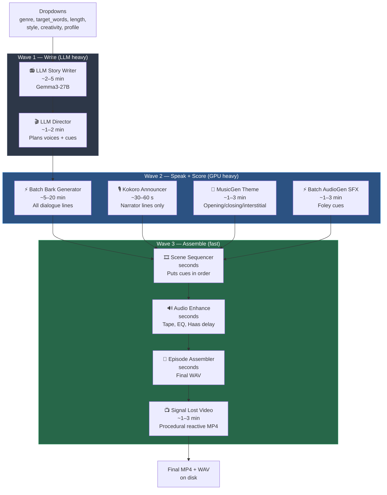

# OTR Pipeline — Plain-English Explainer

**Purpose:** a bird's-eye tour of what happens inside OldTimeRadio when you click "Queue Prompt" in ComfyUI. Written for planning, not for engineers. Use it to reason about where Visual nodes could slot in, and whether long-form video means we need to parse or batch the script differently.

**Audience:** Jeffrey, when thinking about pipeline design without wanting to read code.

**Date:** 2026-04-15
**Branch:** v2.0-alpha
**Companion doc:** `docs/2026-04-15-visual-integration-plan-review.md` (the technical triage).

---

## The 30-second version

OTR takes a few dropdown picks (genre, length, style) and builds a finished old-time-radio episode as a single WAV/MP4. It does this in three waves:

1. **Write the show** — an LLM produces a script, then a second LLM pass plans voices, music, and sound effects.
2. **Speak and score the show** — text-to-speech generates every dialogue line, a music model generates opening/closing/interstitial cues, and a sound model generates Foley.
3. **Assemble the show** — all the audio pieces are stitched in scene order, polished with broadcast-style processing, and optionally rendered to a simple reactive video.

Everything runs locally on the RTX 5080 Laptop. No cloud, no API keys. The whole thing takes roughly **15 to 40 minutes** depending on length and style, with Bark TTS being the single biggest time-sink.

---

## Full pipeline at a glance



Durations above are **observed soak ranges** on the RTX 5080 Laptop. Short-format episodes sit at the low end, long format at the high end. A "maximum chaos" creativity run can add 20–30%.

---

## Wave 1 — Write the show

### Stage 1. 📻 LLM Story Writer (`OTR_Gemma4ScriptWriter`)

**What it does:** writes the actual episode script — acts, scenes, character lines, stage directions, SFX/MUSIC/ENV tokens inline.

**Input:**
- `genre` — sci-fi, noir, horror, etc.
- `target_words` — 350 / 750 / 1200 / 2100
- `target_length` — "short (3 acts)" / "medium (5 acts)" / "long (7-8 acts)"
- `style_variant`, `creativity`, `optimization_profile`
- `self_critique` toggle

**Output:**
- `script_json` — a structured script blob with title, characters, dialogue, and cue tokens.

**Typical time:** **2 to 5 minutes.** Gemma3-27B streaming generation with heartbeat pulses every 25 tokens. The self-critique pass (P0 #1) runs a second look over the draft and can add 30–90 seconds.

**Why it matters for planning:** this is where the narrative truth of the episode is fixed. Everything downstream — voices, music, sound effects, and eventually video — is derived from `script_json`. If Visual is going to produce faithful visuals, the script must contain enough scene-level cues (setting, mood, time of day) for the Director to extract them cleanly.

### Stage 2. 🎬 LLM Director (`OTR_Gemma4Director`)

**What it does:** takes the script and plans the production — who voices whom, what sound effects to generate, what music cues fit where.

**Input:**
- `script_json` from the Story Writer.

**Output:**
- `director_plan` — JSON with three required sections:
  - `voice_assignments` — character → Bark voice preset
  - `sfx_plan` — list of `{cue_id, generation_prompt}`
  - `music_plan` — list of `{cue_id, duration_sec, generation_prompt}` with required cues `opening`, `closing`, `interstitial`

**Typical time:** **1 to 2 minutes.** One LLM pass, no streaming.

**Why it matters for planning:** this is the natural place to attach visual planning too. The Director already produces structured JSON; extending it to emit a per-scene geometry cue (setting, mood, time_of_day, style_anchor_hash) is the Keep #6 idea from the Visual review. The validator we just shipped (P0 #2) gives us the fail-fast boundary needed to add visual fields without cascading crashes.

---

## Wave 2 — Speak and score the show

This is the GPU-heavy phase. Multiple generators run sequentially, each loading its own model and clearing VRAM before the next. The VRAM ceiling is 14.5 GB; every handoff is guarded.

### Stage 3. ⚡ Batch Bark Generator (`OTR_BatchBarkGenerator`)

**What it does:** generates expressive TTS audio for every character dialogue line using Suno's Bark via HuggingFace `transformers`. Pre-computes **all** lines in one batch so the Scene Sequencer doesn't have to stream-generate later.

**Input:** `script_json`, `director_plan` (for voice_assignments).

**Output:** a dict of `{line_id: audio_tensor}` — every dialogue line as raw audio.

**Typical time:** **5 to 20 minutes.** Scales with total dialogue line count. A short episode might be 40–60 lines; a long one 150+. With P1 #5 shipped (length-sorted batching within voice-preset groups), short lines stop wasting pad cycles behind long lines.

**Why it matters for planning:** Bark is the single biggest wall-clock cost in the whole pipeline. If Jeffrey wants to keep total pipeline time under 30 minutes while adding visuals, any visual work that can overlap with Bark generation is "free wall-clock time." This is the entire thesis of Keep #1 (Head-Start async pre-bake): kick off Visual on the outline **while** Bark is still grinding through dialogue.

### Stage 4. 🎙️ Kokoro Announcer (`OTR_KokoroAnnouncer`)

**What it does:** routes every `ANNOUNCER:` line to Kokoro v1.0 TTS instead of Bark. Bark produces "ums" and bathroom-reverb artifacts on narrator voice; Kokoro is cleaner and faster.

**Typical time:** **30 to 60 seconds.** Kokoro is small and CPU-friendly.

### Stage 5. 🎺 MusicGen Theme (`OTR_MusicGenTheme`)

**What it does:** generates the three required music cues (opening theme, closing sting, act-break interstitial) based on Director prompts.

**Typical time:** **1 to 3 minutes.** MusicGen small model, 8–12 second cues.

### Stage 6. ⚡ Batch AudioGen SFX (`OTR_BatchAudioGenGenerator`)

**What it does:** generates sound-effect Foley for every SFX cue the Director planned — thunder, footsteps, door slams, static, etc.

**Typical time:** **1 to 3 minutes.** Scales with SFX count. A radio drama with lots of atmosphere cues takes longer.

---

## Wave 3 — Assemble the show

All four audio generators above produce clips in isolation. Wave 3 arranges them into a finished episode. This phase is fast because there is no new generation — just stitching.

### Stage 7. 🎞️ Scene Sequencer (`OTR_SceneSequencer`)

**What it does:** interleaves dialogue audio, announcer audio, music cues, and SFX cues according to the script's scene structure. Produces a scene-by-scene ordered audio track.

**Typical time:** **seconds.**

### Stage 8. 🔊 Audio Enhance (`OTR_AudioEnhance`)

**What it does:** broadcast-style polish — tape saturation, warm EQ, Haas delay for faux-stereo width, AM radio band-limit option, bass warmth, mono-to-stereo upscaling.

**Typical time:** **seconds** (DSP-only, CPU).

### Stage 9. 📼 Episode Assembler (`OTR_EpisodeAssembler`)

**What it does:** renders the final WAV file on disk with the episode title in the filename.

**Typical time:** **seconds.**

### Stage 10. 📺 Signal Lost Video (`OTR_SignalLostVideo`)

**What it does:** generates a length-perfect MP4 with procedural, audio-reactive visuals — CRT static, waveform scopes, title cards, mood-driven color fields. No LLM or diffusion; purely procedural Python + ffmpeg.

**Typical time:** **1 to 3 minutes** depending on episode length.

**Why it matters for planning:** this is the placeholder visual engine. It delivers a complete MP4 today, no GPU required. The v2.0 vision replaces (or augments) this node with real Visual-generated visuals. **Critical rule from CLAUDE.md C7:** audio output must remain byte-identical to v1.5 baseline at every gate. Whatever visual engine replaces this node must not touch the audio path.

---

## Inputs and outputs at the whole-pipeline level

**Inputs (what the user picks):**
- Genre, length, word count, style, creativity, optimization profile
- Self-critique toggle
- Visual profile (once v2.0 lands)

**Outputs (what lands on disk):**
- `{episode_title}.wav` — the finished radio show audio
- `{episode_title}.mp4` — the reactive video (currently procedural)
- `otr_runtime.log` — every phase's heartbeat, VRAM snapshot, and timing

**What does NOT land on disk:**
- Individual dialogue line audio files (held in memory across Wave 2 → Wave 3)
- Intermediate music and SFX cue files (same)
- The raw `script_json` or `director_plan` (these are passed node-to-node in ComfyUI, not persisted by default)

This last point matters for Visual: the geometry vault will want **persisted** Director output per episode, keyed by `episode_fingerprint`, to enable cross-episode continuity.

---

## How Visual nodes would slot in

Using the plain view above, here is where each Visual component naturally lives:

### Parallel to Wave 1 — `VisualBridge` (async pre-bake)

- **Where:** fires the moment the Director emits a scene plan; runs in parallel with Wave 2.
- **Reads:** `director_plan.scene_plan` (needs to exist; not in today's schema yet).
- **Writes:** per-scene geometry payloads into the Scene-Geometry-Vault.
- **Why parallel, not serial:** Wave 2 already eats 10–25 minutes on the GPU. Geometry generation running during that window is effectively free wall-clock time (Keep #1).

### Replaces Stage 10 — Real visual rendering

- **Where:** the `OTR_SignalLostVideo` position.
- **Reads:** the vault's baked geometry for each scene + the final assembled audio.
- **Writes:** MP4 with real camera motion, character blocking, lighting.
- **Constraint C4:** Visual clips are max 10–12 s each (257 frames @ 24fps). A 20-minute episode is ~100–120 clips that must be chunked and crossfaded in ffmpeg. **This is the long-form-video parsing question.** The script does not naturally break into 10-second beats; the Director's `scene_plan` will need sub-scene "shot" entries of 8–12 s each for the video engine to consume cleanly.

### New layer — Style-Anchor cache (between vault and renderer)

- **Where:** sits between the vault and the final video renderer.
- **Reads:** one `style_anchor_hash` per scene from the Director's JSON.
- **Writes:** relit + palette-adjusted frames on top of cached World Seed geometry.
- **Why:** reuses a single geometry bake across many lighting moods — same bridge interior for Day/Night, Tense/Calm. Without this, every mood change re-bakes geometry and the vault balloons.

### Parse-differently question

Today's script format emits character dialogue and inline `SFX:` / `MUSIC:` / `ENV:` tokens, but there is **no explicit shot list**. For long-form video with actual movement, the Director will need to emit something like:

```json
{
  "scene_id": "scene_03",
  "setting": "abandoned radio station control room, dusk",
  "mood": "tense, claustrophobic",
  "time_of_day": "dusk",
  "style_anchor_hash": "a1b2c3d4e5f6",
  "shots": [
    {"shot_id": "s03_01", "duration_sec": 8, "camera": "slow push-in on console", "dialogue_line_ids": ["line_14", "line_15"]},
    {"shot_id": "s03_02", "duration_sec": 10, "camera": "reverse on Commander", "dialogue_line_ids": ["line_16"]}
  ]
}
```

That `shots` array is the hinge. It does not exist today. It is also the natural way to satisfy C4 (≤12 s per Visual clip) without inventing chunk boundaries after the fact.

### Batch-differently question

Today Bark batches dialogue by voice preset. With visuals, we could also batch Visual clips by **style anchor** — all scenes sharing the same World Seed relit N ways in one pass. That is why the Style-Anchor cache design (Keep #2) matters structurally, not just as a disk-saving optimization.

---

## What this means for next decisions

Three real forks to think about, not code:

**Fork A — Do we extend the Director schema now, or wait for Visual Gate 0?**

Pro-now: the `shots` and `style_anchor_hash` fields cost nothing to add behind a validator and are useful even without Visual (they document scene intent). Pro-wait: if Gate 0 fails and we stay on 1.5, the schema extensions might need to look different.

**Fork B — Does Wave 2 stay sequential, or do we parallelize Bark + Visual?**

Sequential is simpler and keeps the VRAM story clean (one big model loaded at a time). Parallel is a wall-clock win of ~10–15 minutes on a long episode but needs a second device budget or very careful offload discipline. Gate 0 will tell us whether Visual 2.0 is light enough to coexist with Bark.

**Fork C — Does the final video node stay procedural as a fallback?**

Option 1: delete `OTR_SignalLostVideo` once Visual lands. Option 2: keep it as the "audio-only safe mode" fallback when Visual fails or is disabled. Option 2 respects the C7 rule (audio is king, visual must never break audio) more cleanly.

---

## One-paragraph mental model

OTR is an audio-first pipeline where the first two stages write and plan the show (LLM), the next four stages speak and score it (GPU generators), and the last four stages stitch and polish it (fast DSP + ffmpeg). Bark TTS dominates wall-clock time. Visual nodes naturally live **in parallel with Bark**, not serially after it, and they **replace** the placeholder video engine rather than adding a new step. The integration hinge is the Director's output schema — every visual decision downstream reads from it, so that schema is the right place to invest before writing any Visual glue code.

---

## References

- `docs/2026-04-15-visual-integration-plan-review.md` — technical triage
- `docs/2026-04-12-otr-v2-visual-sidecar-design.md` — sidecar architecture
- `ROADMAP.md` — live priority matrix (P0/P1/P2 + Gate 0)
- `CLAUDE.md` — platform pins, C1–C7 constraints
- `ComfyUI_Visual_Narrative_Integration_Plan_v2_5.md` — integration master plan
