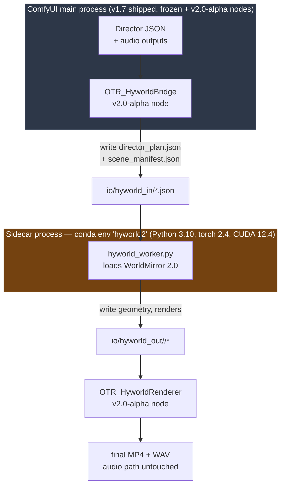

# HyWorld 2.0 Proof-of-Concept Design

**Date:** 2026-04-15
**Branch:** `v2.0-alpha`
**Status:** Design spec, implementation not started
**Owner:** Jeffrey A. Brick
**Companion:** `docs/superpowers/specs/2026-04-15-hyworld-integration-plan-review.md`, `docs/OTR_PIPELINE_EXPLAINER.md`

---

## 1. Purpose

Prove end-to-end that HyWorld 2.0 can produce real (non-procedural) visuals driven by OTR Director output, on the RTX 5080 Laptop, without touching the frozen v1.7 audio pipeline. One working episode with real visuals is the success bar. Not a production release. Scrappy exploration is fine; we are de-risking the architecture before investing in polish.

What this doc is not: a release plan, a benchmark harness, a performance study. It is the minimum design needed to get started on PoC nodes without painting ourselves into corners we will regret.

---

## 2. Hard constraints (non-negotiable)

From `CLAUDE.md` and the 2026-04-15 direction pin:

1. **v1.7 is frozen.** No edits to v1.7 files, workflows, or behavior. HyWorld consumes v1.7 outputs but never modifies them.
2. **C1 platform:** RTX 5080 Laptop, 16 GB VRAM, Blackwell sm_120, single GPU, Windows, no cloud.
3. **C2:** No `CheckpointLoaderSimple` or stock diffusion nodes in the main graph. OOM.
4. **C3:** Visual generation runs in a sidecar subprocess via `multiprocessing.get_context("spawn")` (or equivalent), not in the ComfyUI main process.
5. **C4:** LTX-2.3 clips cap at 10-12 s. Applies to any future video model we chain. Chunk + ffmpeg crossfade.
6. **C5:** LTX-2.3 uses `torch.float8_e4m3fn`. Blackwell-native.
7. **C6:** IP-Adapter for environments only, never characters. (Silent Lip Bug.)
8. **C7:** Audio output byte-identical to v1.5/v1.7 baseline at every gate. If any HyWorld change risks this, revert.
9. **VRAM ceiling:** 14.5 GB real-world target.
10. **No dragon-chasing:** no weight streamers, no quantization hacks, no FA chasing on our stack. Fall back to SDPA if FA does not install.
11. **No more soak/supersoaker testing on v1.7 stability.** v1.7 is solid.

---

## 3. Current state of HyWorld 2.0 (2026-04-15)

Source: https://huggingface.co/tencent/HY-World-2.0

Shipped today:
- **WorldMirror 2.0** (~1.2B params) — multi-view / video to 3D reconstruction. Weights live.
- **WorldMirror 1.0** (legacy) — weights live.

Coming Soon (not shipped, do not plan around):
- **HY-Pano-2.0** — text/image to 360 panorama.
- **WorldStereo 2.0** — panorama to navigable 3DGS.
- **WorldNav** — trajectory planning.

Tencent's recommended stack:
- Python 3.10 in `hyworld2` conda env.
- `torch==2.4.0 torchvision==0.19.0` on CUDA 12.4.
- FlashAttention-3 (Hopper-only; does not apply to Blackwell) with FA-2 as fallback. We will treat FA as **best-effort** — if neither installs, fall back to SDPA.
- License: `tencent-hy-world-2.0-community` (permissive, not gated on HF).

---

## 4. Preconditions on Jeffrey's machine (as of 2026-04-15 20:57)

From `scripts/_gate0_precheck.ps1` run:

| Check | Result | Action |
|---|---|---|
| conda | NOT FOUND in PATH | Install Miniconda (user-scope), or locate existing install and add to PATH |
| git | NOT FOUND in PATH | Exists on machine (Jeffrey pushes from cmd), but PowerShell PATH is missing it. Add `C:\Program Files\Git\cmd` to User PATH, or use full path |
| nvidia-smi | NOT FOUND in PATH | Exists (he runs a 5080). Add `C:\Windows\System32` or NVIDIA's install dir to PATH, or use full path |
| Disk C: free | 1726.8 GB | Plenty. No concern. |
| ComfyUI venv python | blank (probe returned nothing) | Investigate — venv may be corrupt or the exe hangs. Not blocking for HyWorld env (we build a fresh env) but worth knowing. |
| ComfyUI on :8000 | NOT RESPONDING | Desktop app may be on a different port, or had not finished initializing at probe time. Not blocking for HyWorld sidecar install. |
| HF_TOKEN (User scope) | SET, length 37 | Correct length for a fine-grained HF token. Fixed in this session. |
| Supersoaker | 2 PIDs running | Killed in this session per direction change. |

**Resolution order before any HyWorld install:**
1. Install Miniconda (or surface existing install on PATH).
2. Add git + nvidia-smi + ffmpeg to User PATH so our scripts can find them.
3. (Optional, does not block) investigate why `.venv\Scripts\python.exe --version` returned empty.

---

## 5. Architecture — the sidecar contract

v1.7 stays in its current process. HyWorld runs in `hyworld2` conda env as a subprocess with its own Python 3.10 + torch 2.4. They communicate **only via files on disk and well-formed JSON**. No in-process imports across the boundary.



Key properties of this contract:

1. **Audio path is not touched.** The bridge node runs alongside the existing audio assembly; if the bridge fails, the existing procedural video fallback still produces an MP4.
2. **No torch version conflict.** Main ComfyUI stays on torch 2.10 + CUDA 13; sidecar uses torch 2.4 + CUDA 12.4. They never import each other.
3. **Process isolation absorbs crashes.** If HyWorld OOMs or hangs, only the sidecar dies. Main ComfyUI sees a timeout and falls back gracefully.
4. **Cache boundary is the filesystem.** `io/hyworld_in/` and `io/hyworld_out/` are the full API surface. Trivial to inspect, diff, and resume.

---

## 6. Node inventory on `v2.0-alpha` (new, not in v1.7)

Three new nodes. All go in a new subfolder `otr_v2/hyworld/` so the v1.7 `nodes/` folder stays untouched.

| Node ID | Purpose | Input | Output |
|---|---|---|---|
| `OTR_HyworldBridge` | Writes director plan + scene manifest to `io/hyworld_in/`, spawns the sidecar worker, polls for completion | `director_plan`, `script_json` | `hyworld_job_id` (string) |
| `OTR_HyworldPoll` | Polls `io/hyworld_out/<job_id>/STATUS.json` for ready/error, blocks until done or timeout | `hyworld_job_id` | `hyworld_assets_path` |
| `OTR_HyworldRenderer` | Reads geometry + images from `io/hyworld_out/`, composites a per-scene MP4, crossfades to match audio length | `hyworld_assets_path`, `final_audio_wav` | `final_mp4_path` |

We deliberately split Bridge and Poll into two nodes so the ComfyUI workflow can show a spinner on Poll while the sidecar runs. Spawning and polling in one node makes the graph look hung.

The existing `OTR_SignalLostVideo` (procedural) stays as the fallback. If `OTR_HyworldRenderer` raises, the workflow routes to `OTR_SignalLostVideo` and still ships an MP4. This satisfies C7 and the "audio is king" rule.

---

## 7. Director schema extension (optional fields only)

Two optional fields added to `_DIRECTOR_SCHEMA` on `v2.0-alpha` only. Defaults preserve v1.7 behavior exactly.

```json
{
  "shots": [
    {
      "shot_id": "s01_01",
      "duration_sec": 9,
      "camera": "slow push-in on console",
      "dialogue_line_ids": ["line_14", "line_15"]
    }
  ],
  "style_anchor_hash": "a1b2c3d4e5f6"
}
```

Rules:
- Both fields are **optional**. v1.7 Director prompts never produce them; existing runs remain byte-identical.
- `shots[].duration_sec` must be in `[3, 12]` to respect C4 (HyWorld clip ceiling).
- `style_anchor_hash` is a 12-char hex fingerprint keying the eventual geometry vault. For PoC, it can be a random seed per episode — full vault logic lives in a later iteration.
- Validator accepts both shapes (with and without the new fields). No existing workflow breaks.

If we need to modify v1.7's Director node to emit these fields, we do NOT — we override on v2.0-alpha only, in a subclass or a new node.

---

## 8. Install sequence (do not execute yet — this is the plan)

### Phase 8A — Toolchain preconditions (user-level, no GPU work)

1. Install Miniconda (user-scope, no admin required): https://docs.conda.io/en/latest/miniconda.html → "Miniconda3 Windows 64-bit".
2. Open a **new** PowerShell and run `conda --version` to confirm it is on PATH.
3. If `git --version` fails in PowerShell, add git's install dir to User PATH (`[Environment]::SetEnvironmentVariable(...)`).
4. If `nvidia-smi` fails in PowerShell, add NVIDIA install dir to User PATH. Usually `C:\Program Files\NVIDIA Corporation\NVSMI`.

Checkpoint: rerun `scripts/_gate0_precheck.ps1`. All three should flip to FOUND.

### Phase 8B — Sidecar env + WorldMirror 2.0 weights (no GPU work beyond download)

1. `conda create -n hyworld2 python=3.10 -y`
2. `conda activate hyworld2`
3. `pip install torch==2.4.0 torchvision==0.19.0 --index-url https://download.pytorch.org/whl/cu124`
4. Clone HY-World 2.0: `git clone https://github.com/Tencent-Hunyuan/HY-World-2.0 C:\Users\jeffr\Documents\hyworld2\repo` (URL inferred from HF acknowledgments; verify at runtime).
5. `cd C:\Users\jeffr\Documents\hyworld2\repo`
6. `pip install -r requirements.txt`
7. FA install is **best-effort**. Try `pip install flash-attn --no-build-isolation`. If it fails on Blackwell, shrug — the pipeline will use SDPA. Do not chase.
8. Trigger first-run weight download by loading the pipeline in a throwaway script:
   ```python
   from hyworld2.worldrecon.pipeline import WorldMirrorPipeline
   p = WorldMirrorPipeline.from_pretrained('tencent/HY-World-2.0')
   print('weights cached at', p.config._name_or_path)
   ```
   The HF cache lives at `%USERPROFILE%\.cache\huggingface\hub\`. HF_TOKEN is already set, downloads should saturate link speed.

Checkpoint: `pip freeze | findstr torch` shows 2.4.0. WorldMirror 2.0 weights exist on disk.

### Phase 8C — First reconstruction smoke test (GPU, 10-15 min)

1. In `hyworld2` env, run Tencent's gradio demo or CLI with a handful of test images (5-8 images, 512x512 minimum).
2. Side terminal: `nvidia-smi dmon -s umt -c 60` logs VRAM every second for a minute — capture peak.
3. Record wall-clock from script start to 3D output written.
4. Log in `docs/gate0_partial_results.md`:
   - Did FA install? (FA-3 / FA-2 / neither / SDPA fallback)
   - Peak VRAM during inference
   - Wall-clock
   - Output fidelity (subjective "did the 3D reconstruction look right")
   - Any stack traces

**Pass criteria for PoC gate:** reconstruction completes without OOM, peak VRAM below 14.5 GB, wall-clock under 5 minutes for the test input.

**Fail criteria:** OOM, driver crash, FA-2 hard-requires Blackwell and absence means no fallback. On fail, stay on WorldMirror 1.0 or the procedural fallback and wait for upstream quantization.

---

## 9. Weight download plan

Today:
- WorldMirror 2.0 (~1.2B params, exact disk size not on HF page; expect 2-5 GB in safetensors)
- WorldMirror 1.0 (legacy, similar size)

When they ship:
- HY-Pano-2.0
- WorldStereo 2.0
- WorldNav

Download path: first-run auto-download via `huggingface_hub` into `%USERPROFILE%\.cache\huggingface\hub\`. No manual git-lfs pull required. HF_TOKEN ensures higher rate limits.

Optional: schedule a weekly check of the HF repo to notify Jeffrey when Pano/Stereo/Nav flip from "Coming Soon" to shipped. Candidate for the `schedule` skill — not critical for PoC, nice-to-have.

---

## 10. Smoke test report template

Placed at `docs/gate0_partial_results.md` once the test runs. Template:

```markdown
# Gate 0 Partial Results — WorldMirror 2.0

**Date:** YYYY-MM-DD
**Operator:** Jeffrey
**Platform:** RTX 5080 Laptop, 16 GB VRAM, Blackwell sm_120, Windows

## Install verdict
- conda env created: pass / fail
- torch 2.4.0 + CUDA 12.4 installed: pass / fail
- Flash Attention: FA-3 / FA-2 / neither (SDPA fallback)
- requirements.txt installed without errors: pass / fail
- WorldMirror 2.0 weights downloaded: pass / fail (size on disk: X GB)

## Smoke test
- Test images: N files, resolution WxH
- Wall-clock: X minutes
- Peak VRAM: Y GB
- Driver crashes: yes / no
- OOM: yes / no
- Output fidelity (subjective): good / usable / bad
- Stack traces (if any): paste or link

## Verdict
- 16 GB fit confirmed: yes / no
- Sidecar architecture viable: yes / no
- Next step: proceed to bridge node / wait for upstream fix / Path B fallback
```

---

## 11. Fail-safe and rollback

At every stage, the fallback is "audio-only with procedural visuals." v1.7 audio + `OTR_SignalLostVideo` is the safe mode that always works. No HyWorld failure should ever produce a broken episode — worst case, the user gets the same output v1.7 has been producing for weeks.

Three fail patterns to plan for:

1. **FA does not install on Blackwell.** Expected. Fall back to SDPA. Probably works. Log the slowdown.
2. **WorldMirror 2.0 OOMs on 16 GB.** Unlikely at 1.2B params, but possible with multi-view input. Reduce batch to 1, reduce resolution, or stay on WorldMirror 1.0.
3. **Sidecar subprocess hangs forever.** Poll node times out after N seconds (configurable, default 900 s = 15 min). Main workflow routes to procedural video fallback. User sees a log line, not a hang.

---

## 12. Out of scope for PoC

Explicitly NOT doing in this iteration:

- Scene-Geometry-Vault persistence (noted in HyWorld integration review as P0, but it is post-PoC).
- Style-Anchor cache split (same).
- Head-Start async pre-bake (wall-clock optimization, post-PoC).
- ASCII sanitizer for prompt encoder (defensive hygiene, post-PoC).
- Full `shots` array emission from Director (PoC can hardcode one shot per scene).
- Cross-episode visual continuity (vault territory).
- Production error handling, retries, progress bars in the UI.

---

## 13. Open questions (resolve during implementation)

1. Exact GitHub URL for HY-World 2.0 — HF page does not link directly; need to visit the "Official Site" / "Models" buttons or check Tencent-Hunyuan GitHub org.
2. Full disk size of WorldMirror 2.0 weights + download time at Jeffrey's link speed.
3. Whether FA-2 builds at all on Blackwell sm_120 with torch 2.4 / CUDA 12.4. Likely no. Plan on SDPA.
4. Whether the gradio demo works on a single 16 GB card or requires their `--use_fsdp` multi-GPU flag removed.
5. What exactly the Director's Short-Prompt mode emits today that could be treated as a shot boundary (inspect existing `director_plan` JSON from a v1.7 run).

---

## 14. Next action checklist

In order. Do not skip.

- [ ] Jeffrey installs Miniconda and adds conda to PATH.
- [ ] Jeffrey adds git + nvidia-smi to PowerShell PATH (or confirms they resolve).
- [ ] Rerun `scripts/_gate0_precheck.ps1`; confirm all green.
- [ ] Create `hyworld2` conda env + install torch 2.4 + clone HY-World 2.0 repo.
- [ ] Run Tencent's requirements install.
- [ ] Trigger WorldMirror 2.0 first-run weight download.
- [ ] Pick 5-8 test images for the smoke test.
- [ ] Run reconstruction with `nvidia-smi dmon` logging side-by-side.
- [ ] Fill `docs/gate0_partial_results.md` from the template.
- [ ] Only if the PoC smoke test passes: scaffold `otr_v2/hyworld/bridge.py`, `poll.py`, `renderer.py` as stub nodes on `v2.0-alpha`.
- [ ] Wire stubs into a minimal workflow JSON that still runs end-to-end (with the procedural fallback intact).

Stop there. Scene-vault, style-anchor, async pre-bake are all post-PoC.

---

## 15. References

- HuggingFace model card: https://huggingface.co/tencent/HY-World-2.0
- Review triage: `docs/superpowers/specs/2026-04-15-hyworld-integration-plan-review.md`
- Pipeline explainer: `docs/OTR_PIPELINE_EXPLAINER.md`
- v2 sidecar design (pre-HyWorld-2.0): `docs/superpowers/specs/2026-04-12-otr-v2-visual-sidecar-design.md`
- Platform pins: `CLAUDE.md`
- Active roadmap: `ROADMAP.md`
